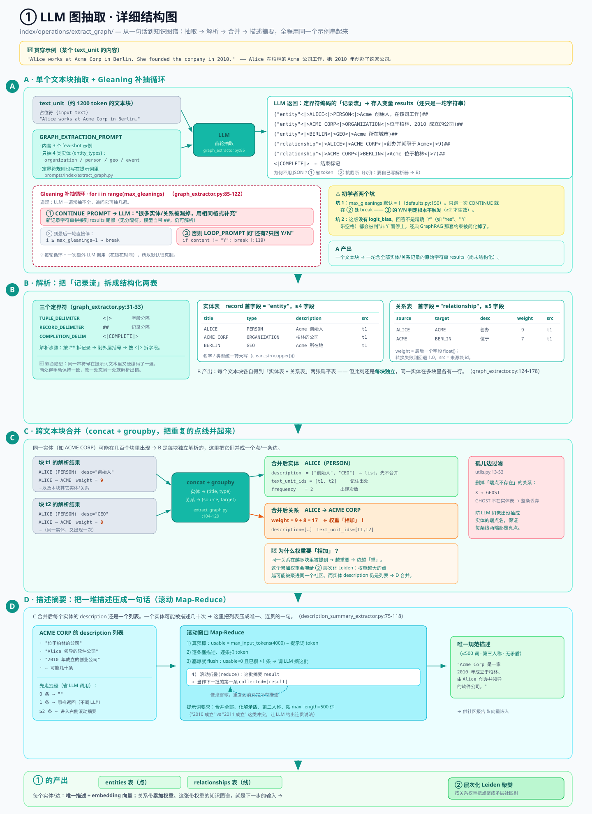

# ① LLM 图抽取（Entity / Relationship Extraction）

> GraphRAG 核心机制深入 · **1 / 5** · [← 总览](./core-deep-dive.md) · [下一篇：② 层次化 Leiden 聚类 →](./core-02-hierarchical-leiden.md)
> 版本 `graphrag` 3.1.0 · 所有 `file:line` 引用相对 `packages/graphrag/graphrag/`。

**位置**：`index/operations/extract_graph/`，提示词 `prompts/index/extract_graph.py`。

---

## 这一步在做什么（先看大白话）

想象你有一大堆文档（比如几百篇新闻、一本书、一堆公司报告）。GraphRAG 要做的第一件事，是把这些**纯文字**变成一张**知识图谱**——也就是"谁是谁、谁和谁有什么关系"的网络。

- **实体（Entity）** = 图里的**点**，比如某个人、某家公司、某个地点。
- **关系（Relationship）** = 图里的**线**，比如"Alice 创办了 Acme 公司"。

这一步就是让 **LLM（大语言模型）逐段读文档，把点和线抽出来**，再把重复的点线合并、给每个点线写一句干净的描述。产出两张表：`entities`（所有点）和 `relationships`（所有线）。它们是后面所有步骤的地基。

> 打个比方：这一步像是让一个助理通读所有资料，做成一张"人物关系图 + 每个人一句话简介"。

---

## 术语小抄（看不懂的词先查这里）

| 词 | 通俗解释 |
|---|---|
| **text-unit（文本块）** | 文档太长喂不进 LLM，所以先切成小块。默认每块约 **1200 个 token**。一个 token 约等于 0.75 个英文单词 / 1～2 个汉字。 |
| **token** | LLM 处理文字的最小计价单位。"上下文窗口""预算"都是按 token 算的。 |
| **LLM 调用** | 就是"向大模型发一次请求、拿一次回答"。每次都花钱花时间，所以后面很多设计都在**省调用次数**。 |
| **prompt（提示词）** | 发给 LLM 的指令模板。这里的模板告诉它"请从下面这段文字里抽实体和关系，按我规定的格式输出"。 |
| **few-shot（少样本示例）** | 在 prompt 里塞几个"输入→输出"的完整例子，让 LLM 照猫画虎。这里塞了 3 个。 |
| **DataFrame** | pandas 库里的"表格"对象，可以理解成内存里的一张 Excel 表。 |
| **groupby（分组聚合）** | 表格操作：把某几列相同的行归成一组，再对每组做汇总（求和、拼列表、计数…）。像 Excel 的数据透视表。 |
| **embedding（向量/嵌入）** | 把一段文字变成一串数字（一个向量），语义相近的文字向量也相近。后面检索靠它算相似度。 |
| **gleaning（补抽）** | 字面意思"拾穗"。LLM 一遍抽不干净，就追问它"还有漏的吗"，再抽几遍。 |

---

## 配图总览：四个区块



这张图分四块，也是本文的四个大节，数据从上到下、从左到右流动：

- **A（左上）· 单块抽取 + gleaning 循环** — 一个文本块怎么被 LLM 抽一遍、再补抽几遍。
- **B（右上）· 解析记录流** — LLM 吐出来的那串"奇怪符号文本"怎么被拆成结构化的实体/关系。
- **C（右中）· 跨块合并** — 成百上千个块各抽各的，重复的点线怎么合并去重。
- **D（下方横条）· 描述摘要** — 同一个实体被描述了几十次，怎么压成一句话。

下面逐块细讲，全程用**同一个例子**串起来。

> 🧵 **贯穿全文的例子**
> 假设某个文本块的内容是：
> *"Alice works at Acme Corp in Berlin. She founded the company in 2010."*
> （Alice 在柏林的 Acme 公司工作。她在 2010 年创办了这家公司。）

---

## A · 单个文本块的抽取（含 gleaning 补抽循环）

对应图中左上角青色大框。这一块回答："**一个文本块，怎么变成一串实体/关系记录？**"

### A-1 输入：文本块 + 提示词 → LLM

图里最上面两个小盒子：

- 左盒 **text_unit** = 待处理的文本块（我们例子里那句话），在 prompt 里占位符是 `{input_text}`。
- 右盒 **GRAPH_EXTRACTION_PROMPT** = 指令模板（`prompts/index/extract_graph.py`）。它包含 3 个 few-shot 例子，外加一个 `{entity_types}` 占位符——告诉 LLM"只抽这几类实体"。

默认只抽 4 类实体（`config/defaults.py:147-149`）：

```
organization（组织）、person（人物）、geo（地点）、event（事件）
```

> 为什么要限定类型？不限的话 LLM 会把"桌子""天气"这种也抽出来，图会又大又乱。限定类型让图聚焦在真正重要的实体上。

### A-2 首轮抽取：LLM 吐出"定界符编码"的记录

LLM 读完那句话，**不是**返回 JSON，而是返回一串用**特殊符号分隔**的文本。对我们的例子，它大概会吐出：

```
("entity"<|>ALICE<|>PERSON<|>Alice 是 Acme 公司的创始人，在该公司工作)##
("entity"<|>ACME CORP<|>ORGANIZATION<|>一家位于柏林、成立于 2010 年的公司)##
("entity"<|>BERLIN<|>GEO<|>Acme 公司所在的城市)##
("relationship"<|>ALICE<|>ACME CORP<|>Alice 创办并就职于 Acme 公司<|>9)##
("relationship"<|>ACME CORP<|>BERLIN<|>Acme 公司位于柏林<|>7)##
<|COMPLETE|>
```

代码把这串原始文本存进变量 `results`（`graph_extractor.py:85-122`）。**注意：此刻它还只是一坨字符串**，怎么拆成结构化数据是 B 区块的事。

> **为什么用符号而不用 JSON？** 两个原因：① 更省 token（JSON 的括号引号很占地方）；② 更抗截断（LLM 输出被截断时，符号格式更容易解析出已完成的部分）。代价是要自己写解析器（见 B）。

> [!tip] 🔍 逐字段拆解：拿第一条记录 `("entity"<|>ALICE<|>PERSON<|>Alice 是 Acme 公司的创始人，在该公司工作)##` 举例，为什么长这样
> 按实体记录模板 `("entity" <|> 实体名 <|> 类型 <|> 描述)`（完整规则见下面 B-2）逐个字段看：
>
> 1. **`"entity"`** —— 固定字面量，标记"这是一条实体记录"（区别于后面 `"relationship"` 开头的关系记录）。
> 2. **`ALICE`** —— 实体名。原文写的是 "Alice"，被 prompt 要求**强制转成大写**。这不是随意的格式偏好，而是为了后面 C 区块跨文本块合并时，"Alice"、"alice"、"ALICE" 这些大小写不同的写法能被当成**同一个实体**分组合并，不会因为大小写差异被误判成两个不同的点。
> 3. **`PERSON`** —— 实体类型，取自前面限定的 4 类之一（`organization/person/geo/event`）。LLM 根据上下文判断"Alice"是个人，于是归到 `person`（同样转大写）。同理，"Acme Corp" → `ORGANIZATION`、"Berlin" → `GEO`——类型不是 LLM 自由发挥出来的，而是从这 4 个预定义类别里挑的。
> 4. **描述字段**（`Alice 是 Acme 公司的创始人，在该公司工作`）—— LLM 把原文两句话（"Alice works at Acme Corp... She founded the company"）的信息合并总结成的一句话。
>
> 行尾的 `)##` 里，`)` 是这条记录自身的收尾括号，`##` 才是**记录分隔符**，标记"这条记录结束，下一条开始"。

### A-3 gleaning：追问"还有漏的吗"，再抽几遍

图中那个**红色虚线大框**就是补抽循环（`graph_extractor.py:85-122`）。原理很简单——LLM 一遍常常抽不全，于是：

1. 首轮抽完得到 `results`。
2. 如果允许补抽（`max_gleanings > 0`），进入循环，最多补 `max_gleanings` 次：
   - **追加 `CONTINUE_PROMPT`**（红盒）：告诉 LLM"很多实体和关系被漏掉了，用相同格式补充"，再调一次 LLM，新抽出来的记录**字符串拼接**到 `results` 后面。
   - **到最后一轮直接停**（灰盒）：`i >= max_gleanings - 1` 时 `break`。
   - **否则追加 `LOOP_PROMPT`**（红盒）：问 LLM"还有没有遗漏？只回 Y 或 N"，代码检查 `if response.content != "Y": break`（`graph_extractor.py:119`）——只要回答不是精确的 `"Y"`，就停止补抽。

> 🟡 **图里黄色警告框（初学者尤其注意两个"坑"）**
>
> **坑 1：默认只补一次，而且那句"Y/N 追问"根本不会触发。**
> `max_gleanings` 默认 = 1（`defaults.py:150`）。循环只跑一次 CONTINUE 补抽，然后立刻在 `i >= max_gleanings-1` 处 `break`——**永远走不到 LOOP_PROMPT 的 Y/N 判定**。那段 Y/N 逻辑只有当你把 `max_gleanings` 调到 ≥2 时才会真正生效。
>
> **坑 2：这版没有 `logit_bias`。**
> 你如果读过经典 GraphRAG 论文/老代码，会看到它用 `logit_bias` 技巧把 LLM 的回答强制约束成单个 token 的 Y 或 N。**这版代码简化掉了**，退化成朴素的字符串比较 `!= "Y"`。所以如果 LLM 回答 `"Yes"` 或 `" Y"`（带空格），都会被判为"不是 Y"而停止。

**A 区块的产出**：一个文本块 → 一坨包含所有实体/关系记录的原始字符串 `results`。

---

## B · 把"记录流"解析成结构化数据

对应图中右上角。这一块回答："**那串符号文本，怎么变成一行行干净的数据？**"

解析器在 `graph_extractor.py:124-178`。步骤（拿 A-2 的输出举例）：

### B-1 拆记录、拆字段

1. 先按**记录分隔符 `##`** 把整串切成一条条记录。
2. 每条记录**剥掉外层括号** `(...)`。
3. 再按**字段分隔符 `<|>`** 把一条记录切成几个字段。

三个分隔符（`graph_extractor.py:31-33`）：

| 角色 | 常量名 | 长什么样 | 作用 |
|---|---|---|---|
| 字段分隔（记录内） | `TUPLE_DELIMITER` | `<\|>` | 隔开一条记录里的各个字段 |
| 记录分隔 | `RECORD_DELIMITER` | `##` | 隔开一条条记录 |
| 结束标记 | `COMPLETION_DELIMITER` | `<\|COMPLETE\|>` | 标记"我抽完了" |

### B-2 两类记录的字段格式

**实体记录**（第一个字段是 `"entity"`，至少 4 个字段）：

```
("entity" <|> 实体名 <|> 类型 <|> 描述)
```

解析成一行：`{title, type, description, source_id}`。其中：
- **实体名和类型会被统一转大写**（`clean_str(x.upper())`）——所以 `Alice`、`alice`、`ALICE` 会被当成同一个实体。这是为了后面合并时能对上号。
- `source_id` = 这条记录来自哪个文本块的 id（用来日后回溯出处）。

**关系记录**（第一个字段是 `"relationship"`，至少 5 个字段）：

```
("relationship" <|> 源实体 <|> 目标实体 <|> 关系描述 <|> 关系强度)
```

解析成一行：`{source, target, description, source_id, weight}`。其中：
- **`weight`（权重）取最后一个字段**转成小数（`float(...)`），比如例子里的 `9`、`7`。如果 LLM 那个字段写得不是数字、转换失败，**回退成 `1.0`**。
- 源/目标实体名同样转大写。

拿我们的例子过一遍，B 区块的产出是两张扁平表：

**实体表（局部）**

| title | type | description | source_id |
|---|---|---|---|
| ALICE | PERSON | Alice 是 Acme 公司的创始人… | t1 |
| ACME CORP | ORGANIZATION | 一家位于柏林、成立于 2010 年的公司 | t1 |
| BERLIN | GEO | Acme 公司所在的城市 | t1 |

**关系表（局部）**

| source | target | description | weight | source_id |
|---|---|---|---|---|
| ALICE | ACME CORP | Alice 创办并就职于 Acme 公司 | 9 | t1 |
| ACME CORP | BERLIN | Acme 公司位于柏林 | 7 | t1 |

> 🔧 **图里标红的"耦合隐患"**：这三个分隔符在代码里被写了**两遍**——一次是上面的 Python 常量，一次**又硬编码在提示词文本里**（提示词里直接写着"用 `##` 分隔""输出 `<|COMPLETE|>`"）。两处必须手动保持一致，改一处忘了改另一处就会解析出错。这是初学者读源码时容易困惑的点：为什么同一个符号到处都是。

---

## C · 跨文本块合并（把重复的点线并起来）

对应图中右中部。这一块回答："**几百个文本块各抽各的，同一家公司被抽了几十次，怎么合并？**"

关键认识：**B 区块是每个块独立做的**。整本书里 "ACME CORP" 可能在 50 个块里出现，于是会有 50 行 ALICE、50 段不同的描述。C 区块（`extract_graph.py:104-129`）用 pandas 的 **concat（拼接）+ groupby（分组聚合）** 把它们并成一个点。

### C-1 合并实体：按 (名字, 类型) 分组

把所有块的实体表**竖着拼起来**，然后按 **`(title, type)`** 分组，每组汇总：

- `description = list(所有描述)` —— 把这一组的所有描述**收集成一个列表**（先不合并成一句，那是 D 的事）。
- `text_unit_ids = list(所有 source_id)` —— 记住这个实体在哪些块里出现过。
- `frequency = count` —— 出现了多少次。

> ⚠️ **初学者关键点：为什么是按 `(名字, 类型)` 两个字段一起分组？**
> 因为**同名但不同类型 = 两个不同的点**。比如 "APPLE"（PERSON，指某个姓 Apple 的人）和 "APPLE"（ORGANIZATION，指苹果公司）会被当成两个实体，不会错误合并。

### C-2 合并关系：按 (源, 目标) 分组，权重相加

同理，所有块的关系表拼起来，按 **`(source, target)`** 分组：

- `description = list(所有描述)`
- `text_unit_ids = list`
- **`weight = sum`（求和！）** —— 这是重点。

> ⚠️ **为什么权重要"相加"？**
> 如果 "ALICE → ACME CORP" 这条关系在 30 个块里都被提到，说明这俩关系很强、很重要。把每次的强度**累加**起来，边就越"重"。这个累加后的权重，后面**② 层次化 Leiden 聚类**会拿去判断哪些点该聚成一个社区——关系越重的点越可能被分到一起。
>
> 举例：块 1 抽出 ALICE→ACME 权重 9，块 2 又抽出权重 8，合并后这条边 `weight = 17`。

### C-3 孤儿边过滤

最后一步（图里红盒，`utils.py:13-53`）：**删掉那些"端点不存在"的关系**。

有时 LLM 会抽出一条关系，但它的源或目标实体在实体表里根本找不到（LLM 幻觉出了一个没抽成实体的名字）。这种"悬空的线"会被丢掉，保证图的干净——每条线的两端都必须是真实存在的点。

**C 区块的产出**：全语料**去重后**的两张表。但注意——此刻每个实体/关系的 `description` 还是一个**列表**（比如 ACME CORP 的描述是 `["位于柏林的公司", "Alice 领导的软件公司", ...]`），还没合并成一句话。这就轮到 D。

---

## D · 描述摘要（把一堆描述压成一句话）

对应图中最下方的横条。这一块回答："**同一个实体被描述了几十遍，怎么变成一句连贯的话？**"

代码在 `description_summary_extractor.py:75-118`，用的是一个叫**滚动 Map-Reduce**的技巧。别被名字吓到，本质就是"分批摘要 + 把上一批的摘要接着往下摘"。

### D-1 先看两个捷径（省 LLM 调用）

对每个实体的描述列表，先判断（图里左侧盒子）：

- **0 条描述** → 直接返回空字符串 `""`，不调 LLM。
- **恰好 1 条描述** → **原样返回，不调 LLM**。（只有一句话，没啥好摘要的，省一次调用。）
- **2 条及以上** → 才真正进入下面的摘要流程。

> 这种"能不调 LLM 就不调"的短路判断，在 GraphRAG 里到处都是——因为 LLM 调用是整个系统最贵、最慢的部分。

### D-2 滚动窗口摘要（图中间的循环）

假设 ACME CORP 有 40 条描述，一次喂不进 LLM。流程是：

1. 算出**这一批能装多少**：`usable_tokens = max_input_tokens - 提示词占用的 token`，其中 `max_input_tokens = 4000`（`defaults.py:319-320`）。
2. **一条条往里塞描述**，每塞一条就减去它的 token 数。
3. **塞爆了就"flush"（清空并摘要）**：当 `usable_tokens < 0` 且**已经攒了不止一条**时，把当前这批喂给 LLM 摘要成一段。（"不止一条"这个条件保证：哪怕单条描述本身就超长，也至少含一条，不会空转。）
4. **滚动折叠（这就是 reduce）**：中间摘出来的那段结果，**当作下一批的第一条**（图里那条绕回去的虚线箭头：`collected = [result]`），再继续塞剩下的描述。如此往复，直到 40 条全部消费完，得到最终一句。

> 📌 用一句话理解"滚动折叠"：像滚雪球——摘要 A 批 → 得到小结 → 把小结和 B 批一起再摘 → 得到更大的小结 → 再和 C 批一起摘…… 最后滚成一个总结。这样无论多少条描述都能压成一句。

### D-3 摘要的要求

喂给 LLM 的提示词要求它："合并所有描述、化解矛盾、用第三人称写、限 `{max_length} = 500` 词"。

- **化解矛盾**很重要：如果一处说"成立于 2010"、另一处说"成立于 2011"，LLM 要给出一个连贯的说法，而不是两句打架的话。

**D 区块的产出**：每个实体/边有了**唯一、连贯的一句描述**。

---

## 这一步整体产出了什么

跑完 ①，你得到两张核心表：

- **`entities`**：所有去重后的实体，每个带唯一描述 + 一个 embedding 向量（描述被转成向量，供后面 Local search 检索）。
- **`relationships`**：所有去重后的关系，每条带累加后的权重 + 唯一描述。

这两张表合起来就是一张**带权重、带描述的知识图谱**。它是下一步的输入——

👉 **[② 层次化 Leiden 聚类](./core-02-hierarchical-leiden.md)** 会拿这张图，按"关系权重"把点聚成一棵多层的社区树。

---

## 本篇关键默认值

| 环节 | 参数 | 默认 | 出处 | 一句话 |
|---|---|---|---|---|
| 图抽取 | `max_gleanings` | 1 | `defaults.py:150` | 补抽几次；默认 1，Y/N 判定不触发 |
| 图抽取 | 定界符 tuple/record/complete | `<\|>` / `##` / `<\|COMPLETE\|>` | `graph_extractor.py:31-33` | LLM 输出的分隔符 |
| 图抽取 | 默认实体类型 | organization/person/geo/event | `defaults.py:147-149` | 只抽这 4 类 |
| 描述摘要 | `max_length` | 500 词 | `defaults.py:319` | 单条描述最长 |
| 描述摘要 | `max_input_tokens` | 4000 token | `defaults.py:320` | 每批摘要的输入预算 |

---

**产出** `entities` / `relationships` 两表（每个节点/边含唯一描述 + 向量），成为下一步聚类的输入图。

[← 总览](./core-deep-dive.md) · [下一篇：② 层次化 Leiden 聚类 →](./core-02-hierarchical-leiden.md)
