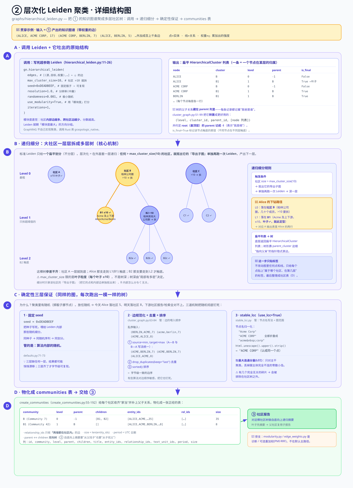

# ② 层次化 Leiden 聚类

> GraphRAG 核心机制深入 · **2 / 5** · [← 上一篇：① LLM 图抽取](./core-01-graph-extraction.md) · [总览](./core-deep-dive.md) · [下一篇：③ 社区报告 →](./core-03-community-reports.md)
> 版本 `graphrag` 3.1.0 · 所有 `file:line` 引用相对 `packages/graphrag/graphrag/`。

**位置**：`graphs/hierarchical_leiden.py`、`index/operations/cluster_graph.py`、`graphs/stable_lcc.py`。

拿到 ① 产出的实体-关系图后，这一步把它聚成一棵**多层社区树**：粗粒度的大主题在上层，细粒度的小话题在下层。这棵树是 ③ 社区报告"自底向上递归摘要"的骨架。

---

## 这一步在做什么（先看大白话）

回想一下 **① 图抽取** 给了你什么：一张**知识图谱**——一堆点（实体，比如 Alice、Acme、Berlin）用一堆带权重的线（关系）连起来。点多、线多，密密麻麻。

现在的问题是：**这么大一张网，怎么看出它在讲哪些"主题"？** 光看一张网状图，人脑是抓不住重点的。

这一步（层次化 Leiden 聚类）做的事，就是**把关系紧密的点圈成一个个小圈子**，我们把这种小圈子叫 **社区（community）**。

- 关系越紧密（边权重越大、连得越多）的点，越可能被分到**同一个社区**。
- 关系疏远的点，会被分到**不同社区**。

换句话说，它像**在一场几百人的大聚会里，看谁总跟谁站在一起聊天，然后把常聊的人圈成一桌一桌**。经常互动的坐一桌，互不认识的分到不同桌。

那"层次化"又是什么？**因为有的圈子太大了。** 比如"柏林的科技圈"可能有 200 个实体，圈成一桌根本坐不下，也看不清里面还有什么门道。于是算法会**把太大的圈子再拆成更小的圈子**，形成"大圈子里套小圈子"的多层结构：

```
Level 0（最粗）  柏林科技圈（200 个实体，太大）
   └─ Level 1    ├─ Acme 及其合作方（30 个）
                 ├─ 柏林高校圈（40 个，还是太大）
                 │     └─ Level 2  ├─ 计算机系相关（8 个，够小了✓）
                 │                 └─ 商学院相关（7 个，够小了✓）
                 └─ 政府机构圈（12 个）
```

是不是很像**公司的"部门 → 小组 → 个人"**，或者**一本书的"篇 → 章 → 节"**？大主题在上，越往下越具体。这棵树就是本步的产物。

> 打个比方：① 把资料变成了"人物关系大网"，② 则是**给这张大网做了一份"目录 + 分组名册"**——先分大部门，大部门太大就再分小组，一直分到每组人数够少为止。

📌 **一句话记住**：这一步不改动图里的任何点和线，只是给每个点**贴上"你属于哪个社区、在第几层"的标签**，最后按标签整理成一张社区表。

---

## 术语小抄（看不懂的词先查这里）

| 词 | 通俗解释 |
|---|---|
| **聚类（clustering）** | 把一堆东西按"相似 / 紧密"程度自动分组。这里是把图里的点分组。注意：没人事先告诉算法该分几组、每组是谁，全靠它自己看关系"猜"出来。 |
| **社区（community）** | 聚类分出来的**一个小圈子**——内部彼此关系紧密、跟外部关系稀疏的一群点。可以理解成"一桌人""一个部门""一个话题簇"。 |
| **Leiden 算法** | 一种在图上做聚类的经典算法，专门用来找"社区"。你只要知道：喂给它一张带权重的图，它就吐出一份"每个点属于哪个社区"的划分，而且划分质量比老一代的 Louvain 算法更稳。 |
| **模块度（modularity）** | 衡量"这份社区划分好不好"的一个分数。直觉：**社区内部的边越多、跨社区的边越少，分数越高**。Leiden 就是朝着"模块度最大"的方向去分组的。 |
| **层次化（hierarchical）** | "分了还能再分"。大社区拆成子社区，子社区还能拆孙社区，最后形成一棵多层的树。 |
| **连通分量（connected component）** | 图里"能互相走到"的一块。如果两个点之间存在一条路径（哪怕绕很多步），它们就在同一个连通分量里；完全走不到，就是两个分量。一张图可能碎成好几块互不相连的岛。 |
| **LCC（最大连通分量，Largest Connected Component）** | 上面那些"岛"里**最大的那一块**。GraphRAG 默认只保留 LCC，把零散的小碎块丢掉，让聚类聚焦在主干上。 |
| **seed（随机种子）** | 算法里有"掷骰子"的随机环节。种子就是**固定骰子结果的那个数**：同样的种子 → 同样的随机序列 → 同样的输出。这里固定成 `0xDEADBEEF`。 |
| **导出子图（induced subgraph）** | 从大图里"抠出"某个社区的所有点，以及**这些点之间**的所有边，单独组成的一张小图。递归细分时，就是对这张抠出来的小图再跑一次 Leiden。 |
| **确定性 / 可复现** | 同样的输入，每次跑都得到**一模一样**的结果，不会因为随机而飘。索引任务必须这样，否则今天和明天建出来的社区树不一样，下游全乱。 |

---

## 配图总览：一图四块



这张图左边一整列讲"树是怎么长出来的"，右边从上到下三块讲"怎么调用、怎么保证可复现、最后产出什么"。数据流是：**先固定超参调用 Leiden（右上）→ 它在内部递归细分出多层树（左侧）→ 一路上靠三层机制保证确定性（右中）→ 最后物化成 communities 表（右下）**。

- **左侧 · 递归细分树（level 0 → 1 → 2）** — 最粗的大社区在上，超过阈值的被一层层拆细，直到每个叶子社区 ≤ 10 个实体。本文的重头戏。
- **右上 · 调用与固定超参** — 底层那行 `gn.hierarchical_leiden(...)` 到底传了哪些写死的参数，以及输出长什么样。
- **右中 · 确定性三层保证** — 三道机制联手保证"每次跑结果都一样"。
- **右下 · 产出 communities 表** — 把聚类结果整理成一张带 parent/children 的社区表，交给下一步。

下面逐块细讲，全程用**和 ① 同一个例子**串起来。

> 🧵 **贯穿全文的例子**
> 还是 ① 里那批实体：**Alice**（人）、**Acme Corp**（公司）、**Berlin**（地点）……以及它们背后成百上千个别的点。
> Alice、Acme、Berlin 三者关系紧密（Alice 创办并就职于 Acme、Acme 位于 Berlin），所以它们很可能被**聚进同一个小社区**。而如果"柏林的公司圈子"整体太大，这个大社区又会被**再拆成若干子社区**。

---

## A · 右上：调用与固定超参（对应 2.1）

先看图**右上角紫色框**——这是整件事的入口。GraphRAG 自己不实现聚类算法，而是调用一个**用 Rust 写的高性能库** `graspologic_native`（`hierarchical_leiden.py:11-26`），把参数**写死**成这样：

```python
gn.hierarchical_leiden(
    edges,                      # list[(source_str, target_str, weight_float)]
    max_cluster_size=10,        # 递归触发阈值
    seed=0xDEADBEEF,            # 3735928559，可复现
    resolution=1.0,
    randomness=0.001,
    use_modularity=True,        # 用模块度（非 CPM）作质量函数
    iterations=1,
)
```

逐个参数用大白话解释：

| 参数 | 传的值 | 大白话 |
|---|---|---|
| `edges` | 一串 `(源, 目标, 权重)` | 就是 ① 产出的那些带权重的关系边。权重越大代表这条关系越"重"（回忆 ①：同一条关系在越多文本块里出现，权重被累加得越高）。 |
| `max_cluster_size` | `10` | **"一个社区超过 10 个成员就得拆"** 的阈值。这是本步最关键的旋钮，下面 B 会细讲。 |
| `seed` | `0xDEADBEEF` | 固定"骰子"，保证可复现（右中会讲）。这个十六进制数换算成十进制是 `3735928559`。 |
| `resolution` | `1.0` | "分辨率"。粗略理解：调大 → 倾向切出更多更小的社区；调小 → 更少更大的社区。默认 `1.0` 是中庸值。 |
| `randomness` | `0.001` | 算法在挪动节点时掺入的一点点随机性。非常小，几乎只在"打破平局"时起作用。 |
| `use_modularity` | `True` | 用**模块度**当"打分标准"（而不是另一种叫 CPM 的标准）。就是术语表里说的：内部边多、跨社区边少的划分得分高。 |
| `iterations` | `1` | 迭代轮数，跑 1 轮。 |

> ⚠️ **初学者最容易搞混的一点：`max_cluster_size=10` 限的不是"树有几层"，而是"叶子社区最多几个成员"。**
> 它不会让你的树刚好 2 层或 3 层。它只保证**最底下每个叶子社区 ≤ 10 个实体**。至于要拆几层才能拆到这么小，完全取决于你的图有多大多密——密的地方（比如柏林科技圈）会拆很多层，稀的地方一层就到底。

**输出长什么样？** 看图右上那第二个框（"输出 · 扁平 HierarchicalCluster 列表"）。算法不是直接吐给你一棵树，而是吐一个**扁平的列表**，每条记录是：

```
(node, cluster, level, parent_cluster, is_final_cluster)
```

即"**某个节点，在第 `level` 层，属于 `cluster` 这个社区，它的父社区是 `parent_cluster`，这里 `is_final_cluster` 标记它是不是已经到叶子层了**"。同一个节点会在多层各出现一次（level 0 一条、level 1 一条……）。

📌 别被"扁平列表"吓到：树的父子关系其实就藏在 `parent_cluster` 这一列里——每条记录都记着"我爸是谁"，把所有记录的父子指针串起来，自然就还原成一棵树。`cluster_graph.py`（图里也标了）随后会把这个扁平列表**转置**成更好用的 `(level, cluster_id, parent_id, [nodes])`，并且约定**root（最顶层社区）的 parent 记成 `-1`**（表示"我没有爸爸，我是根"）。代码里还有 `first_level_*` / `final_level_*` 两个 helper，把它切成"节点→社区"的字典，方便别处查。

---

## B · 左侧：层次是怎么一层层长出来的（对应 2.2）

这是全篇最核心的机制，对应图**左侧那一大列**（Level 0 → Level 1 → Level 2）。

先理解一个前提：**标准 Leiden 只会给你一个"扁平"的划分**——一刀切成若干社区，追求模块度最大，但**不分层**。所谓"层次化"变体，是在标准 Leiden 外面又包了一层**递归细分**的逻辑：

> 跑一次全局 Leiden（**level 0**，最粗的社区）→ 检查每个社区大小 → 任何 **> `max_cluster_size`(10)** 的社区，就把它的**导出子图**单独再跑一次 Leiden，产出 **level 1** → 继续递归，直到每个叶子社区 ≤ 10 个节点。

拿图里的三个社区走一遍，你就全懂了：

### Level 0（图左上第一个浅蓝大框）：全图跑一次，得到最粗的划分

对**整张图**跑一次 Leiden，得到最粗的几个大社区。图里画了三个：

- **社区 A**（小圆，标注 `≤10 · 叶子✓`）：成员不超过 10 个，已经够小了，**它就此定型，不再拆**，成为一片叶子。
- **社区 B**（大圆，标注 `>10 → 需细分`）：成员超过 10 个，**触发细分**。
- **社区 C**（大圆，标注 `>10 → 细分`）：同理，太大，要拆。

> 结合我们的例子：假设 Alice、Acme、Berlin 和另外几个紧密相关的点一起，落在了**社区 B**（"柏林公司圈"）里。而这个 B 一共有几十个成员，`> 10`，所以它会被送去细分。

### Level 1（图左中的浅蓝框）：只对超阈值的社区细分

**注意图里那句"仅对超阈值社区细分"——这是关键：不是每个社区都往下拆，只有上一层里 `>10` 的才拆。** A 已经封顶了，不参与。

- 对 **B 的导出子图**（把 B 的所有成员和它们之间的边单独抠出来，见图上那条箭头"对 B 的导出子图再跑 Leiden"）再跑一次 Leiden，B 裂成 **B1、B2**：
  - **B1**（`≤10 · 叶子✓`）：够小，定型。
  - **B2**（`>10 → 再细分`）：还是太大，继续往下。
- 对 **C 的导出子图**再跑 Leiden，C 裂成 **C1、C2**，两个都 `≤10`，都成叶子。

> 例子：柏林公司圈 B 被拆成"Acme 及其上下游"（B1，正好装下 Alice、Acme、Berlin 这一小簇，够小，封顶）和"柏林其他大公司群"（B2，还是太大）。

### Level 2（图左下的浅蓝框）：B2 触底，全部成叶子

只有 B2 还需要拆。对 B2 再跑一次，裂成 **B2a、B2b、B2c**，全部 `≤10`，**全成叶子，递归结束**。

图最底下那句话是整个机制的总结，务必读懂：

> **不同节点在不同层"触底"：小社区早停，大社区一路下探。`max_cluster_size` 限的是叶子粒度，不是树深。**

换句话说，**这棵树是"参差不齐"的**——社区 A 只有 level 0 一层就到底了；而 B 这一支要走到 level 2 才触底。就像一本书，有的章很短一节就写完，有的章要拆成好几节。

> ⚠️ **初学者容易困惑的三个点**
>
> **困惑 1：为什么 A 那一支的树比 B 那一支浅？** 因为 A 本来就小（≤10），一开始就满足条件，不需要拆。树深由"局部有多密"决定，不是全局统一的。
>
> **困惑 2：细分时是拿整张大图还是只拿这个社区？** 只拿这个社区的**导出子图**——把 B 的成员和它们内部的边单独抠出来再聚。B 内部怎么分，跟 C 里发生什么完全无关。
>
> **困惑 3：返回的是树还是列表？** 底层返回的是**扁平的 `HierarchicalCluster` 列表**，每条 = `(node, cluster, level, parent_cluster, is_final_cluster)`。树的形状靠 `parent_cluster` 这根"指向父亲的指针"隐式表达。`cluster_graph.py:51-99` 负责把它转置成 `(level, cluster_id, parent_id, [node_titles])`，并把 root 的 parent 记成 `-1`。

---

## C · 右中：确定性的三层保证（对应 2.3）

对应图**右中那个框**（三条并排的小条）。先说**为什么非要确定性**：

聚类里有随机成分（掷骰子挪节点）。如果放任随机，**今天建索引 Alice 落在社区 5，明天重建又落在社区 8**——那下游的社区报告、检索全对不上号，用户会觉得系统"飘"。所以 GraphRAG 用三道机制把随机性彻底钉死，保证**同样的图，每次跑出一模一样的社区树**：

| # | 机制 | 在做什么 | 为什么需要 |
|---|---|---|---|
| **1** | **固定 seed** `0xDEADBEEF` | 把种子写死，喂给 Leiden 内部那些随机细分。 | 固定"骰子"结果——同种子 → 同随机序列 → 同划分。 |
| **2** | **边规范化 + 去重 + 排序**（`cluster_graph.py:63-84`） | 无向边强制 `source=min, target=max`（保证 `A—B` 和 `B—A` 写法统一），`drop_duplicates(keep="last")` 去重，再 `sorted()` 排序 → 得到**字节级一致的边序**。 | 有些算法对"边喂进去的顺序"敏感，顺序不同结果就微妙不同。把边序也钉死，输入就永远一样。 |
| **3** | **`stable_lcc`**（`use_lcc=True` 时，`stable_lcc.py`） | `html.unescape(name).upper().strip()` 归一化节点名（大小写 / 空白 / HTML 实体都折叠成同一个节点）→ 取**最大连通分量（LCC）** → 字典序定向 → 去重排序。 | 让 `Berlin`、`BERLIN`、`Berlin&nbsp;` 被认成同一个点；并且只保留主干（LCC），丢掉零散小碎块，聚类更稳更聚焦。 |

> 🔧 **把这三层串起来理解**：第 1 层管"算法内部的随机"，第 2 层管"边的喂入顺序"，第 3 层管"节点名的写法和图的范围"。三个层面都固定了，输出才能真正做到字节级可复现。缺任何一层，结果都可能悄悄漂移。

> 📌 关于 **LCC**：默认 `use_lcc=True`（`defaults.py:71-73`）。回忆术语表——LCC 是图里"最大的那块能互相走到的子图"。取 LCC = **只对主干做聚类，丢掉那些跟主体完全不连的孤立小群**。如果你的语料有几个完全无关的小碎片，它们会被排除在社区树之外。

---

## D · 右下：产出 communities 表（对应 2.4）

对应图**右下角绿色框**——这是本步交给下游的最终成果。

前面 Leiden 吐的是一个扁平的节点-社区列表，还不够好用。`create_communities`（`index/workflows/create_communities.py:55-192`）把它**物化**成一张正经的表：给每个社区收集齐它的家当，并补上父子关系。具体每个社区会算出：

- **`entity_ids`** —— 这个社区里都有哪些成员实体。（例子里，那个装着 Alice/Acme/Berlin 的叶子社区，`entity_ids` 就是这几个点。）
- **`relationship_ids`** —— 属于这个社区的边。⚠️ **注意判定标准：只收"两端都在社区内"的边**。像"Alice—Acme"（两端都在社区里）算这个社区的；但如果有条边一端在社区里、一端在社区外，它不算进来。
- **`text_unit_ids`** —— 这些实体/关系来自哪些原始文本块（回溯出处用，接回 ① 的 `source_id` 血缘）。
- **`children`** —— 按 `parent` 反查建**双向树**：本来每条记录只知道"我爸是谁"，这一步再反过来给每个父社区补上"我有哪些孩子"，于是父子双向都能查。
- **`size`** = `len(entity_ids)`，即成员数。
- **`period`** = 建表时的 **UTC 日期**（记录这批社区是哪天算出来的）。

最终这张 `communities` 表的列是：

```
id, community, level, parent, children, title, entity_ids, relationship_ids, text_unit_ids, period, size
```

> 📌 **为什么要建成"双向树"？** 因为下一步 ③ 要做**自底向上**的摘要：先总结最底层的叶子社区，再把子社区的摘要往上汇总成父社区的摘要。既要能"从父找子"（拿到所有孩子的摘要），也要能"从子找父"（知道汇报给谁），所以父子指针两个方向都得有。这也正是图里右下最后一句"→ 成为 ③ 社区报告自底向上摘要的输入"的含义。

> 🔧 **旁支提醒（别被带偏）**：`modularity.py` / `edge_weights.py` 是**诊断与可选重加权**（PMI / RRF）模块，**不在默认聚类主路径上**。你第一次读源码看到它们，不用纠结——默认流程根本不走那里。图左下角脚注也特意标了这一点。

---

## 这一步整体产出了什么

跑完 ②，你得到一张 **`communities` 表**——本质是一棵**多层社区树**：

- 上层是**粗粒度的大主题**（level 0），下层是**细粒度的小话题**（level N），每个叶子社区不超过 10 个实体。
- 每个社区都知道自己的成员（`entity_ids`）、内部的边（`relationship_ids`）、出处（`text_unit_ids`）、以及父子关系（`parent` / `children`）。
- 整个过程**完全可复现**——同一张图跑多少次，都是这棵一模一样的树。

它是下一步的输入——

👉 **[③ 社区报告](./core-03-community-reports.md)** 会拿这棵树做**自底向上的递归摘要**：先给每个叶子社区写一份报告，再把子社区的报告向上汇总成父社区的报告，一层层往上，直到最粗的大主题也有了自己的一句话总结。

---

## 本篇关键默认值

| 环节 | 参数 | 默认 | 出处 | 一句话 |
|---|---|---|---|---|
| 聚类 | `max_cluster_size` | 10 | `defaults.py:71-73` | 社区超过 10 个成员就递归拆；限的是**叶子粒度**，不是树深 |
| 聚类 | `use_lcc` | True | `defaults.py:71-73` | 只对**最大连通分量**聚类，丢掉零散小碎块 |
| 聚类 | `seed` | `0xDEADBEEF` | `defaults.py:71-73` | 固定"骰子"，保证每次结果一模一样 |
| 聚类 | Leiden `resolution` | 1.0 | `hierarchical_leiden.py:22-24` | 分辨率；大→更多更小社区，小→更少更大社区 |
| 聚类 | Leiden `randomness` | 0.001 | `hierarchical_leiden.py:22-24` | 一丁点随机，主要用来打破平局 |
| 聚类 | Leiden `use_modularity` | True | `hierarchical_leiden.py:22-24` | 用**模块度**打分：内部边多、跨社区边少的划分更优 |

---

**产出** `communities` 表（多层社区树，含 parent/children/entity_ids…），成为 ③ 社区报告自底向上摘要的输入。

[← 上一篇：① LLM 图抽取](./core-01-graph-extraction.md) · [总览](./core-deep-dive.md) · [下一篇：③ 社区报告 →](./core-03-community-reports.md)
