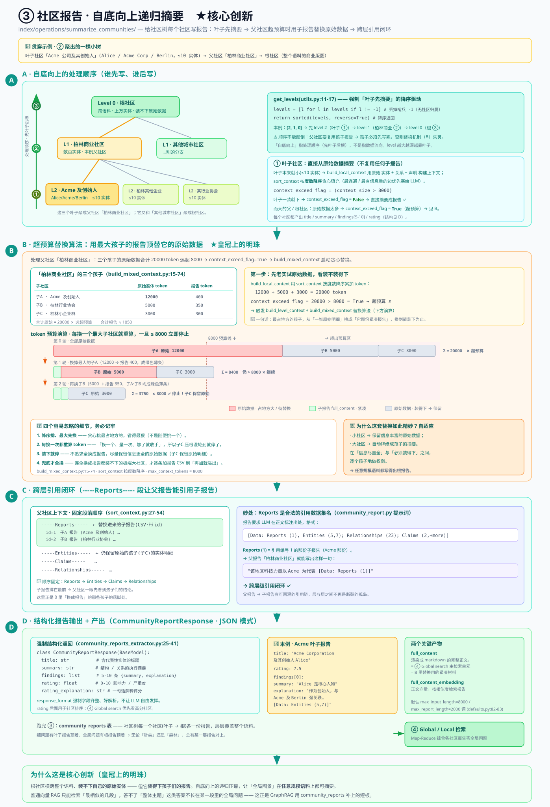

# ③ 社区报告：自底向上递归摘要 ★核心创新

> GraphRAG 核心机制深入 · **3 / 5** · [← 上一篇：② 层次化 Leiden](./core-02-hierarchical-leiden.md) · [总览](./core-deep-dive.md) · [下一篇：④ Global / Local 检索 →](./core-04-query-global-local.md)
> 版本 `graphrag` 3.1.0 · 所有 `file:line` 引用相对 `packages/graphrag/graphrag/`。

**位置**：`index/operations/summarize_communities/`，提示词 `prompts/index/community_report.py`。

这是 GraphRAG 全部机制里**最关键**的一环。理解它，就理解了为什么 GraphRAG 能做"全局问答"。

---

## 这一步在做什么（先看大白话）

上一篇 **② 层次化 Leiden 聚类** 已经把知识图谱切成了一棵**社区树**：最底下是一个个只有几个实体的"叶子社区"，往上是把叶子合起来的中层社区，最顶上是横跨整个语料、动辄上万实体的"根社区"。这一篇要做的事，就是**给这棵树上的每一个社区，写一份"报告"**——一段自然语言的小结，说清楚"这个社区讲的是什么、里面有哪些关键角色、它们之间发生了什么"。

那问题来了：**为什么要写报告？直接检索原始数据不行吗？**

先想想普通的**向量 RAG** 是怎么工作的。你问一个问题，它把问题变成向量，去一堆文本块里找**最相似的几段**，把这几段塞给 LLM 让它作答。这套办法回答"Alice 在哪家公司工作"没问题——答案就藏在某一两段话里，检索到就行。

但你要是问 **"这个语料的主要主题是什么？"** 或者 **"这堆文档整体在讲一个什么样的故事？"**，向量 RAG 就抓瞎了。因为**这种问题的答案不在任何一段话里**——它散落在成千上万段话里，需要"通读全部、再综合"才能回答。向量 RAG 只会捞回来"最相似的 5 段"，你拿 5 段去回答"整体主题"，当然是盲人摸象。而"通读全部"又根本做不到：几万个实体的原始数据，**塞不进任何一个 LLM 的上下文窗口**。

> 换句话说：向量 RAG 擅长"针尖问题"（答案是一个点），不擅长"全局问题"（答案是整片森林）。GraphRAG 的社区报告，就是专门为"全局问题"造的。

GraphRAG 的解法叫 **自底向上递归摘要（bottom-up recursive summarization）**。打个最贴切的比方——**这就像一家大公司写年报**：

- **叶子社区**像公司里的一个个**小组**。小组长通读自己组里的原始邮件、聊天记录，写一份**小组小结**。
- **父社区**像**部门**。部门经理**不用**回头去重读每个小组的几千封原始邮件——那他一辈子也读不完。他只需要读**各小组交上来的小结**，就能写出**部门报告**。
- **根社区**像**整个公司**。CEO 也不读原始邮件，甚至不读小组小结，他只读**各部门的报告**，就能写出**全公司总结**。

关键洞察在这里：**"全公司概况"这种一个人根本读不完全部原始资料的问题，靠"层层摘要、逐级向上"就能回答。** 每一层都只读下一层的摘要，而不是原始数据，所以无论语料多大，每一步都装得进上下文窗口。最后你得到的，是一整套**从细到粗、层层覆盖全语料**的自然语言报告——它们就是回答"全局问题"的弹药。

> 打个比方：这一步像是把一座图书馆，先给每本书写摘要，再给每个书架写"这排书讲什么"，再给整个楼层写"这层是什么主题"。想了解全馆概况，你读几张楼层牌子就够了，不用把书全搬出来。

---

## 术语小抄（看不懂的词先查这里）

| 词 | 通俗解释 |
|---|---|
| **社区（community）** | ② 聚类的产物：图里联系紧密的一撮实体被分到一组。比如 "Alice / Acme / Berlin" 这些强关联的点会聚成一个社区。 |
| **社区树 / 层级（level）** | 社区是分层的。`level` 数字**越大越深、越细**（叶子）；越小越粗（越靠近根）。level-0 就是最顶层的根社区。 |
| **社区报告（community report）** | 本篇的主角。给一个社区写的一段结构化小结，含标题、摘要、若干条洞见、一个评分。是后面 Global search 的检索单元。 |
| **自底向上（bottom-up）** | 处理顺序：**先摘要最深的叶子，再一层层往上**。因为父社区要复用孩子的报告，孩子必须先写完。 |
| **递归摘要** | "摘要之上再摘要"。叶子摘要原始数据 → 父摘要孩子的报告 → 根摘要孩子的报告……一层套一层。 |
| **叶子社区 / 根社区** | 叶子 = 树最底层、最小的社区（可能只有 ≤10 个实体）；根 = 最顶层、最大的社区（可能上万实体）。 |
| **上下文窗口预算（token budget）** | LLM 一次能读的文字有上限，按 token 计。这里给"喂给报告 LLM 的输入"定了个上限：**默认 8000 token**。 |
| **超预算（context exceed）** | 一个社区的原始数据换算成 token 后，超过了上面那个 8000 的上限，塞不下。这时就要启动"替换"来瘦身。 |
| **原始数据 vs 报告** | "原始数据" = 社区里一条条实体、关系、声明的明细（很占地方）；"报告" = 对这些明细的一段摘要（紧凑得多）。替换算法就是用后者顶替前者。 |
| **full_content** | 一份社区报告渲染成 markdown 后的完整正文。它既是"给父社区复用的紧凑材料"，也是后面 Global search 检索的主要单元。 |
| **findings（洞见）** | 报告里的核心发现，5–10 条，每条是 `{summary 一句话, explanation 详细解释}`。 |
| **rating（评分）** | 报告给这个社区打的一个 0–10 分，表示它的"重要性/影响力/严重度"。后面用它给社区排序。 |
| **JSON 模式（response_format）** | 强制 LLM 按一个固定的数据结构（`CommunityReportResponse`）返回，而不是自由发挥。这样字段齐整、好解析。 |
| **引用 / citation** | 报告正文里会标 `[Data: Reports (1), Entities (5,7); ...]` 这样的出处，表明"这句话是根据哪些数据得出的"，可回溯。 |
| **贪心（greedy）算法** | 一种"每一步都选当下最划算的那个"的策略。这里指：每次都先拿**最大**的子社区去替换，因为它最能立竿见影地省 token。 |
| **度数（degree）** | 一个实体在图里连了多少条边。度数高 = 更"中心"、更有信息量，填充上下文时优先放它。 |

---

## 配图总览



这张图分几大块，对应本文的几个大节，数据流是"左边自底向上产报告 → 右边父社区超预算时拿这些报告去替换"：

- **左侧 · 社区树 + 自底向上处理顺序 ①②③** — 一棵三层的社区树（叶子 L2 → 中层 L1 → 根 L0），左边一根绿色向上箭头标着处理顺序：**① 先摘要叶子 → ② 再摘要中层 → ③ 最后摘要根**。底部灰条说明"叶子直接从原始实体+关系+声明摘要"。
- **右侧 · `build_mixed_context` 超预算替换算法** — 橙色大框，演示处理 level-0 根社区时的困境：原始子数据远超 8000 token 预算。上面有一条 **token 预算条**（画出 8000 的上限线），下面把子社区**按大小降序**排成几条，最大的那条（红色，超大 ✗）被一根橙色箭头"替换为其报告"（变成绿色的紧凑 `full_content` ✓），其余装得下的子社区保留原始数据。旁边写着循环规则与兜底规则。
- **右下 · 跨层引用闭环** — 靛蓝色框，点明替换进来的子报告以 `-----Reports-----` 段出现在父上下文里，而报告提示词允许引用 `Reports` 数据集，于是 `[Data: Reports (1), Entities (5,7); ...]` 这样的引用把跨层级闭环了。
- **底部 · 为什么这是核心创新** — 绿色横条，一句话总结：根社区装不下自己的原始实体，但装得下孩子们的报告；这让"全局图景"在任意规模语料上都可摘要，正好补上向量 RAG 的短板。

下面逐块细讲，全程用**同一个例子**串起来。

> 🧵 **贯穿全文的例子**
> 还记得 ① 抽出、② 聚类的那批点吗——**Alice、Acme Corp、Berlin** 这些强关联的实体。假设 ② 把它们聚成了这样一棵小树：
> - 叶子社区 **"Acme 公司及其创始人"**（含 Alice、Acme Corp 等 ≤10 个实体）
> - 它和别的叶子（比如"柏林其他企业""某行业协会"）一起，聚成父社区 **"柏林商业社区"**
> - "柏林商业社区" 又和别的城市社区一起，聚成 **根社区**（整个语料的商业版图）
> 本文就看这棵树是怎么从下往上，一层层写出报告的。

---

## 3.1 为什么它是核心（把大白话落到机制上）

对应图**底部绿色横条**。这一节回答："**为什么说这一步是 GraphRAG 的皇冠？**"

一个横跨整个语料的 **level-0 根社区**可能包含上万个实体——**它的原始实体/关系绝无可能塞进任何 LLM 上下文窗口**。你就算有个 100 万 token 的超大模型，几万个实体加上它们之间的关系明细也未必装得下，何况成本高到离谱。

普通向量 RAG 面对"这个数据集的主要主题是什么"这种问题，只能检索到几个局部片段——它捞回来的永远是"和问题字面最像的几段"，而"整体主题"这种答案**根本不长在某一段里**，所以它无法给出全局图景。

GraphRAG 的解法就是前面那个"公司年报"的比方：**自底向上递归摘要**。

- 先把最细的**叶子社区**摘要成一份短报告（叶子直接读原始实体+关系+声明）。
- **父社区不看原始数据，而是看孩子的报告**。
- 一层层往上，直到根。

这样一来，一个根社区虽然**装不下自己的原始实体**，却**装得下孩子们的报告**——因为报告已经被压缩得很短了。**语料的全局结构，就被逐层压缩成了可被检索的自然语言。** 这正是向量 RAG 做不到、而 GraphRAG 能做到"全局问答"的根本原因。

> 📌 一句话记住：**根社区读不完自己的原始数据，但读得完孩子的报告。** 整套机制就建立在这一句上。

---

## 3.2 自底向上的顺序（谁先写、谁后写）

对应图**左侧那根绿色向上箭头**和 ①②③ 三个圈。这一节回答："**为什么必须从叶子开始，不能从根开始？**"

道理很简单：父社区要**复用孩子的报告**，所以**孩子必须先写完**。你不可能让部门经理在小组小结还没交上来的时候就写部门报告。于是处理顺序必须**从最深的叶子层开始，一层层往上**。

代码里这个方向由 `get_levels`（`utils.py:11-17`）**强制**保证。它做两件事：

1. 丢掉 `-1`（那是"没有社区归属"的哨兵值，不是真正的层）。
2. 把所有 level **降序**返回：`sorted(levels, reverse=True)`。

`level` 数字越大越深（越靠叶子），降序就意味着**最深的叶子层最先被摘要**。等轮到处理某个父层时，它孩子的报告**早就生成好、就绪可供复用**了。

拿我们的例子：先给最深的叶子 **"Acme 公司及其创始人"** 写报告（图里的 ①），再给中层 **"柏林商业社区"** 写报告（②，此时它能直接拿到 Acme 那份报告），最后才轮到根社区（③）。

> ⚠️ 初学者容易搞反：这里的"自底向上"指**处理顺序**（先叶子后根），不是指"数据往上流"。数据确实也是往上汇聚的，但关键是**顺序不能颠倒**——颠倒了父社区就拿不到孩子的报告，整个替换机制（下一节）就失灵了。

---

## 3.3 关键：超预算时用子报告替换原始数据 ★皇冠上的明珠

对应图**右侧橙色大框**。这一节是全篇——甚至全系列——**最核心的一段**，请慢慢读。它回答："**父社区的原始数据装不下，具体是怎么一步步塞进去的？**"

### 3.3.1 先试原始数据，看装不装得下

每个社区**第一步都先老实尝试**：用**原始实体 + 关系 + 声明**来构建上下文（`build_local_context`）。

怎么构建？靠 `sort_context`（`graph_context/sort_context.py`）。它不是随便乱塞，而是**按度数降序**贪心填充——**最连通、最有信息量的边优先放**（度数高的实体更"中心"，更该被 LLM 看到）。它逐条累加 token，一旦累加到 `> max_context_tokens`（**默认 8000**）就**截断**，并产出一个标志位：

```
context_exceed_flag = context_size > max_context_tokens
```

- 对**叶子社区**：原始数据本来就小（≤10 个实体），一装就下，`context_exceed_flag=False`，直接拿原始数据摘要成报告，皆大欢喜。这就是图左侧底部灰条说的"① 叶子：直接从原始实体+关系+声明摘要"。
- 对**大的父社区 / 根社区**：原始数据太多，`context_exceed_flag=True`（**超预算**），装不下——这时才需要下面的替换算法救场。

### 3.3.2 替换算法：用最大的孩子的报告，顶替它的原始数据

对于**超预算**（`context_exceed_flag=True`）的社区，`build_level_context` + `build_mixed_context`（`build_mixed_context.py:15-74`）执行 **替换算法**。核心思想一句话：**把最占地方的那个孩子，从"一堆原始明细"换成"它那份紧凑的报告"，换到能装下为止。**

具体四步：

1. **把子社区按 `context_size` 降序排**（最大的先处理）。为什么先动最大的？因为它最占地方，换掉它省的 token 最多——这就是**贪心**：每一步都挑当下最划算的动作。
2. **贪心遍历子社区，逐个替换**：把当前最大的那个子社区的**冗长原始实体**，替换成它**已经生成好的紧凑报告**（`full_content`）。还没有报告的子社区，就保留它的原始 `ALL_CONTEXT`（原始明细）。
3. **每替换一次就重建候选串**（已替换的用报告 + 剩余孩子的原始数据），**重新算一遍 token**；一旦 `<= max_context_tokens`（8000）就**立即停止**，不再多换。
4. **兜底**：万一把**所有**孩子都换成报告了，加起来**仍然**超预算 → 那就退而求其次，**逐条往里加报告 CSV**，加到"再加下一条就要溢出"为止（接受截断，能装多少算多少）。

### 3.3.3 用具体的 token 数字走一遍（重点中的重点）

光看步骤还是抽象，我们拿 **"柏林商业社区"** 这个父社区，配上具体数字演示一遍。假设预算是 `max_input_length = 8000` token，而它有三个孩子：

| 子社区 | 原始实体要多少 token | 它自己的报告（full_content）多少 token |
|---|---|---|
| 子 A：**Acme 公司及其创始人** | **12000**（最大） | 约 **400** |
| 子 B：柏林某行业协会 | 5000 | 约 350 |
| 子 C：柏林某小企业群 | 3000 | 约 300 |

**一开始全用原始数据**：12000 + 5000 + 3000 = **20000 token**，远超 8000，超预算 ✗。（这正是图里橙框顶部那句"原始子数据远超 8000 token 预算 →"。）

现在启动替换，**降序排**后第一个动的就是最大的**子 A**：

- **第 1 次替换**：把子 A 的原始实体（12000）换成它的报告（400）。重算：400 + 5000 + 3000 = **8400 token**。还是 > 8000 ✗，**继续**。
- **第 2 次替换**：轮到第二大的**子 B**，把它的 5000 换成报告 350。重算：400 + 350 + 3000 = **3750 token**。**≤ 8000 了！立即停止 ✓**。

最终这个父社区喂给 LLM 的上下文 = **子 A 报告 + 子 B 报告 + 子 C 原始数据**（子 C 根本没轮到就停了，保留原始明细，因为它够小、还装得下）。这正好对应图右侧：子 A 那条红色"超大 ✗"被箭头换成绿色"报告 ✓"，而装得下的子 B/子 C 就保留原始。

> 🔧 **三个容易忽略的细节，务必记牢**：
> 1. **降序排、最大的先替换**——不是随便挑一个，是**贪心地挑最大的**，因为省得最狠。
> 2. **每换一次都重算 token**——不是一次性全换，是"换一个、量一次、够了就收手"。所以子 C 可能压根没被动到。
> 3. **装下就停**——不追求"全换成报告"，能省到预算内就见好就收，尽量保留信息更全的原始数据。
> 4. **兜底才全换**——只有连全换成报告都装不下的极端大社区，才会退到"逐条加报告直到溢出"。

> 📌 为什么这套替换如此精妙？因为它**自适应**：小社区保留信息丰富的原始数据，大社区自动降级成孩子的摘要——**在"信息尽量全"和"必须装得下"之间，逐个孩子地做权衡**。这就是 GraphRAG 能在**任意规模**语料上都写出根报告的秘密。

### 3.3.4 跨层引用闭环（`-----Reports-----`）

对应图**右下靛蓝色框**。这里有个漂亮的收尾设计。

上面被替换进来的**子报告**，在父社区的上下文里不是随便乱贴的，而是以一个专门的段落 **`-----Reports-----`** 呈现（`sort_context.py:27-54` 里固定了顺序：**Reports → Entities → Claims → Relationships**）。也就是说，父社区的上下文长这样：

```
-----Reports-----
（子 A 的报告、子 B 的报告……以 CSV 形式列出，每份带一个 id）
-----Entities-----
（还保留原始数据的那些孩子的实体明细）
-----Claims-----
...
-----Relationships-----
...
```

妙就妙在：报告提示词（`community_report.py`）的**引用规则**里，`Reports` **正是一个合法的数据集名**。报告要求 LLM 在正文里标注出处，格式就是：

```
[Data: Reports (1), Entities (5,7); Relationships (23); Claims (2,+more)]
```

看到没——`Reports (1)` 就是在引用**编号为 1 的那份子报告**。这就把**跨层级的引用闭环**了：

> **父报告能够引用子报告。** 当 LLM 给"柏林商业社区"写报告、读到 `-----Reports-----` 段里 Acme 那份子报告时，它可以在父报告里写一句"该地区的科技力量以 Acme 为代表 `[Data: Reports (1)]`"——出处直接指回子报告。层与层之间因此有了可回溯的引用链，而不是断裂的孤岛。

---

## 3.4 结构化报告输出（每份报告长什么样）

对应图左侧灰条那句"→ 每个社区产出 title / summary / findings[5-10] / rating（JSON 模式）"。这一节回答："**LLM 写出来的报告，具体是什么格式？**"

`CommunityReportsExtractor` 在 **JSON 模式**下强制 LLM 按一个固定结构 `response_format=CommunityReportResponse` 返回（`community_reports_extractor.py:25-41`）。不让它自由发挥，而是要求它填这几个字段：

```python
class CommunityReportResponse(BaseModel):
    title: str              # 含代表性命名实体的标题
    summary: str            # 结构与关系的执行摘要
    findings: list[FindingModel]   # 5-10 条洞见，每条 {summary, explanation}
    rating: float           # 0-10 影响力/严重度评分
    rating_explanation: str # 一句话解释这个评分为什么这么打
```

逐个字段说人话：

- **`title`（标题）**：一句能代表这个社区的名字，通常含关键实体。比如给我们的叶子社区可能起 **"Acme Corporation 及其创始人 Alice"**。
- **`summary`（摘要）**：一段"执行摘要"，讲清这个社区的整体结构和主要关系。相当于年报开头那段"本部门概况"。
- **`findings`（洞见）**：**5–10 条**核心发现，每条是 `{summary（一句话结论）, explanation（展开解释）}`。比如一条 finding 可能是 `{summary: "Alice 是核心人物", explanation: "作为创始人，Alice 与公司及所在城市 Berlin 均有强关联……[Data: Entities (...)]"}`。
- **`rating`（评分）**：给这个社区打一个 **0–10** 分，代表它的重要性 / 影响力 / 严重度。这个分数**后面用于社区排序**——④ Global search 会优先看高分社区。
- **`rating_explanation`**：一句话说明为什么打这个分。

📌 其中最重要的产物是两个：

- **`full_content`**：把上面这些字段**渲染成 markdown** 的完整报告正文。它是后续 **Global search 的主要检索单元**——也就是说，你以后问"全局问题"时，系统检索的就是这一份份 `full_content`。同时它也是 3.3 里被拿去**替换父社区原始数据**的那份"紧凑材料"。
- **`full_content_embedding`**：`full_content` 的向量。用于后面按相似度检索报告。

默认限制：报告最长 `max_report_length = 2000` 词，输入上下文最多 `max_input_length = 8000` token（`defaults.py:82-83`），rating 范围 0–10（由 `community_report.py` 提示词规定）。

---

## 这一步整体产出了什么

跑完 ③，你得到一张核心表：

- **`community_reports`**：社区树上**每一个社区**（从叶子到根）各一份报告，每份带 `title / summary / findings / rating`，外加渲染好的 `full_content` 和它的向量 `full_content_embedding`。

这张表最妙的地方在于：它**层层覆盖了整个语料**——细的问题有叶子报告顶着，全局的问题有根报告顶着。无论问题是"针尖"还是"森林"，总有某一层的报告能对上。

---

## 本篇关键默认值

| 环节 | 参数 | 默认 | 出处 | 一句话 |
|---|---|---|---|---|
| 社区报告 | `max_length`（报告最长） | 2000 词 | `defaults.py:82-83` | 每份报告最多写这么长 |
| 社区报告 | `max_input_length`（输入预算） | 8000 token | `defaults.py:82-83` | 喂给 LLM 的上下文上限，超了就触发替换 |
| 上下文构建 | `max_context_tokens` | 8000 | `build_mixed_context.py` / `sort_context.py` | 原始数据累加超它 → `context_exceed_flag=True` |
| 处理顺序 | `get_levels` 降序 | 降序 | `utils.py:11-17` | 丢掉 `-1`、降序返回，强制"叶子先摘要" |
| 报告结构 | rating 范围 | 0–10 | `community_report.py` 提示词 | 打分用于社区排序 |
| 引用规则 | 合法数据集名 | Reports/Entities/Relationships/Claims | `community_report.py` 提示词 | `Reports` 让父报告能引用子报告 |

---

**产出** `community_reports` 表（title/summary/findings/rating + 向量）—— 这是 ④ Global search 做全局综合的检索单元。

👉 **[④ Global / Local 检索](./core-04-query-global-local.md)** 会拿这一层层报告来回答问题：面对"全局问题"，它用 **Map-Reduce** 把每份相关社区报告先各自"Map"出一个局部答案，再"Reduce"综合成最终回答——这正是本篇写好的报告发光发热的地方。

[← 上一篇：② 层次化 Leiden](./core-02-hierarchical-leiden.md) · [总览](./core-deep-dive.md) · [下一篇：④ Global / Local 检索 →](./core-04-query-global-local.md)
