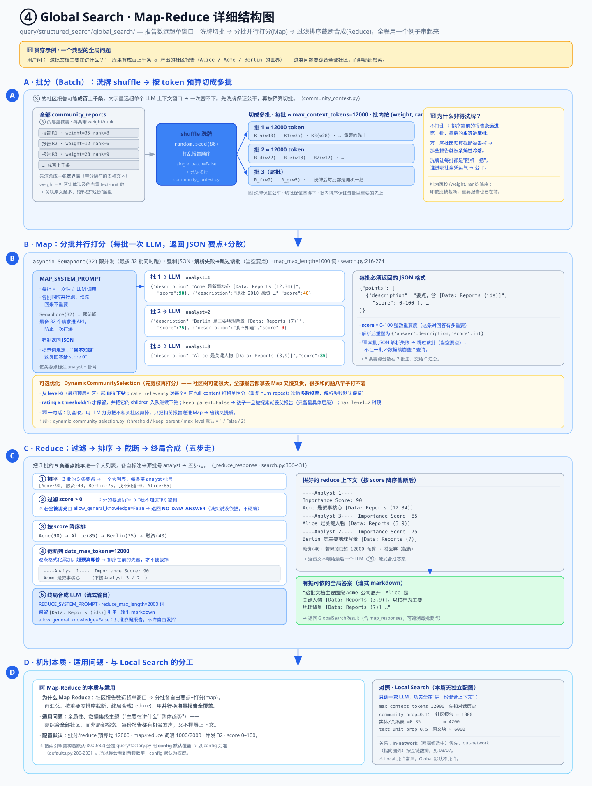

# ④ 查询：Global（Map-Reduce）与 Local（混合上下文）

> GraphRAG 核心机制深入 · **4 / 5** · [← 上一篇：③ 社区报告](./core-03-community-reports.md) · [总览](./core-deep-dive.md) · [下一篇：⑤ DRIFT 检索 →](./core-05-drift-search.md)
> 版本 `graphrag` 3.1.0 · 所有 `file:line` 引用相对 `packages/graphrag/graphrag/`。

**位置**：`query/structured_search/global_search/` 与 `query/structured_search/local_search/`。

---

## 这一步在做什么（先看大白话）

前面 ①②③ 三步，全都是**离线建库**——你可以理解成"图书馆闭馆装修"：

- **①** 让 LLM 逐段读文档，抽出**实体**（点）和**关系**（线），并给每个实体的描述生成一个**向量**。
- **②** 把这张图按关系权重聚成一棵**多层社区树**（大社区套小社区）。
- **③** 给每个社区写一份**社区报告**（一段层层递归的摘要）。

到这一步为止，库里已经躺好了四样东西：**实体表、关系表、社区报告、向量库**。它们不会再变了。

**这一步（④）是"开馆营业、在线回答问题"**——用户扔来一个问题，我们从建好的库里捞料、拼上下文、喂给 LLM，产出答案。GraphRAG 提供了两种截然不同的问法：

| | **Global Search（全局搜索）** | **Local Search（局部搜索）** |
|---|---|---|
| 适合的问题 | 全局大主题，如"**这批文档主要在讲什么？**""整体趋势是什么？" | 具体实体，如"**Alice 和 Acme 是什么关系？**""Berlin 发生过哪些事？" |
| 吃什么料 | 只吃 **③ 的社区报告**（全部或剪枝后的） | 从 query 找到相关**实体**，再把它相关的报告 / 实体 / 关系 / 原文块**混着**拼进去 |
| 怎么算 | **Map-Reduce**：分批并行出要点，再汇总 | **单次** LLM 调用，喂一份精心拼装的"混合上下文" |

> 打个比方：
> - **Global** 像一家咨询公司接了个大题目。老板把一摞行业报告分给**每个分析师**，让他们各读一批、各写几条要点并给每条打分（这是 **Map**）；然后**主编**把所有分析师的要点收上来，按分数排序、砍掉不重要的、汇总成一份总报告（这是 **Reduce**）。
> - **Local** 像针对**某一个具体的人**做背景调查：把他的**个人档案、同事名单、相关事件、原始文件**全摊在桌上，一次性看完再回答。

---

## 术语小抄（看不懂的词先查这里）

| 词 | 通俗解释 |
|---|---|
| **查询 / 检索（query / retrieval）** | query = 用户问的那句话；retrieval = "从库里捞出相关资料"这个动作。RAG 的核心就是"先检索、再让 LLM 根据检索到的料作答"。 |
| **Map-Reduce** | 一种"分而治之"的经典套路。**Map**：把大任务切成小块，每块独立处理（可并行）；**Reduce**：把每块的结果汇总成一个最终答案。Global 就是它。 |
| **批（batch）** | 一"批"社区报告。报告太多一次塞不进 LLM，就切成好几批，每批单独喂一次。 |
| **shuffle（洗牌）** | 把报告顺序**打乱**再切批，避免"排在前面的报告总是分到第一批"这种系统性偏袒。 |
| **并发 / Semaphore（信号量）** | 多批报告同时发给 LLM 处理叫"并发"。`Semaphore(32)` 是个"限流阀"，最多同时放 32 个请求进去，防止一次打爆 API。 |
| **要点 + 重要度分（points / score）** | Map 阶段每批 LLM 返回一串"要点"（points），每条要点附一个 0–100 的分数（score），表示"这条对回答问题有多重要"。 |
| **截断（truncate）** | 料太多、超预算了，就按顺序往里塞，**塞到装不下就停**，后面的丢掉。 |
| **token 预算** | LLM 的上下文窗口是有限的（按 token 计）。我们给每一块料都分配一个 token 上限，这就是"预算"。 |
| **混合上下文（mixed context）** | Local 的招牌。不是只喂一种料，而是把"社区报告 + 实体表 + 关系表 + 原文块"**几种料按比例混在一起**喂给 LLM。 |
| **向量检索 / 相似度** | 把 query 也变成一个向量，去**实体描述向量库**里找"方向最接近"的实体。语义越相近，向量越接近。 |
| **top-k** | "取最相关的前 k 个"。比如 `top_k_entities=10` 就是取最相似的 10 个实体。 |
| **in-network / out-network 关系** | 站在"选中实体"这个圈子看关系：**两端都在圈内** = in-network（网内）；**一端在圈内、一端在圈外** = out-network（网外）。 |
| **对话历史** | 多轮对话里之前聊过的内容。它也要占 token，所以拼上下文时**先扣掉它**。 |
| **动态社区选择** | Global 的可选优化：不盲目取全部报告，而是**先用 LLM 给每个报告打相关性分**，把不相关的剪掉，只留相关的。 |
| **常识（general knowledge）** | LLM 脑子里自带的世界知识（没写在你的文档里）。Local **允许**用一点，Global 默认**不允许**（只准依据报告）。 |

---

## 配图总览



这张图画的是 **Global Search 的 Map-Reduce 流水线**，数据从左往右流：

- **左区 · 全部 community_reports** — 库里成百上千条社区报告，先 shuffle 洗牌、再按 token 预算切成多个批次。
- **中区（MAP）· 分批并行打分** — 每批各发一次 LLM，返回"要点 + score"列表；底下那个黄框是可选的**动态社区选择**（先剪枝再打分）。
- **右区（REDUCE）· 汇总合成** — 把所有批的要点摊平 → 过滤 score>0 → 按 score 降序 → 截断到预算 → 喂给最终 LLM 流式合成答案。
- **底部横条 · 机制本质与适用** — 为什么要 Map-Reduce、它适合什么问题、和 Local 的分工。

> ⚠️ **本篇讲两种搜索，但只有 Global 有配图。** Local Search 没有独立配图，下面 **4.2 节**用文字 + 表格讲清楚。看到 4.2 就别再对着这张图了。

下面先逐区块拆 Global，再讲 Local。全程用**同一个例子**（Alice / Acme / Berlin）串。

---

## 4.1 Global Search — 对社区报告做 Map-Reduce

**位置**：`query/structured_search/global_search/`。适合"全局性、数据集级主题"问题。

先说**为什么非得分批**：③ 产出的社区报告可能有**成百上千条**，全部加起来的文字量远远超过一个 LLM 上下文窗口能装的量——一次根本塞不下。硬要塞就得砍掉大半，那就不叫"全局"了。Map-Reduce 的思路是：**既然一口吃不下，就分几口吃，每口各出结论，最后把结论汇总。**

### 批分（Batch）：洗牌 + 切批

对应图**左区**。代码在 `community_context.py`：

1. 把所有社区报告渲染成一张**定界表**（带分隔符的表格文本）。
2. `random.seed(86)` 后 **shuffle 洗牌**——打乱报告顺序。
   > 为什么要洗牌？如果不打乱，排序靠前的报告永远进第一批、靠后的永远进最后一批。万一后面因预算截断丢掉了尾批，那些报告就**系统性地被冷落**了。洗牌让每批都是"随机一把"，公平。
3. 按 `max_context_tokens`（**12000**）把报告切成**多个批次**（`single_batch=False` 表示允许多批）。
4. 每批内部再按 `(weight, rank)` 降序排——重要的报告排前面。
   > **社区权重** = 该社区里的实体涉及的**去重 text-unit 数**（可归一化）。直觉：一个社区关联的原文块越多，说明它在语料里"戏份"越重。

📌 一句话：**洗牌保证公平，切批保证塞得下，批内排序保证每批里重要的先上。**

### Map 步：每批并行出"要点 + 分数"

对应图**中区**。代码 `_map_response_single_batch`（`search.py:216-274`）：

- 每批**一次 LLM 调用**，用 `asyncio.Semaphore(32)` 限并发（最多 32 批同时跑），强制 LLM 返回 **JSON**。
- 每批必须返回一个**要点列表**，格式长这样：

```json
{"points": [
    {"description": "要点，含 [Data: Reports (ids)] 引用", "score": 0-100}
]}
```

- **`score`** 是 0–100 的整数**重要度**：这条要点对回答用户问题有多重要。提示词特意规定："**'我不知道'这类回答给 0 分**"。
- 解析后代码内部把它重塑成 `{"answer": description, "score": int}`。
- 🔧 **容错**：如果某批 LLM 返回的 JSON 解析失败，就**跳过这一批**（当作空要点），不让一批坏数据搞崩整个查询。

> 🧵 **小例子**：假设问题是"这批文档主要在讲什么？"，报告被切成 3 批：
> - **批 1** 出 2 条要点：`{"Acme 公司是叙事核心，多起事件围绕它" , score: 90}`、`{"提到一次 2010 年的融资", score: 40}`
> - **批 2** 出 2 条：`{"Berlin 是主要地理背景", score: 75}`、`{"我不知道", score: 0}`
> - **批 3** 出 1 条：`{"Alice 是关键人物", score: 85}`
>
> 注意这几批是**同时并行**跑的，谁先回来不重要。每条要点还会被标注它来自哪一批（`analyst` = 批号），方便 Reduce 追溯。

### Reduce 步：过滤 → 排序 → 截断 → 合成

对应图**右区**。代码 `_reduce_response`（`search.py:306-431`），五步走：

1. **摊平**所有批的要点，各自标注来源批号 `analyst`。（把上面 3 批的 5 条要点倒进一个大列表。）
2. **过滤 `score > 0`**：把 0 分的要点扔掉（那条"我不知道"就没了）。
   > ⚠️ **边界情况**：如果**所有**要点都被滤光了，而且 `allow_general_knowledge=False`（Global 默认就是 False），直接返回固定的 `NO_DATA_ANSWER`——诚实地说"没找到依据"，而不是硬编一个答案。
3. **按 score 降序排**：`Acme(90) → Alice(85) → Berlin(75) → 融资(40)`。
4. **截断到 `data_max_tokens`（12000）**：逐条格式化成一块块文本累加：

   ```
   ----Analyst 1----
   Importance Score: 90
   Acme 公司是叙事核心……
   ----Analyst 3----
   Importance Score: 85
   Alice 是关键人物……
   ```

   一直往里塞，**超预算就停**，后面的要点丢掉。所以排序很关键——**重要的先塞，才不会被截断截掉**。
5. **终局合成**：把排好序的要点喂给最后一个 LLM（**流式**输出），产出一段保留 `[Data: Reports (ids)]` 引用的 markdown 答案。

> 📌 **Map-Reduce 的本质**（对应图底部横条）：社区报告数量可能远超单窗口，于是"**分批各自出要点 + 打分（map）→ 汇总、按重要度排序截断、终局合成（reduce）**"。用 map 的**并行**换取对**海量报告的全覆盖**——每份报告都有机会发声，同时又不会撑爆上下文。

### 动态社区选择（可选，先剪枝再打分）

对应图中区那个**黄框**。`DynamicCommunitySelection`（可选开启）解决一个浪费问题：**社区树可能很大，全部报告都拿去 Map 又慢又贵，其中很多和问题八竿子打不着。**

它的做法是**先用 LLM 剪枝**：

- 从 **level-0（最粗的顶层社区）开始 BFS 下钻**。
- `rate_relevancy` 对每个社区的 `full_content` 打**相关性分**（重复 `num_repeats` 次做**多数投票**，解析失败则默认保留）。
- `rating >= threshold(1)` 才保留，并把它的 `children`（更细的子社区）入队，继续往下钻。
- `keep_parent=False` 时，**孩子一旦被探索，就丢掉父报告**——只保留最具体的那个相关层级，避免父子重复。
- `max_level=2` 封顶，最多钻两层。

> 一句话：**别全取，用 LLM 打分把不相关的社区剪掉，只把相关的报告送进 Map**，省钱又提质。

---

## 4.2 Local Search — 实体局部的混合上下文

**位置**：`query/structured_search/local_search/mixed_context.py`。**单次** LLM 调用，适合"具体的、实体局部"问题。

> ⚠️ Local **没有独立配图**，下面全靠文字 + 表格。它和 Global 最大的不同：Global 是 Map-Reduce 多次调用，**Local 只调一次 LLM**，功夫全花在"**怎么把最相关的料拼进这一次的上下文**"。

Local 的整条流水线可以理解成三步：**从 query 找到相关实体 → 顺着图把相关料捞齐 → 按预算比例拼成一份混合上下文**。用 Alice / Acme / Berlin 的例子走一遍。

### ① query → 实体（找入口）

代码 `map_query_to_entities`（`entity_extraction.py`）：

- 把用户的 query（比如"Alice 和 Acme 是什么关系？"）**嵌入成向量**。
- 拿这个向量去 **① 建好的实体描述向量库**做 `similarity_search_by_text`，找语义最接近的实体。
- 取 `top_k_mapped_entities(10) × oversample_scaler(2) = 20` 个候选。
  > 🔧 **为什么多取一倍（oversample）？** 检索到的候选里可能有要被排除的（`exclude_entity_names`），多捞一些留出余量，剔除后还够 10 个。
- `include_entity_names` 指定的实体**强制置顶**，`exclude_entity_names` 指定的**剔除**。
- 📌 **边界**：如果 query 为空，就回退成"按 `rank` 取 top-k"——没有语义线索时，就拿全局最重要的实体顶上。

例子里，这一步大概会命中 **Alice、Acme、Berlin** 这几个实体，它们就是后面所有检索的"入口"。

### ② 组装混合上下文 + 按比例分预算

代码 `build_context`。总预算 `max_context_tokens=12000`。分配顺序很讲究——**先扣对话历史**（多轮对话时之前聊的内容也占地方），**剩下的**再切成三块（config 默认）：

| 块 | 装什么 | 比例 | token |
|---|---|---|---|
| **社区报告** | 选中实体所属的社区报告，按 `(命中数, rank)` 排序 | `community_prop=0.15` | 1800 |
| **实体 / 关系 / 声明表** | 选中实体本身、它们之间的关系、相关声明（local 剩余） | `1 - 0.15 - 0.5 = 0.35` | 4200 |
| **关联原文 text units** | 这些实体牵出的原始文本块 | `text_unit_prop=0.5` | 6000 |

> 📌 直觉解读三块比例：**原文块拿了一半（0.5）**——因为具体问题最终要靠原文佐证；**实体/关系表 0.35**——图结构是 GraphRAG 的核心价值；**社区报告只留 0.15**——给一点"宏观背景"就够了，Local 主打局部。

拿例子说：找到 Alice/Acme/Berlin 后，就把**它们所属社区的报告**（背景）、**它们仨这几个实体行 + 之间的关系**（Alice→Acme、Acme→Berlin）、**牵出的原文块**（"Alice works at Acme Corp in Berlin…"那段）全按预算拼进同一份上下文，一次喂给 LLM 回答。

### 关系的排序与选择（图的价值所在）

代码 `local_context.py` / `relationships.py`。选中实体之间和向外的关系太多时，得排个优先级。规则是**先网内、后网外**：

| 类型 | 定义 | 排序规则 |
|---|---|---|
| **In-network（网内）优先** | 两端**都是**选中实体的关系 | 按 `rank`（边的合并度数）降序 |
| **Out-network（网外）其次** | 从选中实体指向**未选中**实体的关系 | **互链优先**：先按 `links`（有多少个选中实体指向这个外部实体）排，再按 rank |

- 关系总预算 = `top_k_relationships(10) × 选中实体数`。

> 🧵 例子：Alice、Acme、Berlin 都被选中。
> - `Alice → Acme`、`Acme → Berlin` 两端都在圈内 → **in-network**，优先，按边权重排。
> - 假设 Acme 还连着一个没被选中的 `Investor X` → 这是 **out-network**。如果 Alice 和 Acme **都**指向 Investor X（`links=2`），它就比只有一个实体指向的外部实体更优先——**多个选中实体共同指向的外部节点，往往更相关**。

### 关联 text units 的排序

关联的原文块按 `(实体次序, -该实体与此块的关系密度)` 排序后填充——即**优先高排名实体带出的、且关系更密集的原文块**。直觉：越重要的实体、和这个块联系越紧的原文，越该先进上下文。

### Local 与 Global 的一个关键差异：常识

> ⚠️ **Local 允许常识，Global 默认不允许。**
> Local 的提示词**允许 LLM 用"相关的常识"**补充作答（因为局部问题有时需要一点背景常识把话说圆）。而 Global 默认 `allow_general_knowledge=False`——**只准依据社区报告**，不许 LLM 自由发挥。这也是为什么 Global 在 Reduce 全滤空时会直接回 `NO_DATA_ANSWER`：宁可说"没依据"，也不编。

> 📌 **配置默认值说明**（对应图底部注和原文那段）：搜索引擎类里的构造默认（如 `max_data_tokens=8000`、`concurrent_coroutines=32`）是"直接 new 这个类"时的值；但实际运行时，`query/factory.py` 会用 **config 默认**去覆盖它们。所以你会看到**两套数字**（比如 8000 vs 12000）——**以 config 默认为权威**（`defaults.py`）。本文括注里的数字都按 config 默认写。会有两套，是因为"类自带的兜底默认"和"框架实际注入的默认"是两个层次。

---

## 本篇关键默认值

| 环节 | 参数 | 默认 | 出处 | 一句话 |
|---|---|---|---|---|
| Global | `max_context_tokens`（批分）/ `data_max_tokens`（reduce） | 12000 / 12000 | `defaults.py:200-201` | 切批预算 / reduce 截断预算 |
| Global | `map_max_length` / `reduce_max_length` | 1000 / 2000 词 | `defaults.py:202-203` | Map 每批答案 / Reduce 终答的词限 |
| Global | map score 范围 | 0–100 整数 | map 提示词 | 每条要点的重要度分 |
| 动态选择 | threshold / keep_parent / max_level | 1 / False / 2 | `dynamic_community_selection.py` | 保留分数线 / 是否留父报告 / 下钻封顶 |
| Local | `text_unit_prop` / `community_prop`（local=剩余） | 0.5 / 0.15（→0.35） | `defaults.py:264-265` | 原文块 / 社区报告 / 实体表 三块预算比例 |
| Local | `max_context_tokens` / `top_k_entities` / `top_k_relationships` | 12000 / 10 / 10 | `defaults.py:267-269` | 上下文总预算 / 取几个实体 / 每实体取几条关系 |

---

> 另有 **Basic Search**：纯向量 RAG，完全忽略图（top-k 文本块 → CSV 上下文 → 单次 LLM），作基线用；四种检索的分工见[总览](./core-deep-dive.md)。

👉 下一步：Global 会全局、Local 会局部，那能不能**把两者结合**、像人一样"先看大局、再顺着线索一跳一跳追细节"？这正是 **[⑤ DRIFT 检索](./core-05-drift-search.md)** 干的事——它把 Global 的社区视角和 Local 的实体检索揉在一起，做**多跳**推理。

[← 上一篇：③ 社区报告](./core-03-community-reports.md) · [总览](./core-deep-dive.md) · [下一篇：⑤ DRIFT 检索 →](./core-05-drift-search.md)
