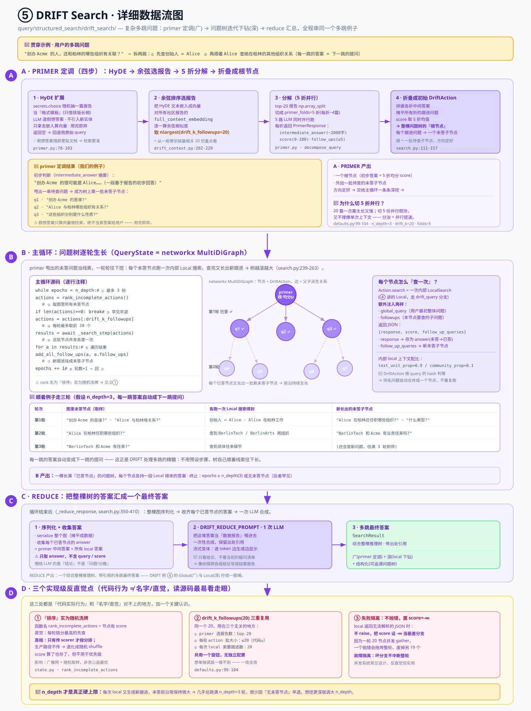

# ⑤ DRIFT Search — 全局定调 + 图结构化局部下钻

> GraphRAG 核心机制深入 · **5 / 5** · [← 上一篇：④ Global / Local 检索](./core-04-query-global-local.md) · [总览](./core-deep-dive.md)
> 版本 `graphrag` 3.1.0 · 所有 `file:line` 引用相对 `packages/graphrag/graphrag/`。

**位置**：`query/structured_search/drift_search/`。DRIFT = "Dynamic Reasoning and Inference with Flexible Traversal"（带灵活遍历的动态推理与推断），适合**复杂多跳**问题。

---

## 这一步在做什么（先看大白话）

上一篇 ④ 讲了两种检索：**Global**（把所有社区报告都过一遍，胜在**广**）和 **Local**（锁定几个实体、深挖它们周围的原文，胜在**深**）。它们各有各的短板——Global 不够深、Local 不够广。**DRIFT 就是把这两者拼起来**：先用 Global 的思路定个大方向，再用 Local 的思路一层层往下挖。

那 DRIFT 到底适合什么问题？答案是**复杂多跳问题（multi-hop）**——也就是"一环扣一环、需要连续追问好几步才能答上来"的问题。比如：

> **"创办 Acme 的人，还和柏林的哪些组织有关联？"**

这个问题一步答不出来。你得先**跳第一步**：谁创办了 Acme？（→ 查到是 Alice）再**跳第二步**：Alice 在柏林还和哪些组织有关系？（→ 顺着 Alice 这个点往外找）。每一步的答案，都是下一步提问的前提。这就叫"多跳"。

DRIFT 处理这类问题的套路，特别像**侦探破案**：

1. **先看全局线索、定个大方向**（这一步叫 **primer / 引子**）：侦探拿到案子，先把所有卷宗（= 社区报告）快速翻一遍，给出一个**初步判断**，同时列出一串**待查的疑点**（"这几条线索得深挖"）。
2. **顺着每条线索深入调查**（**主循环**）：针对每个疑点，派人去现场仔细查（= 每个疑点跑**一次 Local 局部搜索**）。
3. **调查中又冒出新线索**：查着查着，往往会发现新的疑点（新的跟进问题），于是继续追查——这样一轮又一轮，滚出一棵越来越大的"**问题树**"。
4. **最后拼成结论**（**reduce / 汇总**）：把所有调查结果收拢到一起，合成一份完整的破案报告。

一句话总结：**DRIFT = Global 的广度 + Local 的深度，组织成一棵"问题树"**。primer 负责定调（广），树上每个节点负责下钻（深），最后 reduce 把整棵树的调查结果拼成一个答案。

> 打个比方：Global 像"读了所有摘要给个大概说法"，Local 像"就一个点翻遍原始档案"。DRIFT 则是"先读摘要定方向，然后顺着方向翻档案，翻出新问题再翻，最后写总结报告"。

---

## 术语小抄（看不懂的词先查这里）

| 词 | 通俗解释 |
|---|---|
| **多跳（multi-hop）** | 需要"一步答案作为下一步前提"、连续追问好几步才能回答的问题。例：先查出创始人是谁，再查这个人还有哪些关系。单跳问题（"Acme 在哪个城市"）用普通检索就够了，用不着 DRIFT。 |
| **DRIFT** | 本篇主角。全称 Dynamic Reasoning and Inference with Flexible Traversal。就是"先定调再迭代下钻"的那套推理流程。 |
| **primer（引子 / 定调）** | 侦探第一眼扫全局。读社区报告，给一个**初步答案**，外加一串**待查的跟进问题**。它是整棵问题树的**根**。 |
| **HyDE（假想文档嵌入）** | Hypothetical Document Embeddings。一个提升检索命中率的小技巧：**先让 LLM 编一个"假想答案"，再拿这个假想答案去检索**（详见下方重点解释）。 |
| **余弦相似度（cosine similarity）** | 衡量两个向量"方向有多接近"的数值，范围约 -1～1，越接近 1 越相似。这里用来判断"HyDE 假想答案"和"哪些社区报告"最贴近。 |
| **折（fold）/ 并行** | 把一堆东西**切成 N 份**（每份叫一"折"），然后**同时**分别处理。这里把选出的报告切成 5 折，5 路 LLM 一起跑，省时间。 |
| **DriftAction（动作节点）** | 问题树上的**一个节点**。它装着"一个待查问题 + 它的答案（一开始是空的）+ 打分 + 它引出的新跟进问题"。可以理解成侦探手上的**一张调查卡片**。 |
| **QueryState** | 整棵问题树的"账本"。它用一张图把所有 DriftAction 节点和它们的父子关系管起来。 |
| **networkx 有向图（MultiDiGraph）** | networkx 是 Python 的图数据结构库。MultiDiGraph = "允许重复边的**有向**图"。DRIFT 用它来存那棵问题树：节点是 DriftAction，边表示"这个问题是从那个问题里派生出来的"。 |
| **未答 / 已答节点** | 节点的 `answer` 字段还是空（`None`）就是**未答**，填上了就是**已答**。主循环每轮只挑**未答**节点去跑；`is_complete = answer is not None`。 |
| **n_depth（深度轮数）** | 主循环最多迭代几轮，默认 **3**。可以理解成"侦探最多顺着线索往下追几层"。 |
| **drift_k_followups** | 默认 **20**。一个被**反复复用**的数字（后面会专门讲这个反直觉点）：primer 选几篇报告、每轮处理几个节点、每次要几个新跟进问题——都用它。 |
| **reduce（汇总）** | 最后一步。把整棵树上所有已答节点的答案收集起来，让 LLM **一次性**合成最终答案。 |
| **hash 去重** | DriftAction 按它的 `query`（问题文本）算 hash 来判断相不相等。**两个节点问的是同一句话，就自动当成同一个节点**，不会重复调查。 |

> 🔑 **HyDE 值得单独展开（初学者最容易懵的一个词）**
>
> 直接拿**用户的原始问题**去检索，常常不太准。为什么？因为问题的措辞和文档的措辞往往**对不上**——你问"谁创办了 Acme？"，而报告里写的是"Acme 由 Alice 于 2010 年成立"。两句话讲的是一回事，但用词差得远，向量检索就容易miss。
>
> HyDE 的巧思是：**先让 LLM 假装知道答案，编一段"假想答案"出来**（哪怕内容不一定对），再拿这段假想答案去检索。因为**"假想答案"和"真实文档"在措辞、结构上天然更接近**（都是陈述句、都在讲事实），所以用它检索，命中率反而比用原始问题更高。
>
> ⚠️ 注意：这段假想答案**只用来算向量、做检索**，绝不会当成真答案给用户。它是"检索的敲门砖"，用完即弃。

---

## 配图总览



这张图从左到右就是 DRIFT 的三大阶段，也是本文的三个大节；底部黄条是三个"实现级反直觉点"（专门留到最后讲）：

- **左 · PRIMER（定调）** — 侦探翻卷宗、定大方向：HyDE 扩展 → 余弦选报告 → 5 折并行分解 → 折叠成**初始 action**（问题树的根）。
- **中 · 主循环（QueryState）** — 那棵**问题树**本体，是一张 networkx 有向图。根是 primer，往下逐轮长出未答节点，每个节点跑一次内部 Local 搜索，最多 `n_depth` 轮。
- **右 · REDUCE（汇总）** — 把整棵树所有节点的答案收拢，**一次** LLM 合成最终答案。
- **底 · 三个反直觉点** — "排序"其实是随机洗牌、`drift_k_followups` 被三重复用、失败隔离。

下面逐块细讲，全程用**同一个多跳问题**串起来。

> 🧵 **贯穿全文的例子**
> 用户问：**"创办 Acme 的人，还和柏林的哪些组织有关联？"**
> 这个问题得分两跳：① 先查出创始人是 **Alice**；② 再顺着 Alice，找她在**柏林**的其他组织关系。DRIFT 会把这两跳自动拆成问题树上的节点，一层层查下去。

---

## 5.1 左 · PRIMER：HyDE 定调 + 分解出初始跟进问题

对应图中左侧紫色大框。这一块回答："**侦探拿到案子，怎么先定个大方向、列出一串待查问题？**" 分四步走。

### 第 1 步 · HyDE 扩展（`primer.py:70-103`）

- 先用 `secrets.choice` **随机抽一个社区报告**当**格式模板**（只借它的"排版长相"，不是借内容）。
- 让 LLM 照着这个模板，为用户的 query 生成一段**假想答案**——模仿报告的结构，但**不许引入新实体**（避免它瞎编出不存在的人和公司）。
- 这段假想答案**只拿去做嵌入（算向量）**，不当真答案。
- 万一 LLM 返回空，就**回退用原始 query** 去嵌入。

> 拿我们的例子说：LLM 可能编出一段"Acme 由某创始人成立，该创始人与柏林多家科技组织有合作……"这样的假想答案。它未必准，但结构像报告、用词像文档，**拿去检索比原问题准**——这就是上面术语小抄里讲的 HyDE 妙处。

### 第 2 步 · 余弦排序选报告（`drift_context.py:202-229`）

- 把上一步那段 HyDE 文本**嵌入成向量**。
- 拿它和**所有社区报告**的 `full_content_embedding`（报告全文的向量）逐一算**余弦相似度**。
- 取相似度最高的前 `drift_k_followups=20` 篇（`nlargest(20)`）。

这一步就是"侦探从一柜子卷宗里，挑出**最相关的 20 份**重点看"。

### 第 3 步 · 分解（5 折并行，`DRIFTPrimer.decompose_query`，`primer.py`）

- 把选出的 top-20 报告用 `np.array_split` **切成 `primer_folds=5` 折**（每折约 4 篇）。
- **5 路 LLM 同时并行调用**，每折各自处理。
- 每折返回一个结构化的 `PrimerResponse`，含三样东西：
  - `intermediate_answer`（中间答案，约 2000 字）——基于这几篇报告给出的初步回答。
  - `score`（0-100 的打分）——这份初步回答的"自我评估质量分"。
  - `follow_up_queries`（**≥5 个**跟进问题）——"要真正答好，还得追查这些"。

> 📌 **为什么要切 5 折并行？** 20 篇报告一股脑塞给一次 LLM 调用，太长、也慢。切成 5 份让 5 个 LLM 请求**同时跑**，又快、每个请求的上下文又不至于爆掉。这是典型的"分治 + 并行"提速。

### 第 4 步 · 折叠成初始 DriftAction（`search.py:111-157`）

把 5 折的结果**合并成一个**（这个"合并"动作就叫**折叠 / fold**）：

- **拼接**各折的中间答案。
- **摊平（flatten）**所有折的跟进问题，凑成一个大列表。
- `score` **取 5 折的均值**。

合并出来的东西，就建成一个**初始 `DriftAction`**——它是整棵问题树的**根节点**（图中间那个大圆 `primer`）。而它携带的**每个跟进问题**，都会在图里变成**一个"未回答"的子节点**（等着主循环去查）。

拿我们的例子：primer 阶段读完报告，大概能给出"创办 Acme 的很可能是 Alice"这样的初步判断，同时甩出一串待查问题，比如"Alice 具体和柏林哪些组织有关系？""这些组织分别是什么性质？"——这些就成了树上第一批未答节点。

**PRIMER 的产出**：一个根节点（带初步答案 + 均分）+ 一批待查的未答子节点。方向定好了，接下来交给主循环去一条条深挖。

---

## 5.2 中 · 状态：DriftAction 的 MultiDiGraph

在讲主循环怎么转之前，先搞清楚它操作的**那张图**长什么样。

`QueryState`（`state.py`）用一张 **`networkx.MultiDiGraph`**（有向、允许多重边的图）来存整棵问题树：

- **节点 = `DriftAction` 对象**。每个节点持有：
  - `query`（这个节点要查的问题）
  - `answer`（答案，**`None` 表示还没答**）
  - `score`（打分）
  - `follow_ups`（这个节点查完后引出的新跟进问题）
  - `metadata`（其它元信息）
  - `is_complete = answer is not None`（答案非空即"已完成"）
- **边 = 父子派生关系**："这个问题是从那个问题里冒出来的"。

> 🔧 **hash 去重的妙用**：`DriftAction` 按 `query` 字符串来算 hash / 判等——**问的是同一句话，就是同一个节点**。所以如果不同分支都追问出了"Alice 和柏林哪些组织有关联？"这句一模一样的问题，图里**只会有一个节点**，自动合并，不会重复跑同一次局部搜索、浪费 LLM 调用。这也是用"图"而不是用"简单列表"来存状态的一个好处。

---

## 5.3 中 · 主循环：n_depth 轮迭代下钻

对应图中间那棵不断生长的树。这一块回答："**定好方向后，怎么顺着每个未答问题一层层挖下去？**"

核心代码在 `DRIFTSearch.search`（`search.py:239-263`），就这么一个循环：

```python
while epochs < n_depth:                        # ① 最多迭代 n_depth 轮（默认 3）
    actions = rank_incomplete_actions()        # ② 取出图里"所有未答节点"
    if len(actions) == 0: break                # ③ 早退：没有未答节点就收工
    actions = actions[: drift_k_followups]     # ④ 每轮最多处理前 20 个
    results = await _search_step(actions)      # ⑤ 这一批节点"并发"各查一次
    for action in results:                     # ⑥ 遍历这一批查完的结果
        add_all_follow_ups(action, action.follow_ups)  # ⑦ 把新跟进问题挂成新的未答子节点
    epochs += 1                                # ⑧ 轮数 +1，进入下一轮
```

**逐行拆解**：

- **① `while epochs < n_depth`**：`n_depth` 默认 3，所以整个下钻**最多 3 轮**。轮数就是"往下追几层线索"。
- **② `rank_incomplete_actions()`**：从图里捞出**当前所有 `answer` 还是 `None` 的节点**（未答的调查卡片）。⚠️ 这个函数名叫"rank（排序）"，但实际上生产路径里它是**随机洗牌**——这是第一个反直觉点，5.5 专门讲。
- **③ `if len(actions) == 0: break`**：如果一个未答节点都没有了（该查的都查完了），提前结束。
- **④ `actions[: drift_k_followups]`**：就算未答节点很多，这一轮也**最多只取前 20 个**（又是那个 `drift_k_followups=20`）。
- **⑤ `await _search_step(actions)`**：把这 20 个节点**并发**执行——每个节点各自跑**一次内部 Local 搜索**（下面详解）。`await` 表示等这一整批都跑完。
- **⑥⑦ 循环 `add_all_follow_ups`**：每个节点查完会带回一串**新跟进问题**，把它们**挂成新的未答子节点**，让这棵树在下一轮继续"长个"。
- **⑧ `epochs += 1`**：进入下一轮，回到 ①。

**每个节点具体怎么"查一次"？**（`action.search`）

每个 `DriftAction` 的执行，本质是**跑一次内部 LocalSearch**——就是上一篇 ④ 讲的那个 Local 检索，只不过走 `drift_query` 分支，额外**注入两样东西**：

- `global_query`：用户**最初的整体问题**（让局部搜索别忘了大目标）。
- `followups`：当前这个节点要查的具体子问题。

它返回一段 JSON：`{response, score, follow_up_queries}`。DRIFT 拿到后：

- 把 `response` 当作这个节点的 **`answer` 存下**（节点从"未答"变"已答"）。
- 把 `follow_up_queries`（**新冒出来的跟进问题**）扩成**新的未答子节点**，挂到树上——前沿继续生长。

**顺着例子走一遍**（假设 `n_depth=3`）：

| 轮次 | 图里的未答节点（部分） | 各跑一次 Local 搜索得到 | 新长出的未答子节点 |
|---|---|---|---|
| **第 1 轮** | "创办 Acme 的是谁？"、"Alice 和柏林什么关系？" | 查到"创始人是 Alice"、"Alice 在柏林工作" | "Alice 在柏林还任职哪些组织？"、"这些组织是什么类型？" |
| **第 2 轮** | "Alice 在柏林还任职哪些组织？"、"这些组织类型？" | 查到"Alice 参与 BerlinTech、BerlinArts 两个组织" | "BerlinTech 和 Acme 有业务往来吗？" |
| **第 3 轮** | "BerlinTech 和 Acme 有往来吗？" | 查到具体往来细节 | （还会冒新问题，但到 3 轮就停了） |

可以看到：**每一跳的答案，都自动变成下一跳的提问**。这正是 DRIFT 处理多跳问题的精髓——它不需要你预先想好步骤，树会自己顺着线索往下长。

**主循环的产出**：一棵长满了"已答节点"的问题树，每个节点都有一段局部搜索得来的答案。

---

## 5.4 右 · REDUCE：汇总整棵树

对应图中右侧绿色收口。这一块回答："**一棵树几十个答案，怎么拼成一个给用户的最终答案？**"

循环结束后（`_reduce_response`，`search.py:350-410`）：

1. 先把整个图 `serialize`（序列化，摊平成数据）。
2. **收集每一个已答节点的 `answer`**——包括 primer 的中间答案 + 所有局部搜索的答案。
3. ⚠️ **只取 `answer` 字段**，**不含** `query` / `score`——喂给 LLM 的是一堆"调查结论"，而不是"问题"和"分数"。
4. 把这一堆答案当作"**数据报告**"，喂给 `DRIFT_REDUCE_PROMPT`，做**一次** LLM 合成。
5. 产出**保留引用**的最终答案（流式变体会逐 token 吐出来，边生成边显示）。

> 📌 **一句话理解 reduce**：侦探把所有小组的调查报告收上来，**只看结论、不看当初的疑问清单**，然后亲手写一份连贯的、带出处引用的**结案报告**给上级。这就是最终交给用户的答案。

**REDUCE 的产出**：一个综合了整棵推理树、带引用的多跳最终答案（`SearchResult`）。

---

## 5.5 ⚠️ 三个"实现级反直觉点"（初学者尤其容易看走眼）

对应图底部黄色横条。这三点都是"代码实际行为"和"名字/直觉"对不上的地方，读源码时最容易误解。

### 反直觉点 1：`rank_incomplete_actions` 名叫"排序"，实际是**随机洗牌**

**直觉**：函数叫 "rank"（排序），加上每个节点都有 `score`（打分），你会自然以为——每轮是**挑分最高的节点优先查**。

**真相**：这个函数**只有在传入 `scorer` 参数时才真按 score 排序**。而**生产路径根本不传 `scorer`**，于是它退化成对未答节点做一次**随机 shuffle（洗牌）**。`score` 算是算了、也存了，但**完全没用于决定谁先查**。

**为什么反直觉 / 有什么影响**：初学者读到 `score` 会以为系统在做"最优先探索最有希望的分支"，其实并没有——每轮取哪 20 个节点是**随机的**。影响是：DRIFT 的探索是"广撒网 + 随机取样"，而非"贪心地追最优线索"。想改成按分排序，得自己把 `scorer` 传进去。

### 反直觉点 2：`drift_k_followups`（20）被**三重复用**

**真相**：同一个数字 `20`，在三个完全不同的地方当参数：

1. **primer 选报告数**：余弦排序取 top-**20** 篇报告。
2. **每轮 action 批大小**：主循环每轮最多处理 **20** 个未答节点（代码 ④）。
3. **每次 local search 索要的跟进数**：每个节点做局部搜索时，要求返回 **20** 个新跟进问题。

**为什么反直觉 / 有什么影响**：这三件事逻辑上毫不相干（一个是"看几篇报告"，一个是"每轮查几个问题"，一个是"每次生成几个新问题"），却**共用一个旋钮，没有各自独立的配置**。影响是：你想单独调其中一个（比如"多看点报告但每轮少查几个"）**做不到**——一改全改。读代码时看到 `drift_k_followups` 反复出现，别以为是笔误，它是真的被复用了三次。

### 反直觉点 3：失败隔离——一条坏分支**不抛错**，只置 `score=-inf`

**真相**：某个节点的局部搜索返回了**没法解析的 JSON**（LLM 偶尔会吐出格式坏掉的输出）时，代码**不抛异常**，而是把这个节点的 `score` 设成负无穷（`-inf`），当作"这条分支质量极差"处理。

**为什么反直觉 / 有什么影响**：一般人写代码，解析失败就 raise 报错了。但这里是**故意吞掉**——因为一轮里 20 个节点是**并发（gather）**跑的，如果一个坏分支抛错，会**拖垮整轮**、让另外 19 个也白跑。用"标记为极差"代替"抛错"，保证**一条坏分支不会中断整轮**，其余节点照常完成。这是并发系统里常见的"故障隔离"设计，对初学者反直觉但很实用。

> 🔧 **补一个和图底部一致的关键认识**：**`n_depth` 才是真正的硬上限**。因为每次局部搜索都会**再生成一批新跟进问题**，未答前沿常常一直很大，所以循环**很少因为"没有未答节点"（代码 ③）而早退**，几乎总是老老实实跑满 `n_depth=3` 轮才停。想让 DRIFT 挖得更深，调大 `n_depth` 才是正解。

---

## 这一步整体产出了什么

跑完 ⑤（DRIFT Search），你得到的是：**一个针对复杂多跳问题、综合了整棵推理树、带引用的最终答案**。它的价值在于——

- **broad（广）**：primer 用 HyDE + 余弦，从全部社区报告里定了大方向，不会一开始就钻牛角尖。
- **deep（深）**：主循环让每个子问题各跑一次 Local 局部搜索，一层层顺着线索追下去。
- **结构化**：整个推理过程被组织成一棵可追溯的问题树（QueryState 图），而非一团糊涂账。

---

## 本篇关键默认值

| 环节 | 参数 | 默认 | 出处 | 一句话 |
|---|---|---|---|---|
| DRIFT | `n_depth` | 3 | `defaults.py:99-102` | 主循环最多迭代几轮（追几层线索），是实际硬上限 |
| DRIFT | `drift_k_followups` | 20 | `defaults.py:99-102` | 被三重复用：选报告数 / 每轮批大小 / 每次要几个新跟进 |
| DRIFT | `primer_folds` | 5 | `defaults.py:99-102` | primer 把 top-20 报告切成 5 折并行 LLM |
| DRIFT | 内部 local `text_unit_prop` | 0.9 | `defaults.py:103-104` | 每个节点局部搜索时，上下文里原文块占比 |
| DRIFT | 内部 local `community_prop` | 0.1 | `defaults.py:103-104` | 每个节点局部搜索时，上下文里社区报告占比 |

---

**产出** 一个综合整棵推理树、保留引用的多跳最终答案（`SearchResult`）。DRIFT 把 ④ 的 Global（广）与 Local（深）拧成了一股绳。

到这里，五篇核心机制就走完了：① LLM 抽图 → ② Leiden 聚社区 → ③ 社区报告 → ④ Global/Local 检索 → ⑤ DRIFT 多跳推理。建议回到 [总览](./core-deep-dive.md) 再过一遍端到端的心智模型，把"建图 → 分层 → 摘要 → 检索"这条完整链路串成一张图。

[← 上一篇：④ Global / Local 检索](./core-04-query-global-local.md) · [总览](./core-deep-dive.md)
