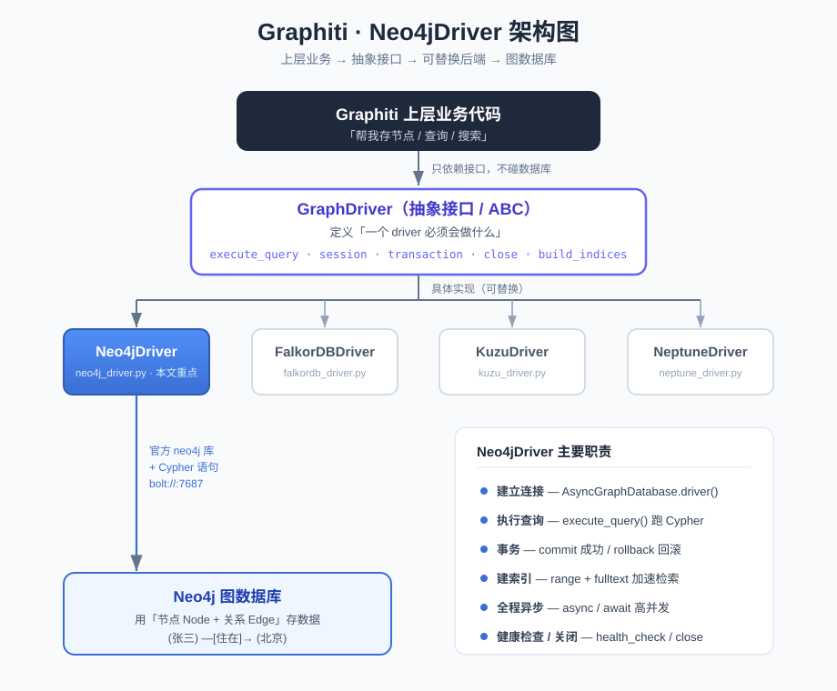

# Neo4jDriver 简介（零基础入门）

> 面向从没接触过 Neo4j 的同学，先讲清楚 Neo4j 是什么，再讲 Graphiti 里的 `Neo4jDriver` 具体在干什么。

---

## 一、先搞懂：Neo4j 是什么？

### 1. 它是一个「图数据库」

你熟悉的数据库大多是 **关系型数据库**（MySQL、PostgreSQL），数据存在一张张「表格」里，行和列。

Neo4j 是 **图数据库（Graph Database）**，它不用表格，而是用「点」和「线」来存数据：

- **节点（Node）**：表示一个实体，比如「张三」「北京」「某公司」。
- **关系（Relationship / Edge）**：表示两个节点之间的联系，比如「张三 —住在→ 北京」。
- **属性（Property）**：节点和关系上都能挂键值对，比如张三的 `age=30`。

一句话对比：

| 概念 | 关系型数据库 | 图数据库 Neo4j |
|------|-------------|----------------|
| 存什么 | 表格里的行 | 节点 + 关系 |
| 强项 | 结构化数据的增删改查 | **实体之间的关联关系** |
| 查「朋友的朋友」 | 要写多层 JOIN，越深越慢 | 顺着关系「走」过去，天然高效 |

### 2. 为什么 Graphiti 要用它？

Graphiti 是做「知识图谱」的——本质就是一堆实体和它们之间错综复杂的关系。这种数据用图数据库来存最自然，所以 Neo4j 是它的默认存储后端之一。

### 3. Cypher：Neo4j 的查询语言

关系型数据库用 SQL，Neo4j 用 **Cypher**。它的语法很直观，用 `()` 表示节点、`-[]->` 表示关系，像画图一样：

```cypher
// 查找「张三住在哪个城市」
MATCH (p:Person {name: '张三'})-[:LIVES_IN]->(c:City)
RETURN c.name
```

后面你会看到 `Neo4jDriver` 里执行的就是这种 Cypher 语句。

---

## 二、Graphiti 里的 `Neo4jDriver` 是什么？

代码位置：`graphiti_core/driver/neo4j_driver.py`

### 1. 它的角色：一个「翻译 + 连接」的中间层

`Neo4jDriver` 就是 Graphiti 和 Neo4j 数据库之间的 **桥梁**。Graphiti 上层业务代码不直接跟数据库打交道，而是喊一声 driver：「帮我把这个节点存进去」「帮我执行这条查询」，由 driver 负责真正连数据库、发命令、拿结果。

### 2. 它是「一套接口的其中一个实现」

Graphiti 支持多种图数据库后端（看 `driver/` 目录下的文件夹就知道）：

- `neo4j_driver.py` → Neo4j
- `falkordb_driver.py` → FalkorDB
- `kuzu_driver.py` → Kuzu
- `neptune_driver.py` → 亚马逊 Neptune

它们都继承同一个抽象基类 **`GraphDriver`**（在 `driver/driver.py`）。基类定义了「一个 driver 必须会做哪些事」，比如 `execute_query`、`session`、`close`、`build_indices_and_constraints`。

> 这是典型的「面向接口编程」：上层只认 `GraphDriver` 这个接口，你想换数据库，只要换一个 driver 实现就行，业务代码几乎不用动。

### 3. 关键代码逐段解读

#### （1）构造函数——建立连接

```python
def __init__(self, uri, user, password, database='neo4j'):
    self.client = AsyncGraphDatabase.driver(
        uri=uri,
        auth=(user or '', password or ''),
    )
    self._database = database
```

- `uri`：Neo4j 地址，通常是 `bolt://localhost:7687`（`bolt` 是 Neo4j 的专用通信协议）。
- `user` / `password`：账号密码。
- `database`：数据库名，**默认就是 `neo4j`**（这也是 CLAUDE.md 里提到的「hardcoded 默认值」）。
- `AsyncGraphDatabase.driver(...)`：这是官方 `neo4j` Python 库提供的**异步**客户端，`self.client` 就是真正干活的连接对象。

构造时它还会顺手做两件事：
- 初始化一堆 `*_ops` 操作对象（如 `entity_node_ops`、`search_ops`），把「怎么存实体节点」「怎么搜索」等具体逻辑拆分到各个专门的类里。
- 尝试异步调度 `build_indices_and_constraints()`，提前给数据库建好**索引**，让后续查询更快。

#### （2）`execute_query`——执行一条查询

```python
async def execute_query(self, cypher_query_, **kwargs):
    params = kwargs.pop('params', None) or {}
    params.setdefault('database_', self._database)
    result = await self.client.execute_query(cypher_query_, parameters_=params, **kwargs)
    return result
```

这是最常用的方法：给它一条 Cypher 语句和参数，它交给 `self.client` 去数据库执行，把结果拿回来。出错会打日志再抛出。

> 注意 `async` / `await`：整个 driver 是**异步**的，适合高并发场景，不会因为等数据库响应而卡住整个程序。

#### （3）`session` 和 `transaction`——会话与事务

- **session（会话）**：跟数据库的一次交互「窗口」，多条语句可以在同一个 session 里跑。
- **transaction（事务）**：保证「要么全部成功，要么全部回滚」。看这段：

```python
async with self.client.session(database=self._database) as session:
    tx = await session.begin_transaction()
    try:
        yield _Neo4jTransaction(tx)
        await tx.commit()      # 一切正常 → 提交
    except BaseException:
        await tx.rollback()    # 出错 → 回滚，撤销所有改动
        raise
```

这就是数据库里「事务」的经典用法，保证数据一致性。Neo4j 支持真正的事务，而有些后端（如 FalkorDB）不支持，所以基类里给了一个「假事务」的降级实现。

#### （4）`build_indices_and_constraints`——建索引

```python
async def build_indices_and_constraints(self, delete_existing=False):
    range_indices = get_range_indices(self.provider)
    fulltext_indices = get_fulltext_indices(self.provider)
    ...
```

给数据库建两类索引：
- **range 索引**：普通字段索引，加速精确/范围查找。
- **fulltext 全文索引**：支持关键词搜索（Graphiti 混合检索里的 BM25 关键词搜索就靠它）。

索引就像书的目录，没有它数据库得一行行翻，有了它能直接跳到目标。

#### （5）`health_check` / `close`——健康检查与关闭

- `health_check`：ping 一下数据库，确认连得上。
- `close`：用完关闭连接，释放资源。

---

## 三、一张图理清关系

```
   Graphiti 上层业务代码
          │  「帮我存节点 / 查询 / 搜索」
          ▼
   GraphDriver（抽象接口，定义"要会做什么"）
          │  具体实现
   ┌──────┼───────┬───────┐
   ▼      ▼       ▼       ▼
 Neo4j  FalkorDB Kuzu  Neptune  ← 4 种后端，可替换
Driver
   │  用官方 neo4j 库 + Cypher 语句
   ▼
  Neo4j 数据库（真正存节点和关系的地方）
```

---

## 四、给你的上手建议

如果想真正跑起来体验一下 Neo4j：

1. **装 Neo4j**：最简单是用 [Neo4j Desktop](https://neo4j.com/download/)，或 Docker 一行命令：
   ```bash
   docker run -p 7474:7474 -p 7687:7687 \
     -e NEO4J_AUTH=neo4j/password neo4j:5.26
   ```
   - `7474`：浏览器可视化界面（打开 http://localhost:7474 能画图看数据）。
   - `7687`：bolt 协议端口，代码里连的就是这个。

2. **在浏览器界面里练 Cypher**：先 `CREATE` 几个节点和关系，再 `MATCH` 查出来，直观感受「点和线」。

3. **回头看 Graphiti 代码**：理解了 Cypher 和节点/关系后，再看 `neo4j/operations/` 下那些 `*_ops.py`，就能明白 Graphiti 具体是怎么把「实体、边、社区」这些概念落到 Neo4j 里的。

---

## 五、一句话总结

> **Neo4j** 是用「点和线」存数据的图数据库；**`Neo4jDriver`** 是 Graphiti 里连接并操作 Neo4j 的桥梁，负责建连接、执行 Cypher 查询、管理事务和索引，是可替换的多种数据库后端之一。

---

> 配套结构图见：
