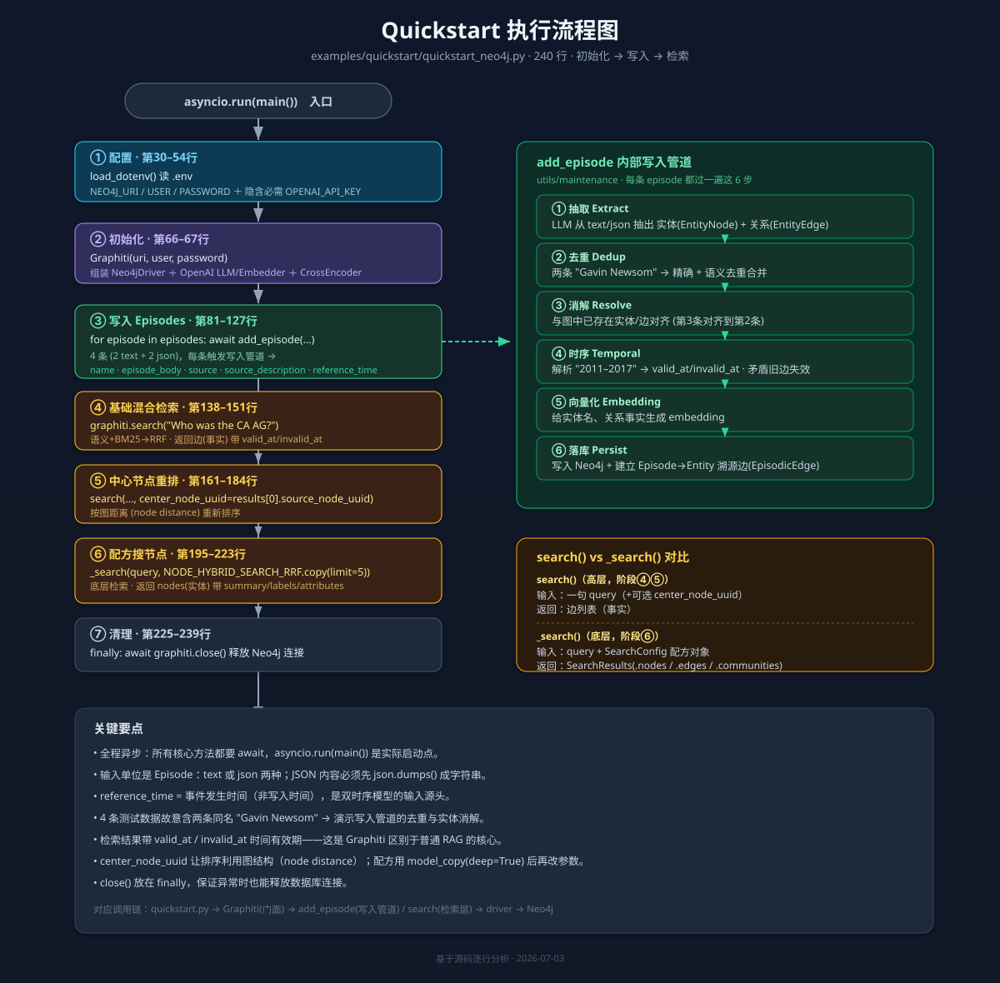

# Graphiti Quickstart 逐段拆解

> 文件：`examples/quickstart/quickstart_neo4j.py`（240 行）
> 目标：把这个「活文档」拆成 7 个阶段，逐段讲清每行在做什么、为什么这么做，并与整体架构对应。

---

## 全局速览

这个文件就是一条完整的主线，串起 Graphiti 的五个核心动作：

```
配置(env) → 初始化 Graphiti → 写入 Episodes → 混合检索
                                                  → 中心节点重排 → 检索配方搜节点 → 清理关闭
```

对应之前架构图的调用链：
`quickstart.py` → `Graphiti`(门面) → `add_episode`(写入管道) / `search`(检索层) → `driver`(存储) → Neo4j

---

## 阶段 0 · 导入与依赖（第 17–28 行）

```python
import asyncio, json, logging, os
from datetime import datetime, timezone
from dotenv import load_dotenv

from graphiti_core import Graphiti                              # 门面类
from graphiti_core.nodes import EpisodeType                     # 输入类型枚举
from graphiti_core.search.search_config_recipes import NODE_HYBRID_SEARCH_RRF  # 检索配方
```

**三个关键导入，对应三层能力：**

| 导入 | 来自 | 作用 |
|---|---|---|
| `Graphiti` | `graphiti_core` 顶层 | 唯一门面，所有操作的入口 |
| `EpisodeType` | `nodes.py` | 声明输入是 `text` 还是 `json` |
| `NODE_HYBRID_SEARCH_RRF` | `search_config_recipes.py` | 预设检索配置，避免手写 SearchConfig |

> 注意 `asyncio`——Graphiti 全程异步，所有核心方法都要 `await`。

---

## 阶段 1 · 配置与环境变量（第 30–54 行）

```python
logging.basicConfig(level=INFO, ...)          # 打开 INFO 日志，能看到管道内部动作
load_dotenv()                                 # 从 .env 读取环境变量

neo4j_uri  = os.environ.get('NEO4J_URI',  'bolt://localhost:7687')
neo4j_user = os.environ.get('NEO4J_USER', 'neo4j')
neo4j_password = os.environ.get('NEO4J_PASSWORD', 'password')

if not neo4j_uri or not neo4j_user or not neo4j_password:
    raise ValueError('NEO4J_URI, NEO4J_USER, and NEO4J_PASSWORD must be set')
```

**要点：**
- `load_dotenv()` 让你把密钥写进 `.env` 而非硬编码。
- 三个 Neo4j 参数都有默认值，本地开箱即用。
- **隐藏的必需项**：代码没显式读 `OPENAI_API_KEY`，但 `Graphiti` 默认用 OpenAI 做抽取和 embedding，所以这个 key **必须**在环境里，否则 `add_episode` 会报错。
- 打开 `INFO` 日志很关键——你能亲眼看到「抽取了哪些实体、做了哪些去重」。

**运行前置清单：**
```bash
# .env 内容
OPENAI_API_KEY=sk-...
NEO4J_URI=bolt://localhost:7687
NEO4J_USER=neo4j
NEO4J_PASSWORD=你的密码
# 并确保本地 Neo4j (5.26+) 已启动
```

---

## 阶段 2 · 初始化 Graphiti（第 66–67 行）

```python
graphiti = Graphiti(neo4j_uri, neo4j_user, neo4j_password)
```

**这一行背后发生了什么：**
- 用 Neo4j 三件套构造门面对象。
- 内部自动创建默认的 `Neo4jDriver` + `OpenAIClient`(LLM) + OpenAI embedder + cross_encoder。
- 此时**还没有建索引**，只是建立了连接和组件。

> ⚠️ 生产用法通常还应调用一次 `await graphiti.build_indices_and_constraints()` 来初始化图数据库索引/约束。quickstart 为了极简省略了它（首次 `add_episode` 也能工作，但显式建索引是推荐做法）。

对应架构：这一步组装了「编排层 + 全部 Provider + 存储层」。

---

## 阶段 3 · 准备并写入 Episodes（第 81–127 行）

### 3.1 准备输入数据

```python
episodes = [
    {  # —— 文本型 episode
        'content': 'Kamala Harris is the Attorney General of California. She was previously '
                   'the district attorney for San Francisco.',
        'type': EpisodeType.text,
        'description': 'podcast transcript',
    },
    { 'content': 'As AG, Harris was in office from January 3, 2011 – January 3, 2017',
      'type': EpisodeType.text, 'description': 'podcast transcript' },
    {  # —— JSON 型 episode（结构化数据）
        'content': {'name': 'Gavin Newsom', 'position': 'Governor',
                    'state': 'California', 'previous_role': 'Lieutenant Governor',
                    'previous_location': 'San Francisco'},
        'type': EpisodeType.json, 'description': 'podcast metadata' },
    { 'content': {'name': 'Gavin Newsom', 'position': 'Governor',
                  'term_start': 'January 7, 2019', 'term_end': 'Present'},
      'type': EpisodeType.json, 'description': 'podcast metadata' },
]
```

**设计意图：** 4 条 episode 故意混合两种输入形态，演示 Graphiti 都能处理：

| # | 类型 | 内容 | 演示点 |
|---|---|---|---|
| 0 | text | Kamala Harris 的职位 | 从自然语言抽实体+关系 |
| 1 | text | Harris 的任期时间 | **时序信息**抽取（valid_at/invalid_at） |
| 2 | json | Gavin Newsom 结构化档案 | 从结构化数据抽取 |
| 3 | json | Newsom 任期（term_start/end） | 与 #2 同实体 → 触发**去重/合并** |

> 注意 #2、#3 都是 "Gavin Newsom"——这正是为了演示写入管道的**去重与实体消解**：两条应合并到同一个 `EntityNode`。

### 3.2 循环写入

```python
for i, episode in enumerate(episodes):
    await graphiti.add_episode(
        name=f'Freakonomics Radio {i}',
        episode_body=episode['content']
            if isinstance(episode['content'], str)
            else json.dumps(episode['content']),   # JSON 必须序列化成字符串
        source=episode['type'],
        source_description=episode['description'],
        reference_time=datetime.now(timezone.utc),  # 事件发生时间（此处用当前时间）
    )
    print(f'Added episode: Freakonomics Radio {i} ({episode["type"].value})')
```

**每次 `add_episode` 触发的完整管道（对应架构图「写入管道」六步）：**

```
episode_body
  ① 抽取   LLM 从文本/JSON 抽出实体(EntityNode)和关系(EntityEdge)
  ② 去重   把 "Gavin Newsom" 等重复实体做精确+语义去重
  ③ 消解   与图中已存在的实体对齐（第3条 Newsom 会对齐到第2条）
  ④ 时序   解析 "January 3, 2011 – 2017" → 写入 valid_at / invalid_at
  ⑤ 向量化 给实体名、关系事实生成 embedding
  ⑥ 落库   写入 Neo4j，并建立 Episode→Entity 的溯源边(EpisodicEdge)
```

**两个易错点：**
- `episode_body` 必须是 **字符串**——所以 JSON 内容要 `json.dumps()`。
- `reference_time` 是「事件发生时间」，不是「写入时间」。这里图省事用了 `now()`，真实场景应传入事件的真实时间戳，这才是双时序模型的价值所在。

---

## 阶段 4 · 基础混合检索（第 138–151 行）

```python
results = await graphiti.search('Who was the California Attorney General?')

for result in results:
    print(f'UUID: {result.uuid}')
    print(f'Fact: {result.fact}')                 # 关系的自然语言事实
    if hasattr(result, 'valid_at') and result.valid_at:
        print(f'Valid from: {result.valid_at}')    # 双时序：何时开始有效
    if hasattr(result, 'invalid_at') and result.invalid_at:
        print(f'Valid until: {result.invalid_at}') # 双时序：何时失效
```

**要点：**
- `search()` 是**高层检索**，输入一句自然语言，返回的是 **边（EntityEdge）**，即"事实"。
- 内部做的是**混合检索**：语义向量相似度 + BM25 关键词，用 RRF 融合排序（对应架构图「检索层」三路召回）。
- 每条结果的 `fact` 是人类可读的关系描述，`valid_at`/`invalid_at` 体现时序——这就是 Graphiti 区别于普通 RAG 的地方：**返回的事实带时间有效期**。

---

## 阶段 5 · 中心节点重排（第 161–184 行）

```python
if results and len(results) > 0:
    center_node_uuid = results[0].source_node_uuid   # 取上一步 top 结果的源节点

    reranked_results = await graphiti.search(
        'Who was the California Attorney General?',
        center_node_uuid=center_node_uuid,           # 关键新增参数
    )
    # ... 打印 reranked_results（同上格式）
```

**这一步在演示什么：**
- 同样的查询，但多传了 `center_node_uuid`。
- Graphiti 会按结果与该"中心节点"在图上的**图距离（node distance）**重新排序。
- 意义：让检索结果更**聚焦于某个实体的上下文**——比如以 Kamala Harris 节点为中心，与她关系更近的事实排更前。
- 这是「图遍历」信号参与排序的体现（架构图检索层的 NodeDistance 重排）。

---

## 阶段 6 · 用检索配方直接搜节点（第 195–223 行）

```python
node_search_config = NODE_HYBRID_SEARCH_RRF.model_copy(deep=True)  # 复制预设配方
node_search_config.limit = 5                                       # 改参数：只要5条

node_search_results = await graphiti._search(       # 注意是底层 _search
    query='California Governor',
    config=node_search_config,                      # 传入配置对象
)

for node in node_search_results.nodes:              # 返回的是节点，不是边
    print(f'Node UUID: {node.uuid}')
    print(f'Node Name: {node.name}')
    node_summary = node.summary[:100] + '...' if len(node.summary) > 100 else node.summary
    print(f'Content Summary: {node_summary}')
    print(f'Node Labels: {", ".join(node.labels)}')   # 实体类型标签
    print(f'Created At: {node.created_at}')
    if hasattr(node, 'attributes') and node.attributes:
        for key, value in node.attributes.items():     # 自定义属性
            print(f'  {key}: {value}')
```

**`search()` vs `_search()` 的关键区别：**

| 维度 | `graphiti.search()`（高层） | `graphiti._search()`（底层） |
|---|---|---|
| 输入 | 一句 query | query + `SearchConfig` 配置对象 |
| 返回 | 边列表（事实） | `SearchResults`（含 `.nodes`/`.edges`/`.communities`） |
| 灵活度 | 开箱即用 | 可精调召回策略、重排方式、limit |
| 本例用途 | 找事实 | 直接找**实体节点**（Governor） |

**配方（recipe）的用法模式：**
1. 从 `search_config_recipes` 拿一个预设（这里 `NODE_HYBRID_SEARCH_RRF`）。
2. `model_copy(deep=True)` 复制一份再改（避免污染全局预设）。
3. 改 `limit` 等参数后传给 `_search`。

节点结果比边多了 `summary`（实体摘要）、`labels`（实体类型）、`attributes`（自定义属性）等字段。

---

## 阶段 7 · 清理关闭（第 225–239 行）

```python
    finally:
        await graphiti.close()      # 释放 Neo4j 连接
        print('\nConnection closed')

if __name__ == '__main__':
    asyncio.run(main())             # 异步入口
```

**要点：**
- `close()` 放在 `finally`——无论中途是否异常都会释放数据库连接，是正确的资源管理姿势。
- `asyncio.run(main())` 是整个程序的实际启动点，把异步的 `main()` 跑起来。

---

## 一图总结执行流

```
asyncio.run(main())
   │
   ├─[阶段1] load_dotenv → 读取 NEO4J_* / OPENAI_API_KEY
   │
   ├─[阶段2] Graphiti(uri,user,pw)  ── 组装门面+Provider+Driver
   │
   ├─[阶段3] for episode in episodes:
   │            add_episode()  ──►  抽取→去重→消解→时序→向量化→落库
   │                                  （写入管道，每条都过一遍）
   │
   ├─[阶段4] search("AG?")  ──►  混合检索(语义+BM25+RRF) → 返回事实(边)
   │
   ├─[阶段5] search(..., center_node_uuid)  ──►  按图距离重排
   │
   ├─[阶段6] _search(query, NODE_HYBRID_SEARCH_RRF)  ──►  搜实体节点
   │
   └─[阶段7] finally: graphiti.close()
```

---

## 学完这个文件你就掌握了

1. **初始化**：三件套 + OPENAI_API_KEY 即可跑起来。
2. **写入**：一切数据都是 Episode，text/json 两种，必须给 `reference_time`。
3. **写入管道**：每次 add_episode 自动完成抽取/去重/消解/时序/向量化/落库。
4. **两种检索**：`search()` 找事实（边）、`_search()`+配方找节点，都是混合检索。
5. **时序价值**：结果带 `valid_at`/`invalid_at`，这是 Graphiti 相对普通 RAG 的核心差异。
6. **图信号**：`center_node_uuid` 让排序利用图结构。

---

## 下一步可以看的例子

| 想了解 | 看哪个例子 |
|---|---|
| 换成 FalkorDB / Neptune | `examples/quickstart/quickstart_falkordb.py` · `quickstart_neptune.py` |
| 自定义实体类型（本体） | `examples/ecommerce/runner.py` |
| 真实长文档批量导入 | `examples/podcast/podcast_runner.py` |
| 接入 LangGraph Agent | `examples/langgraph-agent/` |
| Azure OpenAI | `examples/azure-openai/azure_openai_neo4j.py` |

---

*基于 examples/quickstart/quickstart_neo4j.py 源码逐行分析 · 2026-07-03*

---

> 配套结构图见：
