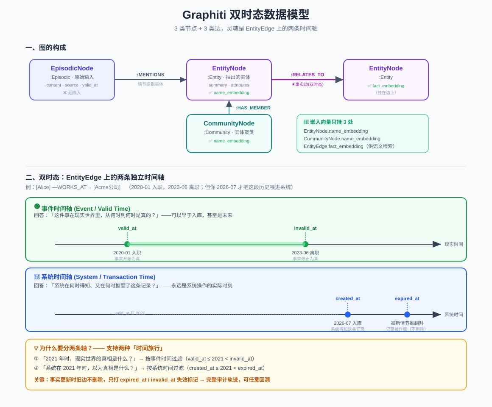

# Graphiti 双时态数据模型：`nodes.py` 与 `edges.py` 详解

> 写入管道往图里「塞」什么、检索管道从图里「取」什么——答案都在这份数据模型里。它是整个 Graphiti 的**地基**。
>
> 代码位置：`graphiti_core/nodes.py`、`graphiti_core/edges.py`

> 📖 关联阅读：[写入管道](04-数据写入管道-add_episode.md) · [检索管道](05-检索管道-search.md)。本文是它们操作的「数据对象」定义。

---

## 一、先看全景：3 类节点 + 3 类边

Graphiti 的图由这几种对象组成（还有一类 Saga 增量摘要节点，附在文末）：

| 类别 | 类 | 图标签/关系 | 一句话 | 有嵌入向量? |
|------|-----|------------|--------|:-----------:|
| **节点** | `EpisodicNode` | `:Episodic` | 原始输入（消息/文本/JSON），知识来源 | ❌ |
| | `EntityNode` | `:Entity` | 从情节抽出的实体（人/地/概念） | ✅ `name_embedding` |
| | `CommunityNode` | `:Community` | 实体聚类成的高层社区 | ✅ `name_embedding` |
| **边** | `EpisodicEdge` | `:MENTIONS` | 情节**提到**实体 | ❌ |
| | `EntityEdge` | `:RELATES_TO` | 实体间的**事实关系** ★双时态核心 | ✅ `fact_embedding` |
| | `CommunityEdge` | `:HAS_MEMBER` | 社区**包含**成员 | ❌ |

> **记住这条规律**：嵌入向量只挂在 3 个「需要被语义检索」的对象上——`EntityNode`(名字)、`CommunityNode`(名字)、`EntityEdge`(事实)。原始情节和结构性的边（MENTIONS/HAS_MEMBER）不需要嵌入。这正好呼应[检索管道](05-检索管道-search.md)里 episode 只能用 BM25 全文、不能用向量的原因。

图数据库里的完整映射：

```
(:Episodic) ──[:MENTIONS]──▶ (:Entity) ──[:RELATES_TO]──▶ (:Entity)
                                 ▲
                                 │[:HAS_MEMBER]
                            (:Community)
```

---

## 二、双时态（Bi-temporal）——本框架的灵魂

这是 Graphiti 区别于普通知识图谱的**最核心设计**，集中体现在 `EntityEdge` 的 **4 个时间字段**上。

### 两条独立的时间轴

一条事实（比如「Alice 在 Acme 公司工作」）身上挂着两套时间，回答两个不同的问题：

| 时间轴 | 字段 | 回答的问题 | 特点 |
|--------|------|-----------|------|
| **事件时间轴**<br>(Event / Valid Time) | `valid_at`<br>`invalid_at` | 「这件事在**现实世界**里，从何时到何时是真的？」 | 可以早于入库时间，甚至可以是未来 |
| **系统时间轴**<br>(System / Transaction Time) | `created_at`<br>`expired_at` | 「**系统**在何时**得知**、又在何时**推翻**了这条记录？」 | 永远是系统操作实际发生的时刻 |

- `valid_at`：事实**开始为真**的现实时间（"became true"）
- `invalid_at`：事实**停止为真**的现实时间（"stopped being true"）
- `created_at`：这条边记录**被写入库**的时间（系统得知）
- `expired_at`：这条边记录**在系统中被作废**的时间（被新信息取代）

### 一个例子彻底讲透

事实：`[Alice] —WORKS_AT→ [Acme公司]`

```
现实世界（事件时间轴）：
  Alice 2020-01 入职 Acme，2023-06 离职
  ⟹ valid_at = 2020-01,  invalid_at = 2023-06

系统认知（系统时间轴）：
  你 2026-07-01 才把这段历史喂给 Graphiti
  ⟹ created_at = 2026-07-01
  后来某条新情节推翻了它 ⟹ expired_at = 那次处理的时刻
```

注意 `valid_at`(2020) **远早于** `created_at`(2026)——**现实世界的事实时间，和系统得知它的时间，是完全解耦的两回事**。

### 为什么要分两条轴？—— 支持两种历史回溯

有了 4 个字段，你能问两种截然不同的历史问题：

1. **「2021 年时，现实世界的真相是什么？」** → 按**事件时间**过滤（`valid_at ≤ 2021 < invalid_at`）
2. **「系统在 2021 年时，*以为*真相是什么？」** → 按**系统时间**过滤（`created_at ≤ 2021 < expired_at`）

> **关键机制**：事实被"更新"时，Graphiti **不物理删除**旧边，而是给旧边打上 `expired_at`（系统时间）和/或 `invalid_at`（事件时间）。旧边永久保留，形成完整审计轨迹。这就是 Graphiti 宣称的「增量更新、无需批量重算、可任意时间点回溯」的底层机制——也正是[写入管道](04-数据写入管道-add_episode.md)第 ④ 步「时序失效」在做的事。

`EpisodicNode` 也有一套**轻量双时态**：`valid_at`（事件发生）vs `created_at`（入库）。

---

## 三、逐类字段详解

### 基类 `Node`（所有节点共有）

| 字段 | 类型 | 默认 | 含义 |
|------|------|------|------|
| `uuid` | str | 自动 uuid4 | 唯一标识 |
| `name` | str | 必填 | 名称 |
| `group_id` | str | 必填 | 图分区（多租户/命名空间隔离） |
| `labels` | list[str] | `[]` | 图数据库标签 |
| `created_at` | datetime | 自动 `utc_now()` | **系统时间**：创建时刻 |

`__hash__`/`__eq__` 都基于 uuid。`save()` 是抽象方法，子类实现。

### `EpisodicNode`（原始情节）额外字段

| 字段 | 类型 | 含义 |
|------|------|------|
| `source` | EpisodeType | 来源类型（见下方枚举） |
| `source_description` | str | 数据源描述 |
| `content` | str | 原始数据本身 |
| `valid_at` | datetime | **事件时间**：现实中何时发生 |
| `entity_edges` | list[str] | 本情节引用的 EntityEdge uuid 列表 |
| `episode_metadata` | dict\|None | 自定义元数据，可用于过滤 |

`EpisodeType` 枚举有 **4 个值**：`message`（"actor: content" 格式）、`json`（结构化）、`text`（纯文本）、`fact_triple`（事实三元组）。
特色方法 `get_by_entity_node_uuid`：反查「提到某实体」的所有情节（走 `MENTIONS` 边）。

### `EntityNode`（实体）额外字段

| 字段 | 类型 | 默认 | 含义 |
|------|------|------|------|
| `name_embedding` | list[float]\|None | None | 实体名的向量嵌入 |
| `summary` | str | `''` | 该实体周边关系的区域摘要 |
| `attributes` | dict | `{}` | 自定义实体类型的字段（取决于 labels） |

- `save()` 时把 `attributes` **平铺**进节点属性，labels 拼成 `Label1:Label2:Entity`——**始终追加 `Entity` 标签**。
- 嵌入生成 `generate_name_embedding`（内存计算），`load_name_embedding`（从库读回）。

### `CommunityNode`（社区）额外字段

`name_embedding`（社区名嵌入）+ `summary`（成员摘要）。**没有** `attributes`。详见[社区构建文档](08-社区构建-communities.md)。

---

### 基类 `Edge`（所有边共有）

| 字段 | 类型 | 含义 |
|------|------|------|
| `uuid` | str | 唯一标识 |
| `group_id` | str | 图分区 |
| `source_node_uuid` | str | 源节点 |
| `target_node_uuid` | str | 目标节点 |
| `created_at` | datetime | **系统时间**：记录时刻（注意：边这里**必填**，无默认工厂） |

### `EpisodicEdge`（`MENTIONS`）

**只有基类 5 个字段**，无嵌入、无时间扩展。`(:Episodic)-[:MENTIONS]->(:Entity)`。

### `EntityEdge`（`RELATES_TO`）★ 双时态核心 ★

基类 5 字段 + 下列：

| 字段 | 类型 | 时间轴 | 含义 |
|------|------|--------|------|
| `name` | str | — | 关系名（如 "WORKS_AT"） |
| `fact` | str | — | 自然语言事实句 |
| `fact_embedding` | list[float]\|None | — | fact 的嵌入向量 |
| `episodes` | list[str] | — | 产生此边的情节 uuid 列表 |
| `valid_at` | datetime\|None | 🟢事件 | 事实开始为真 |
| `invalid_at` | datetime\|None | 🟢事件 | 事实停止为真 |
| `created_at` | datetime | 🔵系统 | 记录被写入 |
| `expired_at` | datetime\|None | 🔵系统 | 记录被作废 |
| `reference_time` | datetime\|None | — | 产生此边的情节时间戳（辅助推导） |
| `attributes` | dict | — | 自定义边类型字段 |

- 图映射 `(:Entity)-[:RELATES_TO]->(:Entity)`。
- **Kuzu 特例**：Kuzu 的关系不能带复杂属性，所以边被**物化成中间节点** `RelatesToNode_`，变成 `(:Entity)-[:RELATES_TO]->(:RelatesToNode_)-[:RELATES_TO]->(:Entity)`。
- 特色查询 `get_between_nodes`（两实体间的边，写入去重时用到）、`get_by_node_uuid`（某实体的所有边）。

### `CommunityEdge`（`HAS_MEMBER`）

**只有基类 5 个字段**。`(:Community)-[:HAS_MEMBER]->(成员)`，成员可以是 Entity 或子 Community。

---

## 四、关键方法速查（各类通用模式）

| 方法 | 作用 |
|------|------|
| `save(driver)` | 序列化写库（含 embedding + 时间字段）。先试 `graph_operations_interface`，回退 Cypher |
| `get_by_uuid(s)` | 按 uuid 查，查不到抛 `NodeNotFoundError`/`EdgeNotFoundError` |
| `get_by_group_ids` | 按分区批量查，支持 `limit` + `uuid_cursor` 游标分页 |
| `generate_*_embedding` | **内存**计算 embedding 并赋值（不落库） |
| `load_*_embedding` | 从库**读回** embedding（因常规查询默认不带大向量，省带宽） |
| `delete` / `delete_by_uuids` | 删除（Kuzu 需先删物化的 `RelatesToNode_`） |

> **性能细节**：`EntityNode`/`EntityEdge` 的 `get_by_group_ids` 有 `with_embeddings` 开关，**默认 False**——普通查询不返回几百上千维的 embedding 向量，只有需要时才单独 `load_*_embedding`。这是个很实用的带宽优化。

---

## 五、多后端映射总表

| Python 类 | 标签/关系 | 端点模式 |
|-----------|----------|---------|
| EpisodicNode | `:Episodic` | — |
| EntityNode | `:Entity`(+自定义) | — |
| CommunityNode | `:Community` | — |
| EpisodicEdge | `:MENTIONS` | `(Episodic)→(Entity)` |
| EntityEdge | `:RELATES_TO` | `(Entity)→(Entity)`，Kuzu 经 `RelatesToNode_` 中转 |
| CommunityEdge | `:HAS_MEMBER` | `(Community)→(成员)` |

所有 save/get 先尝试可插拔的 `graph_operations_interface`，未实现则按 `driver.provider`（NEO4J/FALKORDB/KUZU/NEPTUNE）走内置 Cypher 分支。

---

## 六、附：Saga 相关对象（增量摘要）

文件里还有一套 Saga 对象（用于长会话的增量摘要，非核心三类）：
- `SagaNode`：字段含 `first_episode_uuid`、`last_episode_uuid`、`last_summarized_at`（系统水位线）、`last_summarized_episode_valid_at`（事件时间水位线）——**再次体现系统时间 vs 事件时间的分离**。
- `HasEpisodeEdge`（`:HAS_EPISODE`）：`(Saga)→(Episodic)`。
- `NextEpisodeEdge`（`:NEXT_EPISODE`）：`(Episodic)→(Episodic)`，把情节按时序串成链。

---

## 七、一句话总结

> Graphiti 的图由 **3 类节点 + 3 类边**构成；灵魂是 `EntityEdge` 上的**双时态**——`valid_at`/`invalid_at`（现实世界事实何时有效）和 `created_at`/`expired_at`（系统何时记录/作废）两条独立时间轴。事实更新时**旧边不删、只打失效标记**，从而支持「回溯现实历史」和「回溯系统认知历史」两种时间旅行，这是 Graphiti 增量、可溯源、可回溯的根基。

> 配套结构图见：
