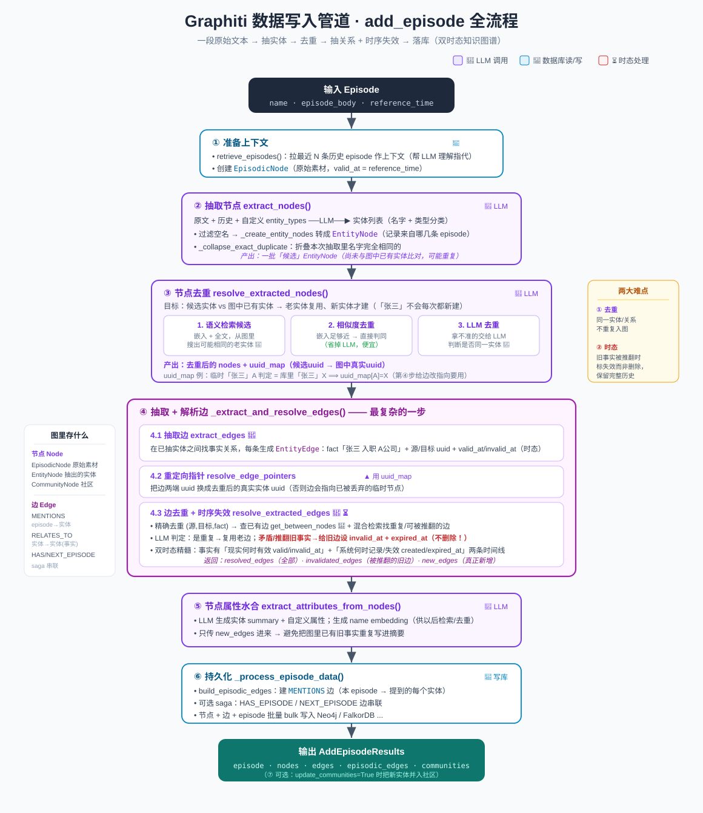

# Graphiti 数据写入管道：`add_episode` 全流程详解

> 梳理 Graphiti 最核心的写入入口 `add_episode`：一段原始文本（episode）是怎么一步步被 LLM 拆成**节点(Node)**和**边(Edge)**，去重、判断时效，最后落进图数据库的。
>
> 代码位置：`graphiti_core/graphiti.py::add_episode`（约 980 行起）

---

## 一、先建立整体认知：三类节点、三类边

在看流程前，先记住 Graphiti 图里有什么。

### 节点（Node）
| 类型 | 含义 | 例子 |
|------|------|------|
| **EpisodicNode**（情节节点） | 你喂进去的**原始数据本身**，一条消息/一段文本/一个 JSON | 「张三今天入职了 A 公司」 |
| **EntityNode**（实体节点） | 从情节里**抽取**出来的实体 | `张三`、`A公司` |
| **CommunityNode**（社区节点） | 实体聚类形成的高层「社区」（可选） | 「A公司员工群体」 |

### 边（Edge）
| 类型 | 含义 | 连接 |
|------|------|------|
| **EpisodicEdge**（`MENTIONS`） | 「这条情节**提到了**这个实体」 | EpisodicNode → EntityNode |
| **EntityEdge**（`RELATES_TO`） | 实体之间的**事实关系**，带时间属性 | EntityNode → EntityNode |
| **CommunityEdge** | 实体属于哪个社区 | CommunityNode → EntityNode |

> **关键区别**：EpisodicNode 是「原始素材」，永久保留、不改；EntityNode/EntityEdge 是「提炼出的知识」，会随新情节不断去重、更新、失效。这就是 Graphiti「双时态知识图谱」的基础。

---

## 二、管道全景（7 个阶段）

```
输入：name + episode_body + reference_time
  │
  ├─① 准备上下文 ── 拉取最近的历史 episode，创建 EpisodicNode
  │
  ├─② 抽取节点 ──── extract_nodes()         【LLM】原文 → 实体列表
  │
  ├─③ 节点去重 ──── resolve_extracted_nodes() 新实体 vs 图中已有实体
  │
  ├─④ 抽取+解析边 ─ _extract_and_resolve_edges() 【LLM】实体间事实 + 去重 + 时序失效
  │
  ├─⑤ 节点属性水合 ─ extract_attributes_from_nodes() 【LLM】生成摘要 + 嵌入向量
  │
  ├─⑥ 持久化 ────── _process_episode_data() 建 MENTIONS 边，批量写库
  │
  └─⑦ 社区更新 ──── (可选) update_community()
输出：AddEpisodeResults(episode, nodes, edges, episodic_edges, ...)
```

下面逐阶段拆解。

---

## 三、逐阶段详解

### ① 准备上下文

```python
previous_episodes = await self.retrieve_episodes(reference_time, last_n=RELEVANT_SCHEMA_LIMIT, ...)
episode = EpisodicNode(name=..., content=episode_body, valid_at=reference_time, ...)
```

- **拉历史**：取最近 N 条 episode 作为**上下文**，让 LLM 抽取时能理解指代（比如「他」指谁）。
- **建情节节点**：把这次输入包装成一个 `EpisodicNode`，`valid_at` = 你给的 `reference_time`（事件发生时间）。

### ② 抽取节点 `extract_nodes` 🧠LLM

**这是"实体抽取"的核心。**

```python
extracted_nodes, node_episode_index_map = await extract_nodes(
    self.clients, episode, previous_episodes, entity_types, excluded_entity_types, ...)
```

内部做了什么：
1. **拼上下文**：当前 episode 内容 + 历史 episode + 你定义的 `entity_types`（自定义实体类型，如 `Person`/`Company`）。
2. **LLM 抽取**（`_extract_nodes_single`）：让模型读原文，吐出实体列表，每个实体带名字 + 类型分类。
3. **过滤**：丢掉空名字的。
4. **转对象**（`_create_entity_nodes`）：变成 `EntityNode`，并记录每个实体来自哪几条 episode（多情节场景）。
5. **折叠精确重复**（`_collapse_exact_duplicate_extracted_nodes`）：同一次抽取里名字完全一样的先合并。

> 输出：一批**候选** `EntityNode`。注意——此时还没跟图里已有的实体比对，可能有大量「其实是同一个人」的重复。

### ③ 节点去重 `resolve_extracted_nodes`

**目标**：把②抽出的候选实体，和**数据库里已存在的实体**对齐——是老实体就复用，是新实体才新建。这样「张三」不会每条消息都变成一个新节点。

三级去重策略（从便宜到贵）：

1. **语义检索候选**（`_collect_candidate_nodes`）：用嵌入向量 + 全文，为每个候选实体从图里搜出可能相同的「候选老实体」。
2. **相似度去重**（`_resolve_with_similarity`）：候选和老实体嵌入足够接近 → 直接判定为同一个，**省掉 LLM**。
3. **LLM 去重**（`_resolve_with_llm`）：相似度拿不准的，交给 LLM 判断「这几个到底是不是同一个实体」。

关键产物 **`uuid_map`**：一张「候选实体 uuid → 图中真实实体 uuid」的映射表。
> 例：抽出的临时「张三」(uuid=A) 被判定等于库里已有的「张三」(uuid=X)，则 `uuid_map[A] = X`。这张表在第④步给边「改指向」时至关重要。

### ④ 抽取 + 解析边 `_extract_and_resolve_edges` 🧠LLM

这是最复杂的一步，分三小步：

**4.1 抽取边 `extract_edges`（LLM）**
让 LLM 在**已抽取的实体之间**找「事实关系」，每条关系生成一个 `EntityEdge`：
- `fact`：一句话事实，如「张三 入职 A公司」
- `source_node_uuid` / `target_node_uuid`：连接哪两个实体
- `valid_at` / `invalid_at`：LLM 从文本里抽出的**事实生效/失效时间**（时态信息）

**4.2 重定向指针 `resolve_edge_pointers`**
用第③步的 `uuid_map` 把边的两端 uuid 换成**去重后的真实实体 uuid**。
> 因为边是基于「候选实体」抽的，而候选实体可能已被合并到老实体，所以边的指向必须同步更新，否则会指到一个被丢弃的临时节点。

**4.3 边去重 + 时序失效 `resolve_extracted_edges`（LLM）**
对每条边：
1. **精确去重**：`(源, 目标, fact)` 三元组完全相同的先合并。
2. **找已有边**：`get_between_nodes` 查这两个实体间已存在的边；再用**混合检索**找语义相关的边（重复候选）和**可能被推翻的边**（invalidation candidates）。
3. **LLM 判定**（`resolve_extracted_edge`）：
   - 是否是已有边的**重复** → 是则复用老边
   - 是否**矛盾/推翻**了某条老边 → 是则把老边标记失效
   - 补全 `valid_at` / `invalid_at` 时间
4. **时序失效**：当新事实推翻旧事实（如「张三从 A 公司离职」推翻「张三在 A 公司」），给旧边设置 `invalid_at` + `expired_at`——**旧边不删除，只标记为"曾经有效"**，保留历史。

返回三个列表：
- `resolved_edges`：解析后的全部边
- `invalidated_edges`：被新信息推翻的旧边
- `new_edges`：真正新增的边（非重复）

> **双时态的精髓在这**：一条事实有「它在现实世界何时有效」(`valid_at`/`invalid_at`) 和「它何时被系统记录/失效」(`created_at`/`expired_at`) 两条时间线，历史永不丢失。

### ⑤ 节点属性水合 `extract_attributes_from_nodes` 🧠LLM

```python
hydrated_nodes = await extract_attributes_from_nodes(
    self.clients, nodes, episode, previous_episodes, entity_types, edges=new_edges)
```

给去重后的实体节点「填充血肉」：
- **LLM 生成 summary**（实体摘要）和自定义属性（按 `entity_types` 定义）。
- 生成 **name embedding**（名字嵌入向量，供以后检索/去重用）。
- 只传 `new_edges` 进来生成摘要，**避免把图里已有的旧事实重复写进摘要**。

### ⑥ 持久化 `_process_episode_data`

```python
episodic_edges = build_episodic_edges(nodes, episode_uuids, now, ...)
```

- **建 `MENTIONS` 边**：把这条 EpisodicNode 连到它提到的每个 EntityNode。
- **saga 关联**（可选）：把 episode 挂到 saga 上，用 `HAS_EPISODE` 边；连续 episode 间用 `NEXT_EPISODE` 边串起来。
- **批量写库**：节点、边、episode 一起 bulk 保存进 Neo4j / FalkorDB 等后端。
- 若 `store_raw_episode_content=False`，会清空原文只留结构（省空间）。

### ⑦ 社区更新（可选）

`update_communities=True` 时，为每个实体调用 `update_community`，把新实体并入对应社区（聚类），维护高层视图。

---

## 四、一次完整的数据流示例

输入 episode：**「张三今天从 A 公司离职，加入了 B 公司」**（reference_time = 2026-07-03）

| 阶段 | 发生了什么 |
|------|-----------|
| ① | 创建 EpisodicNode，拉取张三相关的历史 episode |
| ② 抽节点 | LLM 抽出实体：`张三`、`A公司`、`B公司` |
| ③ 去重 | `张三`、`A公司` 在库里已存在 → 复用老 uuid；`B公司` 是新的 → 新建 |
| ④ 抽边 | LLM 抽出事实：`张三-离职-A公司`、`张三-加入-B公司`；发现旧边`张三-就职于-A公司`被推翻 → 给它设 `invalid_at=2026-07-03` |
| ⑤ 水合 | 更新张三的 summary：「曾任职 A 公司，现于 B 公司」，生成嵌入 |
| ⑥ 存库 | 建 MENTIONS 边（本 episode → 张三/A公司/B公司），批量写入 |

结果：图里张三还连着 A 公司（历史边，已标失效）**和** B 公司（新边，有效）——**历史和现状都在，可按时间点回溯**。

---

## 五、一句话总结

> `add_episode` 把一段原始文本，经过 **①上下文准备 → ②LLM抽实体 → ③实体去重对齐 → ④LLM抽关系+去重+时序失效 → ⑤属性水合 → ⑥落库** 的流水线，增量地织进一张**双时态知识图谱**。核心难点在于**去重**（同一实体/关系不重复）和**时态**（旧事实被推翻时标记失效而非删除，保留完整历史）。

> 配套结构图见：
