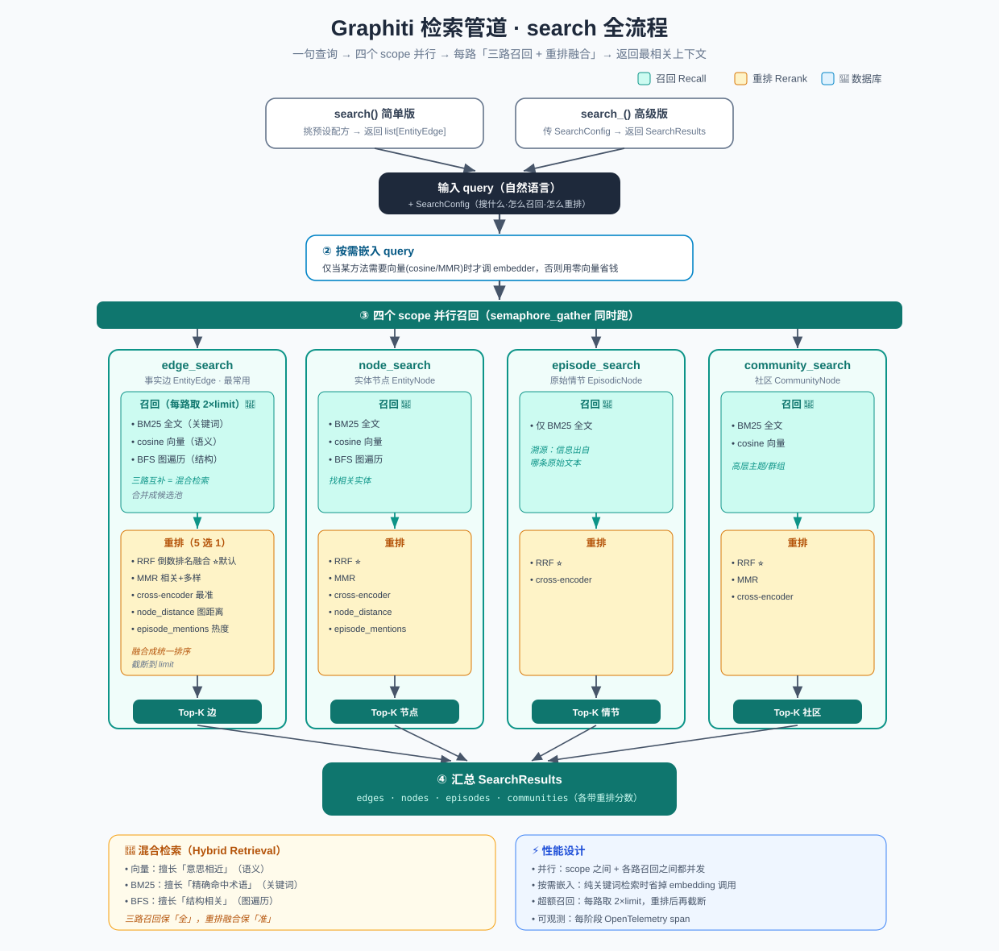

# Graphiti 检索管道：`search` 全流程详解

> 梳理 Graphiti 的读取入口 `search`：一句自然语言查询，是怎么经过**三路召回（向量 + 关键词 + 图遍历）**和**重排融合**，返回最相关的边/节点/情节/社区的。
>
> 代码位置：`graphiti_core/graphiti.py::search` / `search_`，核心实现 `graphiti_core/search/search.py`

> 📖 与写入管道对称阅读：[`04-数据写入管道-add_episode.md`](04-数据写入管道-add_episode.md)。写入是「拆解入图」，检索是「召回出图」。

---

## 一、两个入口：简单版 vs 高级版

| 入口 | 签名 | 返回 | 适用 |
|------|------|------|------|
| **`search()`** | `search(query, center_node_uuid?, num_results, ...)` | `list[EntityEdge]` | 开箱即用，只要事实（边） |
| **`search_()`** | `search_(query, config, ...)` | `SearchResults`（边+节点+情节+社区） | 高级，用 `SearchConfig` 精细控制召回/重排 |

简单版内部就是挑一个预设配方再调核心 `search()`：

```python
# graphiti.search() 的核心逻辑
search_config = (
    EDGE_HYBRID_SEARCH_RRF                # 默认：边的混合检索 + RRF 融合
    if center_node_uuid is None
    else EDGE_HYBRID_SEARCH_NODE_DISTANCE # 给了中心节点：按图上距离重排
)
```

> **核心概念**：所有检索都由一个 `SearchConfig` 描述——「要搜哪几种对象、每种用哪些召回方法、用哪个重排器」。`search_config_recipes.py` 里预置了一堆常用配方（见文末）。

---

## 二、检索全景

```
输入：query（自然语言）
  │
  ├─① 空查询直接返回空
  │
  ├─② 按需嵌入 query ── 只有当某个方法需要向量(cosine/MMR)时才调 embedder，否则用零向量省钱
  │
  ├─③ 四个 scope 并行召回（semaphore_gather 同时跑）
  │      ┌───────────────┬───────────────┬──────────────┬─────────────────┐
  │      ▼               ▼               ▼              ▼
  │   edge_search    node_search    episode_search  community_search
  │   (事实边)         (实体节点)       (原始情节)       (社区)
  │      │               │               │              │
  │      每个 scope 内部都是：  召回(多路) ──▶ 重排(rerank)
  │
  └─④ 汇总成 SearchResults(edges, nodes, episodes, communities + 各自分数)
输出：SearchResults
```

---

## 三、每个 scope 的两个阶段：召回 → 重排

四个 scope（edge/node/episode/community）结构一模一样，都是**先多路召回、再重排取 Top-K**。以 `edge_search` 为最全的例子。

### 阶段 A：多路召回（Recall）

按 `config.search_methods` 配置，**并行**跑下面几种召回，每种取 `2 × limit` 个候选：

| 召回方法 | 原理 | 对应函数 |
|---------|------|---------|
| **BM25 / 全文** | 关键词匹配（Neo4j 全文索引） | `edge_fulltext_search` |
| **cosine_similarity 向量** | query 嵌入 与 边/节点嵌入 的余弦相似度 | `edge_similarity_search` |
| **BFS 图遍历** | 从起点节点做广度优先，捞出 N 跳内的边/节点 | `edge_bfs_search` |

> 这就是 Graphiti 宣传的 **Hybrid Retrieval（混合检索）**：语义（向量）擅长「意思相近」，关键词（BM25）擅长「精确命中术语」，图遍历（BFS）擅长「结构相关」——三者互补，召回更全。
>
> 不同 scope 支持的召回方法略有不同：episode 只有全文；community 有全文 + 向量；edge/node 三种都有。

多路召回的结果先合并成一个 `uuid → 对象` 的候选池，交给重排。

> 📖 RRF / MMR 的公式与逐行实现（带数字算例）详见 [`07-重排算法-RRF与MMR.md`](07-重排算法-RRF与MMR.md)。

### 阶段 B：重排融合（Rerank）

多路召回各自有自己的排序，需要一个重排器把它们**融合成一个统一排序**并截断到 `limit`。Graphiti 支持 5 种重排器：

| 重排器 | 原理 | 特点 |
|--------|------|------|
| **RRF**（Reciprocal Rank Fusion） | 倒数排名融合：一个结果在各路里排得越靠前，综合分越高 | 默认、快、无需额外模型 |
| **MMR**（Maximal Marginal Relevance） | 相关性 + 多样性权衡，避免结果高度雷同 | 需要加载候选嵌入 |
| **cross_encoder** | 把 (query, 每条文本) 成对喂给重排模型精打分 | **最准**，但最慢（要模型推理） |
| **node_distance** | 按候选在图上到 `center_node_uuid` 的距离排 | 需要中心节点，做「以某实体为中心」的检索 |
| **episode_mentions** | 按被多少条 episode 提及排序 | 越常被提到越靠前 |

```python
# 重排器分派（edge_search 节选）
if reranker == rrf:            reranked = rrf(各路结果的uuid列表)
elif reranker == mmr:          reranked = maximal_marginal_relevance(query_vec, 候选嵌入, λ)
elif reranker == cross_encoder: reranked = cross_encoder.rank(query, 候选文本)   # 最准
elif reranker == node_distance: reranked = node_distance_reranker(候选, center_node)
```

重排后 `reranked_edges[:limit]` 即该 scope 的最终结果。

---

## 四、四个 scope 各自搜什么

| scope | 搜索对象 | 返回类型 | 召回方法 | 典型用途 |
|-------|---------|---------|---------|---------|
| **edge_search** | 事实边 | `EntityEdge` | BM25 + 向量 + BFS | 「关于 X 的事实有哪些」（最常用） |
| **node_search** | 实体节点 | `EntityNode` | BM25 + 向量 + BFS | 「找出相关实体」 |
| **episode_search** | 原始情节 | `EpisodicNode` | 仅 BM25 全文 | 「溯源：这信息出自哪条原文」 |
| **community_search** | 社区 | `CommunityNode` | BM25 + 向量 | 「高层主题/群组」 |

`search_()` 用一个 config 可同时开启多个 scope；简单版 `search()` 只开 edge。

---

## 五、性能设计要点

- **并行**：4 个 scope 之间、每个 scope 内的多路召回之间，都用 `semaphore_gather` 并发，压低延迟。
- **按需嵌入**：只有配置里真的用到向量方法时才调用 embedder 生成 query 向量，否则用零向量占位——**纯关键词检索时省掉一次 embedding API 调用**。
- **超额召回**：每路召回取 `2 × limit`，给重排留足候选，重排后再截断到 `limit`，兼顾召回率与精度。
- **可观测**：全流程用 `_trace_phase` 包裹，每个阶段都有 OpenTelemetry span（候选数、重排器、返回数等），方便排查慢查询。

---

## 六、常用检索配方（`search_config_recipes.py`）

预置配方 = scope 组合 + 召回方法 + 重排器，直接传给 `search_()`：

| 配方 | scope | 重排器 | 场景 |
|------|-------|--------|------|
| `EDGE_HYBRID_SEARCH_RRF` | 边 | RRF | 默认，找事实 |
| `EDGE_HYBRID_SEARCH_MMR` | 边 | MMR | 要结果多样 |
| `EDGE_HYBRID_SEARCH_CROSS_ENCODER` | 边 | cross-encoder | 要最高精度 |
| `EDGE_HYBRID_SEARCH_NODE_DISTANCE` | 边 | node_distance | 以某实体为中心 |
| `EDGE_HYBRID_SEARCH_EPISODE_MENTIONS` | 边 | episode_mentions | 按热度 |
| `NODE_HYBRID_SEARCH_RRF / MMR / ...` | 节点 | 各种 | 找实体 |
| `COMBINED_HYBRID_SEARCH_RRF / MMR / CROSS_ENCODER` | 边+节点+情节+社区 | 各种 | 一次全搜 |

---

## 七、一句话总结

> `search` 把一句查询，通过 **①按需嵌入 → ②四个 scope 并行 → ③每个 scope 三路召回（向量 + BM25 + 图遍历）→ ④重排融合（RRF / MMR / cross-encoder / node-distance）** 的流水线，从双时态知识图谱里取回最相关的上下文。核心思想是 **"混合召回保全 + 重排保准"**，并用并行、按需嵌入、超额召回等手段压低延迟。

> 配套结构图见：
