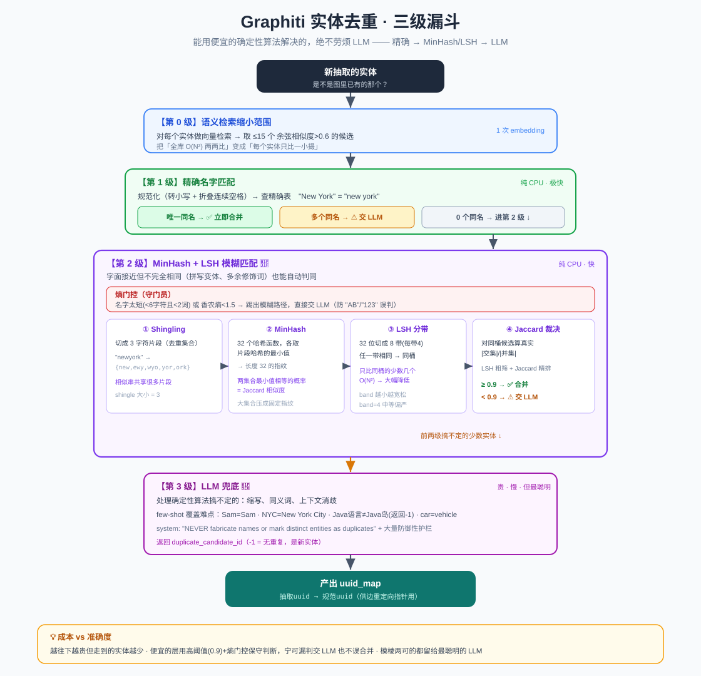

# Graphiti 实体去重算法：MinHash + LSH + LLM 三级漏斗

> 写入管道里最有技术含量的一步——如何判断新抽出的「张三」和图里已有的「张三」是不是同一个人？Graphiti 用了一套 **精确匹配 → MinHash/LSH 模糊匹配 → LLM 兜底** 的三级漏斗，能免则免（少调 LLM），省钱又准确。
>
> 代码位置：`graphiti_core/utils/maintenance/dedup_helpers.py`、`node_operations.py`、`prompts/dedupe_nodes.py`

> 📖 关联阅读：本文是[写入管道](04-数据写入管道-add_episode.md)第 ③ 步「节点去重」的算法深挖。

---

## 一、为什么去重这么难，又这么重要？

每条消息里都可能提到「张三」，如果不去重，图里会堆出成百上千个重复的「张三」节点，知识图谱就废了。但判断「是不是同一个」又很微妙：

- `"New York"` vs `"new york"` —— 大小写/空格差异，**是**同一个
- `"NYC"` vs `"New York City"` —— 缩写，**是**同一个（但字面完全不同）
- `"Java(编程语言)"` vs `"Java(印尼岛屿)"` —— 同名，**不是**同一个

**核心矛盾**：最准的判断是让 LLM 读上下文，但 LLM 又贵又慢。所以 Graphiti 的设计哲学是——**能用便宜的确定性算法解决的，绝不劳烦 LLM**。

---

## 二、三级漏斗全景

```
新抽取的实体
   │
   ├─【第 0 级】语义检索缩小范围
   │    对每个实体做向量检索，从全库捞出 ≤15 个余弦相似度 >0.6 的候选
   │    （把「全库两两比」变成「每个实体只比一小撮」）
   │
   ├─【第 1 级】精确名字匹配 ────────── 唯一同名 → ✅ 立即合并（免 LLM）
   │    规范化(小写+折叠空格)后查精确表         多个同名 → ⚠️ 歧义，交给 LLM
   │
   ├─【第 2 级】MinHash + LSH 模糊匹配 ── Jaccard ≥ 0.9 → ✅ 立即合并（免 LLM）
   │    （先过"熵门控"：名字太短/信息量低的跳过，直接交 LLM）
   │
   └─【第 3 级】LLM 兜底 ─────────────── 处理缩写/同义词/上下文消歧
        只有前两级搞不定的少数实体才走到这里
```

**成本递增，数量递减**：越往下越贵，但需要走到下面的实体越来越少。绝大多数明显重复在第 1、2 级就被便宜地拦截了。

---

## 三、关键常量（都在 `dedup_helpers.py:31-36`）

| 常量 | 值 | 含义 |
|------|-----|------|
| `_FUZZY_JACCARD_THRESHOLD` | **0.9** | Jaccard 相似度阈值，≥0.9 才自动判同 |
| `_NAME_ENTROPY_THRESHOLD` | **1.5** | 名字香农熵下限，低于此不信任模糊匹配 |
| `_MIN_NAME_LENGTH` | 6 | 名字最小字符数 |
| `_MIN_TOKEN_COUNT` | 2 | 名字最小词数 |
| `_MINHASH_PERMUTATIONS` | 32 | MinHash 签名长度（哈希函数个数） |
| `_MINHASH_BAND_SIZE` | 4 | LSH 每带大小（32/4 = 8 个 band） |

检索相关（`node_operations.py:63-65`）：
- `NODE_DEDUP_CANDIDATE_LIMIT = 15`（每个实体检索的候选数上限）
- `NODE_DEDUP_COSINE_MIN_SCORE = 0.6`（候选检索的余弦相似度下限）

---

## 四、逐级详解

### 第 0 级：语义检索缩小范围

`_collect_candidate_nodes` → `_semantic_candidate_search`：对每个抽取实体的名字做 embedding，用向量相似度检索，取**最多 15 个、余弦相似度 > 0.6** 的已有实体作为候选。

> **为什么要这一步**：如果每个新实体都要和图里几万个老实体逐一比较，成本是 O(N²)，不可接受。先用向量检索把"可能相关的"缩小到十几个，后面的精确/模糊匹配只在这一小撮里做。

### 第 1 级：精确名字匹配

先规范化名字（`_normalize_string_exact`）：**转小写 + 把连续空白折叠成单个空格**。于是 `"New   York"` 和 `"new york"` 得到同一个 key。

然后查精确表 `normalized_existing`：
- **恰好 1 个同名** → **立即判为重复**，写入 `uuid_map`，完全跳过 LLM ✅
- **多于 1 个同名** → 歧义（无法自动裁决是哪个）→ 交给 LLM ⚠️
- **0 个同名** → 进入第 2 级

### 第 2 级：MinHash + LSH 模糊匹配 🌟

这是整个算法最精彩的部分。目标：字面**接近但不完全相同**的名字（拼写变体、多余修饰词）也能自动判同，而且要**快**。分三步。

#### 2.1 先过「熵门控」（守门员）

`_has_high_entropy`：如果名字**太短**（<6 字符且 <2 个词）或**信息量太低**（香农熵 < 1.5），直接**踢出模糊路径，交给 LLM**。

> **为什么**：像 `"AB"`、`"123"` 这种名字，字面模糊匹配极易误判（一堆短名字碰巧很像）。这类反而**故意**推给有上下文的 LLM 去消歧。香农熵衡量"名字的独特性"——重复字符多、长度短的名字熵低。

#### 2.2 Shingling：把名字切成字符片段

`_shingles`（**shingle 大小 = 3**）：去空格后用长度 3 的滑动窗口切出所有连续字符三元组，放进集合去重。

```
"newyork" → {"new", "ewy", "wyo", "yor", "ork"}
```

> **通俗理解**：shingle（瓦片/字符 n-gram）就是把字符串切成一小段一小段有重叠的片段。两个相似的字符串会**共享很多相同片段**，于是可以用"共享片段的比例"来衡量相似度。

#### 2.3 MinHash：把集合压成 32 位指纹

`_minhash_signature`：用 32 个不同的哈希函数（`blake2b` 配 32 个 seed），每个函数取"该 shingle 集合里所有片段哈希值的**最小值**"，得到长度 32 的签名。

> **MinHash 的魔法**（这是理解的关键）：两个集合，用**同一个哈希函数**各自取"最小哈希值"，这两个最小值**相等的概率恰好等于它们的 Jaccard 相似度**。用 32 个不同哈希函数就相当于独立采样 32 次——签名里相同的位越多，两个集合越相似。核心价值：把任意大的集合压成**固定长度 32** 的指纹，之后比较飞快。

#### 2.4 LSH：只和"可能像的"比，不全量比

`_lsh_bands`：把长度 32 的签名切成每带 4 个的连续片段 → **8 个 band**。只要**任意一个 band 完全相同**，两个实体就落进同一个"桶"，成为候选。

> **LSH（局部敏感哈希）解决什么**：我不想拿新实体和所有历史实体两两比 Jaccard。做法是——把签名切成 8 段，相似的实体极可能至少有一段相同，从而落进同一桶；不相似的极难碰巧一整段都相同。这样把 O(N²) 的两两比较降成"只比同桶的少数几个"。band 越小越宽松（召回高、误检多），越大越严格；这里 band=4 是中等偏严的设置。

#### 2.5 最终裁决：真实 Jaccard

LSH 只负责快速**找候选**，最后用 `_jaccard_similarity`（`|交集|/|并集|`）算**真实相似度**。取最高分候选：
- **best_score ≥ 0.9** → 立即判为重复 ✅
- 否则（无候选或最高分 < 0.9）→ 交给 LLM

> LSH 找候选（快但可能有假阳性）+ Jaccard 精确确认（准）—— 这是「粗筛 + 精排」的经典组合。

### 第 3 级：LLM 兜底

只有 `unresolved_indices` 非空（前两级没搞定的）才触发。

- 把未解决实体重新编号 0..N-1，连同候选实体（带 summary 截断 120 字符、attributes）一起构造 context。
- 用 `prompt_library.dedupe_nodes.nodes` 这个 prompt，system 强调 **"NEVER fabricate entity names or mark distinct entities as duplicates"**。
- 判重标准：**只有指向同一现实世界对象才算重复**，"相关但不同"不算。
- 4 个 few-shot 例子精准覆盖难点：`Sam=Sam`（同人）、`NYC=New York City`（缩写）、`Java语言≠Java岛`（同名不同物 → 返回 -1）、`Marco's car=Marco's vehicle`（同义词）。
- 返回 `NodeResolutions`，每个 `NodeDuplicate` 含 `duplicate_candidate_id`（**-1 表示无重复，是新实体**）。
- 大量**防御性护栏**：校验 id 数量匹配、跳过越界/重复 id、无效 id 当作新实体并记 warning。

---

## 五、状态对象 `DedupResolutionState`（`dedup_helpers.py:160-167`）

三级漏斗靠这个状态对象串起来：

| 字段 | 作用 |
|------|------|
| `resolved_nodes` | 按抽取顺序，每个位置的最终解析结果（`None`=还没解决），初始 `[None]*n` |
| `uuid_map` | **抽取 uuid → 规范 uuid** 的映射——去重后边要靠它把指向改到合并后的节点 |
| `unresolved_indices` | 三级漏斗的"传送带"：确定性阶段往里放，LLM 阶段消费 |
| `duplicate_pairs` | 记录所有「抽取节点 → 命中的已存在节点」配对，供上层合并边/属性 |

流程结束时，仍为 `None` 的位置填回自身（视为全新实体）。`uuid_map` 就是[写入管道](04-数据写入管道-add_episode.md)第 ④.2 步 `resolve_edge_pointers` 给边改指向用的那张表。

---

## 六、还有一个前置清理：同批预去重

在抽取阶段末尾（`extract_nodes` 内），还有个 `_collapse_exact_duplicate_extracted_nodes`：只合并**同一批抽取里**规范名完全相同的节点（不碰图里已有节点）。冲突时保留**更具体的标签**（`Person` > `Entity`）或更长的名字，并合并 episode 归属。这是 dedup 之前的清理。

---

## 七、成本 vs 准确度的设计智慧

| 层级 | 成本 | 准确度取舍 |
|------|------|-----------|
| 第 0 级 语义检索 | 1 次 embedding/实体 | 把比较范围从全库降到 ~15 个 |
| 第 1 级 精确匹配 | 纯 CPU，极快 | 只在唯一同名时自动合并，有歧义就上交 |
| 第 2 级 MinHash/LSH | 纯 CPU，快 | 高阈值 0.9 + 熵门控，**宁可漏判交给 LLM，也不误合并** |
| 第 3 级 LLM | 贵、慢、有不确定性 | 处理缩写/同义词/消歧，只有少数实体走到这 |

设计意图很清晰：**便宜的方法只在极有把握时下判断（高阈值保守），把模棱两可的都留给最贵但最聪明的 LLM**。短名/低熵名故意不走模糊匹配、直接交 LLM，因为 LLM 有上下文能正确消歧——这是很老练的工程权衡。

---

## 八、一句话总结

> Graphiti 去重是个**三级漏斗**：先用向量检索把候选缩到十几个，再用**精确名字匹配**和 **MinHash+LSH 模糊匹配**（Jaccard≥0.9）在纯 CPU 上便宜地拦截明显重复，只有缩写/同义词/歧义这类需要语义理解的少数实体才升级到 **LLM**。核心哲学是「能用便宜确定性算法解决的绝不劳烦 LLM」，用高阈值和熵门控保证便宜的层只在极有把握时才出手。

> 配套结构图见：
