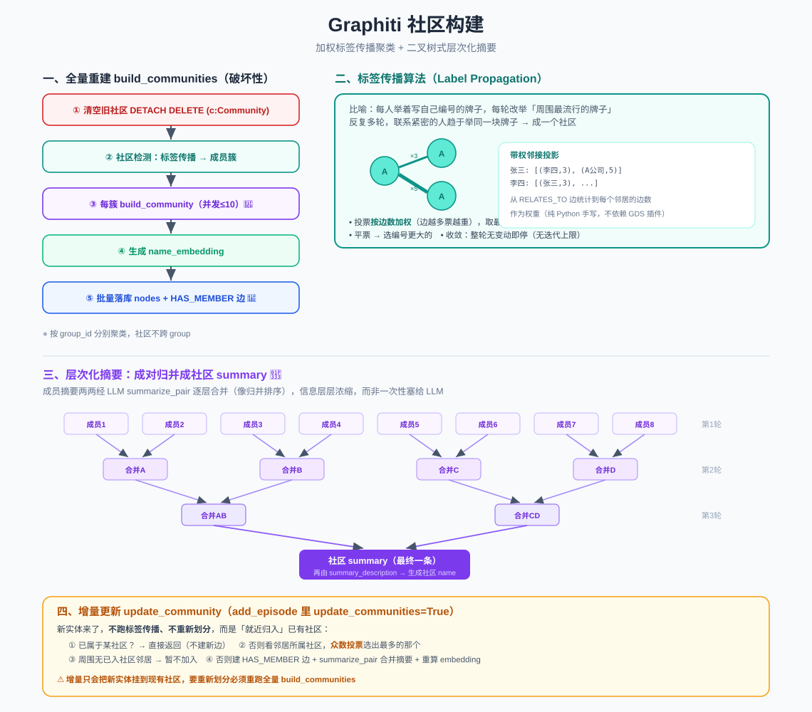

# Graphiti 社区构建：标签传播 + 层次化摘要

> 知识图谱不只有一个个实体和事实，还需要「高层视图」——把联系紧密的实体聚成**社区**（比如「A 公司员工群体」）。本文讲社区怎么被聚类出来、名字和摘要怎么生成、以及新实体如何增量并入。
>
> 代码位置：`graphiti_core/utils/maintenance/community_operations.py`、`graphiti.py`、`prompts/summarize_nodes.py`

> 📖 关联阅读：[双时态数据模型](03-双时态数据模型-nodes与edges.md)（CommunityNode/CommunityEdge 定义）· [写入管道](04-数据写入管道-add_episode.md)（`update_communities=True` 触发增量更新）。

---

## 一、两种模式：全量重建 vs 增量更新

| 模式 | 入口 | 时机 | 特点 |
|------|------|------|------|
| **全量重建** | `build_communities()` | 手动调用 | 破坏性：先删光所有社区再从头聚类 |
| **增量更新** | `update_community()` | `add_episode(update_communities=True)` | 把新实体就近塞进已有社区，**不重新划分** |

> **关键区别**：全量 build 用**标签传播算法**从头聚类；增量 update 用**邻居社区众数**把新节点挂到现有社区上——**不会创建新社区、不会重新划分**。想重新划分必须重跑全量 `build_communities`。

---

## 二、全量重建 `build_communities` 流程

```
① 清空旧社区   remove_communities → MATCH (c:Community) DETACH DELETE c
      │
② 社区检测     get_community_clusters → 标签传播 → list[list[EntityNode]]
      │         （每个子列表 = 一个社区的成员实体）
      │
③ 并发构建     对每个 cluster 调 build_community（并发上限 10）
      │         → 生成 (CommunityNode, [CommunityEdge])
      │
④ 生成嵌入     对每个社区节点 generate_name_embedding
      │
⑤ 落库         并发保存所有 community_nodes + community_edges
```

> **注意**：社区**按 group_id 分别聚类**，不跨 group 形成。`group_ids=None` 时自动查出图中所有 group_id 逐个处理。

---

## 三、社区检测算法：加权标签传播（Label Propagation）🌟

Graphiti **没有依赖图数据库的 GDS 插件**，而是**纯 Python 手写**了标签传播算法。分两部分。

### 3.1 先构建带权邻接投影

对每个 group 下的所有 `Entity`，用 Cypher 查它通过 `RELATES_TO` 边连接的邻居，并**统计到每个邻居的边数**作为权重：

```
projection = {
  "张三": [("李四", 3), ("A公司", 5)],   # 张三与李四有 3 条边，与 A 公司有 5 条边
  ...
}
```

边数越多 = 关系越紧密 = 权重越高。

### 3.2 标签传播算法

> **通俗理解**：想象每个人（节点）一开始都举着写有自己编号的牌子（社区标签）。然后一轮一轮地，每个人看看**周围邻居都举着什么牌子**，改举"周围最流行的那块"。反复多轮后，联系紧密的一群人会趋于举同一块牌子——他们就成了一个社区。

具体实现：

1. **初始化**：每个节点自成一个社区 `community_map = {uuid: i}`（i 递增）。
2. **迭代**（`while True`）：每轮遍历所有节点——
   - 用 `defaultdict` 统计邻居们的社区票数，**按 `edge_count` 加权累加**（不是一人一票，边越多票越重）。
   - 候选社区按 `(票数, 社区id)` **降序排序**，取最高票。
   - **决定新标签**：
     - 最高票候选的**票数 > 1** → 采纳这个社区；
     - 否则（平票或票数很低）→ 用 `max(候选社区id, 当前社区id)`，即**选编号更大的那个**做确定性的平票裁决。
   - 若标签变了，标记 `no_change = False`。
3. **收敛条件**：一整轮下来**没有任何节点改变标签** → `break`。（标准的标签传播收敛判据，无最大迭代次数上限，纯靠自然收敛。）
4. **收尾**：按最终标签把节点分组，返回 `list[list[uuid]]`，再 hydrate 成 `EntityNode`。

---

## 四、社区的 name 和 summary 怎么来的——层次化归并 🌳

一个社区可能有几十个成员，每个成员实体都有自己的 `summary`。怎么浓缩成一条社区摘要？Graphiti 用**二叉树式的成对归并**（像归并排序的合并阶段 / 锦标赛）。

### 4.1 summary：成对逐层合并

```
8 个成员摘要
  ├─第 1 轮：两两合并 → 4 条
  ├─第 2 轮：两两合并 → 2 条
  └─第 3 轮：两两合并 → 1 条  ← 最终社区 summary
```

实现细节（`build_community` 里的 `while length > 1` 循环）：
- 若当前数量是**奇数**，先弹出最后一个暂存（`odd_one_out`），这轮不配对、直接晋级下一轮。
- 剩余的**对半劈开**，前半与后半 `zip` 配对，并发调 `summarize_pair` 把每一对用 LLM 合成一条新摘要。
- 每轮数量约减半，直到只剩 1 条。

> **为什么用树状归并而不是一次性喂给 LLM**：如果把 50 条摘要一次塞给 LLM，上下文过长、信息会被稀释、还可能超 token 限制。两两合并让信息**层层浓缩**，每次 LLM 只处理两条，质量更稳。

### 4.2 name：对最终 summary 生成一句话描述

社区的 **name 其实是对最终 summary 的"一句话概括"**：`generate_summary_description(llm_client, summary)` → 调 `summary_description` prompt → 取 `description` 字段。

### 4.3 涉及的两个 LLM prompt（`prompts/summarize_nodes.py`）

| prompt | 用途 | 输出模型 |
|--------|------|---------|
| `summarize_pair` | 把两条摘要合成一条信息密集的摘要 | `Summary.summary` |
| `summary_description` | 对一条摘要生成一句话描述（做社区名） | `SummaryDescription.description` |

`summarize_pair` 的指令要点：保留所有实质性的名字/角色/地点/日期/数量；用紧凑事实句；避免 "mentioned/described" 等填充词；必须少于 `MAX_SUMMARY_CHARS`。

---

## 五、社区与成员如何连接——`HAS_MEMBER` 边

`build_community_edges` 为社区里**每个实体各建一条边**：
- 方向 **Community → Entity**（`source`=社区，`target`=实体）
- 关系类型 **`HAS_MEMBER`**

图结构：`(Community)-[:HAS_MEMBER]->(Entity)`，一个社区节点指向它的所有成员。

---

## 六、增量更新 `update_community`（新实体就近归入）

`add_episode(update_communities=True)` 时，对每个新实体调用。流程：

### 6.1 决定归属哪个社区 `determine_entity_community`

**不跑标签传播**，用"就近归入"逻辑：

1. **先查是否已属于某社区**（`(c:Community)-[:HAS_MEMBER]->(n:Entity)`）。若有 → 返回 `(该社区, is_new=False)`（本就是成员，不用建新边）。
2. **否则按邻居投票**：查该实体通过 `RELATES_TO` 连到的邻居各自所属社区，用**众数（mode）投票**——出现次数最多的社区胜出。
   - 若周围**没有任何已入社区的邻居**（max_count=0）→ 返回 `(None, False)`，暂不加入任何社区。
   - 否则 → 返回 `(得票最高社区, is_new=True)`（需建 HAS_MEMBER 边）。

### 6.2 更新摘要与名字

1. `summarize_pair(entity.summary, community.summary)` → 把**新实体摘要和社区现有摘要合并**成新摘要（复用同一个 `summarize_pair`）。
2. `generate_summary_description(new_summary)` → 更新社区 name。
3. 若 `is_new` → 建一条 HAS_MEMBER 边。
4. 重算 `name_embedding`，`save` 落库。

---

## 七、社区的 embedding

`CommunityNode.generate_name_embedding`：对社区的 **`name`（那句一句话描述），不是完整 summary** 做 embedding，存入 `name_embedding` 字段。

> 这也解释了[检索管道](05-检索管道-search.md)里 `community_search` 能用向量召回的原因——社区名有嵌入向量。

---

## 八、一句话总结

> Graphiti 社区构建用**纯手写的加权标签传播算法**把关系紧密的实体聚成社区（按 `RELATES_TO` 边数加权投票，整轮无变动即收敛）；社区的摘要通过**二叉树式成对归并**用 LLM 层层浓缩，名字是对摘要的一句话概括。全量 `build_communities` 是破坏性重建；增量 `update_community` 则用"邻居社区众数"把新实体就近挂到已有社区，不重新划分。

> 配套结构图见：
