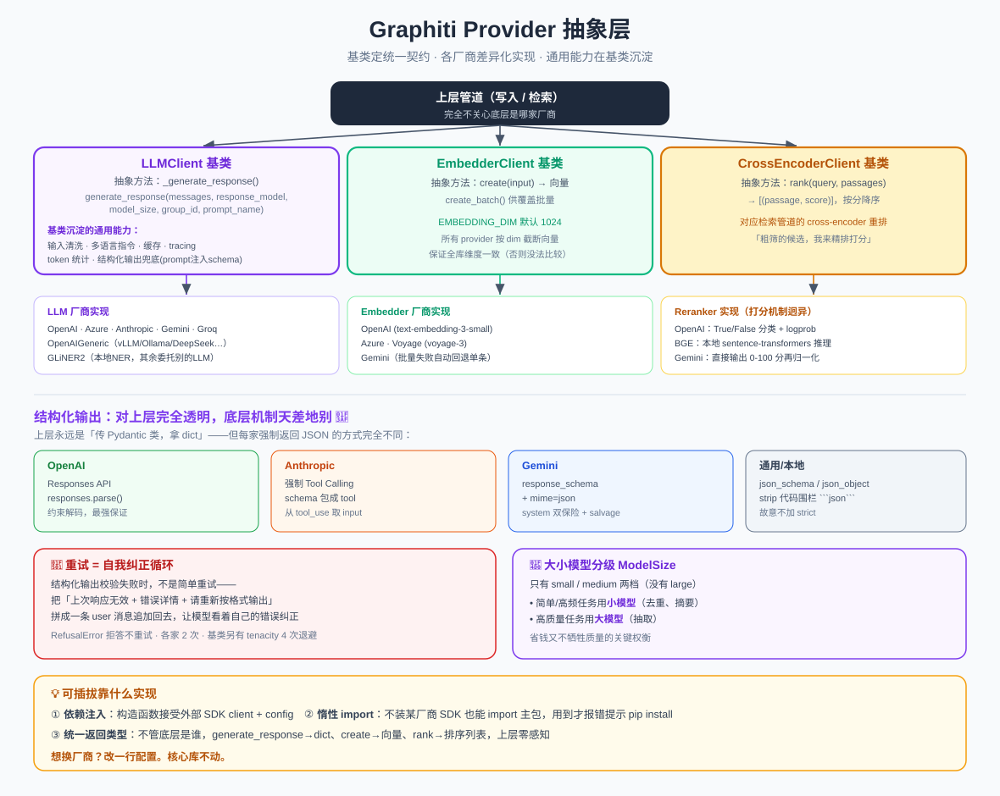

# Graphiti Provider 抽象层：统一多家 LLM / Embedder / Reranker

> Graphiti 支持 OpenAI、Anthropic、Gemini、Groq、Voyage、本地模型…… 这么多厂商，上层代码却完全不用关心用的是谁。秘密就在这套 **「基类定统一契约 + 各厂商差异化实现」** 的 Provider 抽象层。
>
> 代码位置：`graphiti_core/llm_client/`、`embedder/`、`cross_encoder/`

> 📖 关联阅读：[写入管道](04-数据写入管道-add_episode.md) 和 [检索管道](05-检索管道-search.md) 里所有的 🧠LLM 调用、嵌入、重排，底层都走这一层。

---

## 一、三类 Provider，一个共同套路

Graphiti 需要调用三类外部 AI 能力，每类都抽象成一个基类：

| 抽象 | 基类 | 唯一的抽象方法 | 干什么 |
|------|------|--------------|--------|
| **LLM 客户端** | `LLMClient` | `_generate_response()` | 生成文本 / 结构化输出（抽实体、去重…） |
| **Embedder** | `EmbedderClient` | `create()` | 文本 → 向量（语义检索用） |
| **Cross-Encoder** | `CrossEncoderClient` | `rank()` | 给候选重排打分（检索重排用） |

> **设计精髓**：每个基类只有**一个真正的抽象方法**。新增一家厂商，只需实现「怎么调自家 API + 怎么把结果转成统一返回类型」，其余通用能力（重试、缓存、tracing…）全部继承。这就是「可插拔」的含义。

---

## 二、LLMClient：最复杂也最精彩的一层

### 2.1 两个入口：公开的 vs 抽象的

- **`generate_response(...)`**（公开，非抽象）：上层统一调用它。
- **`_generate_response(...)`**（抽象，子类实现）：真正调厂商 API 的地方。

`generate_response` 关键参数：

| 参数 | 作用 |
|------|------|
| `messages` | 统一的 `Message` 列表（system/user） |
| `response_model` | Pydantic 模型 = 期望的结构化输出 schema |
| `model_size` | 选大模型还是小模型（见 2.4） |
| `group_id` | 图分区，用于多语言指令定制 |
| `prompt_name` | tracing / token 统计打标 |

### 2.2 基类沉淀的通用能力（这是关键）

`generate_response` 在调 `_generate_response` 前后，**统一**做了一堆脏活，让所有厂商都免费享受：

1. **输入清洗** `_clean_input`：去掉非法 unicode、零宽字符、控制字符
2. **多语言指令**：按 `group_id` 追加抽取语言指令
3. **属性抽取前导语**：注入强约束，防止模型把「字段描述」当成实际值填进去（带幂等 sentinel 防重复注入）
4. **结构化输出兜底**：若有 `response_model`，把它的 JSON schema 序列化后追加到消息尾部（"Respond with a JSON object in the following format…"）——**这是厂商无关的通用策略，纯靠 prompt**
5. **Tracing span**：`llm.generate` span，记录 provider、model.size、缓存命中等
6. **缓存**：用 model + messages 的 md5 做 key，命中直接返回
7. **Token 统计**：`TokenUsageTracker`
8. **重试包装**：见 2.3

### 2.3 重试与「自我纠正」循环

基类提供了一套 `tenacity` 重试（**最多 4 次**，指数随机退避 5s~120s），重试条件是 `RateLimitError`、`EmptyResponseError`、`JSONDecodeError`、HTTP 5xx。

但有个重要事实：**OpenAI / Anthropic / Gemini 都重写了 `generate_response`**，用各自的手写重试循环（各 2 次）取代基类的 tenacity。为什么？因为它们要做一个更聪明的**「自我纠正」**：

> 结构化输出校验失败时，不是简单重试，而是把「上次响应无效 + 错误详情 + 请重新按格式输出」拼成一条新的 user 消息**追加回去**，让模型看着自己的错误自我纠正后重试。三家机制一致，Anthropic 对 Pydantic `ValidationError` 还有专门文案。

只有通用客户端（`OpenAIGenericClient`）和本地 `GLiNER2Client` 才复用基类的 tenacity 路径。

三类不重试的错误：`RefusalError`（模型拒答，重试没用）、`RateLimitError`（部分厂商 fail-fast）、安全过滤 block。

### 2.4 大小模型分级 `ModelSize`

枚举只有两档：`small` 和 `medium`（没有 large）。

- 各厂商用 `_get_model_for_size` 解析：`small` → `small_model`，否则 → `model`。
- **调用侧的用意**：**简单/高频任务用小模型**（去重、摘要传 `model_size=ModelSize.small`），**高质量任务用大模型**（抽取用默认 medium）。这是省钱又不牺牲质量的关键权衡。

`LLMConfig` 字段：`api_key`、`model`（大）、`small_model`（小）、`base_url`（支持自定义端点）、`temperature`、`max_tokens`。

---

## 三、结构化输出：差异最大的地方 🎯

「传 Pydantic 类、拿 dict」对上层完全一致，但每家**强制返回 JSON** 的机制天差地别：

| 厂商 | 机制 |
|------|------|
| **基类兜底** | Prompt 注入 schema（无原生保证，纯靠提示） |
| **OpenAI** | 原生 **Responses API `responses.parse()`** + `text_format=模型`（约束解码，最强保证） |
| **Anthropic** | **强制 Tool Calling**：把 schema 包成一个 tool，`tool_choice` 强制走工具，从 `tool_use` 取 `input` |
| **Gemini** | 原生 `response_mime_type='application/json'` + `response_schema=模型` |
| **通用/本地**（vLLM/Ollama/DeepSeek） | `response_format` = `json_schema`（约束解码）或回退 `json_object`；还要 `_strip_code_fences` 剥离 ```json``` 包裹（本地模型常见毛病） |

> **有意思的工程细节**：
> - OpenAI 对 reasoning model（gpt-5/o1/o3）会省略 `temperature`、注入 `reasoning.effort`。
> - Anthropic 取不到 tool_use 时降级用「找第一个 `{` 到最后一个 `}`」抢救 JSON。
> - Gemini 额外把 schema 也写进 system_instruction 双保险，解析失败还有 `salvage_json` 从截断输出里抢救。
> - 通用客户端**故意不加 `"strict": true"`**，因为 Pydantic 的 `model_json_schema()` 常不满足 OpenAI strict 子集要求。

---

## 四、Embedder：文本 → 向量

基类 `EmbedderClient`：
- 抽象方法 `create(input) -> list[float]`（单个向量）
- `create_batch()` 默认 `NotImplementedError`，供 provider 覆盖批量
- `EMBEDDING_DIM` 默认 **1024**（可用环境变量覆盖）

| Provider | 默认模型 | 备注 |
|----------|---------|------|
| OpenAI | `text-embedding-3-small` | 支持 Azure；输出按 `embedding_dim` 截断 |
| Azure OpenAI | — | Azure 变体 |
| Voyage AI | `voyage-3` | 惰性 import |
| Gemini | `text-embedding-001` | 批量失败自动回退单条 |

> 统一约定：所有 provider 都用 `embedding_dim` 对输出向量截断，保证全库维度一致（否则向量没法比较）。

---

## 五、Cross-Encoder：重排打分

基类 `CrossEncoderClient`：唯一方法 `rank(query, passages) -> list[(passage, score)]`，**按分数降序**。对应[检索管道](05-检索管道-search.md)里的 cross-encoder 重排器。

三种实现，打分机制完全不同（很有意思）：

| 实现 | 打分机制 |
|------|---------|
| **OpenAIReranker** | 对每个候选跑「相关吗？True/False」布尔分类（`max_tokens=1` + `logprobs`），用 **True token 的对数概率** 归一化成分数 |
| **BGEReranker** | 本地 `sentence_transformers` 的 `BAAI/bge-reranker-v2-m3`，直接 CrossEncoder 推理（无需 API） |
| **GeminiReranker** | Gemini 不支持 logprobs，改让模型**直接输出 0-100 的分数**，正则抽取后归一化 |

---

## 六、完整 Provider 清单

**LLM**：OpenAI、Azure OpenAI、OpenAIGeneric（vLLM/Ollama/DeepSeek/Together 等一切兼容端点）、Anthropic、Gemini、Groq、GLiNER2（本地轻量 NER，只做实体抽取，其余委托给另一个 LLM）。

**Embedder**：OpenAI、Azure OpenAI、Voyage、Gemini。

**Cross-Encoder**：OpenAI Reranker、BGE（本地）、Gemini Reranker。

---

## 七、可插拔是怎么做到的？

1. **依赖注入**：每个 provider 构造函数都接受可选的 `client`（外部注入已构造的 SDK 客户端）和 `config`。
2. **惰性 import**：用 `TYPE_CHECKING` + `try/except ImportError`——**不装某厂商 SDK 也能 import 主包**，等真正用到时才报错并提示 `pip install graphiti-core[anthropic]`。
3. **统一返回类型**：无论底层是谁，`generate_response` 都返回 dict、`create` 返回向量、`rank` 返回排序列表。上层代码零感知。

---

## 八、一句话总结

> Graphiti 的 Provider 抽象层用**三个各只有一个抽象方法的基类**统一了 LLM/Embedder/Reranker 的多厂商接入。通用能力（输入清洗、缓存、tracing、结构化输出兜底、大小模型分级）在基类沉淀，各厂商只实现「调自家 API + 转统一格式」。**结构化输出**是差异最大处（OpenAI 约束解码 / Anthropic 工具调用 / Gemini schema），但对上层完全透明；配合**依赖注入 + 惰性 import**，做到「想换厂商改一行配置，不装的 SDK 不报错」。

> 配套结构图见：
