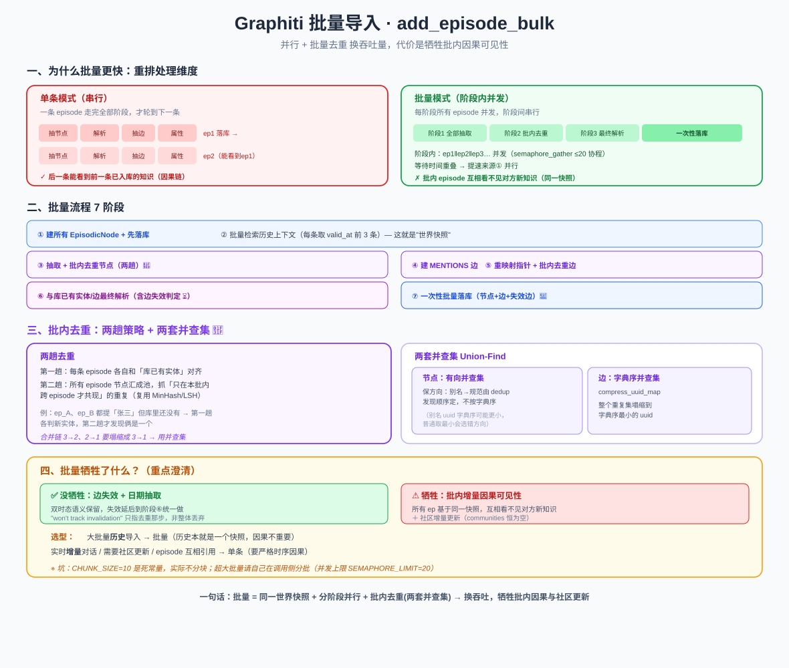

# Graphiti 批量导入：`add_episode_bulk` 为何更快、又牺牲了什么

> 一条条 `add_episode` 太慢了，导入一万条历史消息怎么办？Graphiti 提供 `add_episode_bulk`——用「并行 + 批量去重」大幅提速。但天下没有免费的午餐，它在语义上做了权衡。本文讲清楚**它为什么快**，以及**它牺牲了什么**。
>
> 代码位置：`graphiti_core/graphiti.py::add_episode_bulk`（1230 行起）、`graphiti_core/utils/bulk_utils.py`

> 📖 关联阅读：[单条写入管道](04-数据写入管道-add_episode.md)（对比基准）· [去重算法](06-去重算法-dedup.md)（批内去重复用同一套 MinHash/LSH）。

---

## 一、输入：`RawEpisode`

单条 `add_episode` 把一条 episode 的字段拆成一个个函数参数；批量版把它们打包成 `RawEpisode` 对象，接口收 `list[RawEpisode]`：

```python
class RawEpisode(BaseModel):
    name: str
    uuid: str | None = None
    content: str
    source_description: str
    source: EpisodeType
    reference_time: datetime
```

> 注意：批量版**没有** `previous_episode_uuids` 参数——每条 episode 的历史上下文是内部按时间自动检索的（这点后面很关键）。

---

## 二、核心思路：从「N 条各自串行」到「每阶段 N 条并发」

### 为什么单条必须串行？

单条 `add_episode` 内部是一条**数据依赖链**：

```
抽节点 → 解析节点 → 抽边(依赖节点) → 重映射边指针(依赖uuid_map) → 抽属性
```

每步的输入就是上一步的输出，**一条 episode 内部没有并行空间**。这不是设计缺陷，是本质依赖。

### 批量并行的是「episode 之间」这个维度

同一阶段里，第 i 条和第 j 条 episode 的抽取/解析**互不依赖**。所以批量版把处理**重排**成：

```
单条模式：  [ep1: 抽→解→边→属性]  然后  [ep2: 抽→解→边→属性]  然后 ...   ← 串行
                                                                         
批量模式：  阶段1(所有ep并发抽取) → 阶段2(所有ep并发去重) → 阶段3(所有ep并发解析) → 一次性落库
            └──────────── 阶段内并发，阶段间串行 ────────────┘
```

把大量 LLM/embedding 调用的**等待时间重叠**掉——这是提速的**第一个来源：并行**（靠 `semaphore_gather`，默认最多 20 个协程同时跑）。

**第二个来源：批量去重**——跨 episode 的重复实体/边在内存里一次性合并，避免逐条导入时反复查库、写库。

---

## 三、批量流程的阶段

```
① 构建所有 EpisodicNode，先把 episode 节点落库
② retrieve_previous_episodes_bulk：并行给每条 episode 检索历史上下文（取 valid_at 之前的 3 条）
③ 抽取 + 批内去重节点（两趟去重，见下）
④ 构建 episodic 边（MENTIONS）
⑤ 重映射边指针 + 批内去重边
⑥ 与数据库已有实体/边做最终解析（含边失效判定）
⑦ 一次性批量落库（节点 + episodic边 + entity边 + 失效边）
```

---

## 四、批内去重：两趟策略 + 两套并查集 🌟

这是批量版最精巧的地方。跨 episode 的重复怎么合并？

### 4.1 节点两趟去重（`dedupe_nodes_bulk`）

- **第一趟**：每条 episode **各自**和「数据库已有实体」对齐（和单条一样），得到每条的 `resolved_nodes` + `uuid_map`。
- **第二趟**：把所有 episode 解析后的节点汇成一个池，**专门抓「只在本批内跨 episode 才共现的重复」**。

> **为什么需要第二趟**：假设 ep_A 和 ep_B 都提到「张三」，但库里原本还没有「张三」。第一趟各自和库对齐时，两个「张三」都被判成新实体（库里没有）。只有第二趟把它们放一起比，才能发现「这俩其实是一个」。第二趟复用[去重算法](06-去重算法-dedup.md)那套：先精确名匹配，不中再 MinHash/LSH + Jaccard。

### 4.2 两套并查集（Union-Find）合并重复链

去重会产生一堆「A 其实是 B」的成对映射，可能形成链：`3→2`、`2→1` 要塌缩成 `3→1`。Graphiti 用**并查集**做这件事，而且用了**两套**：

| 用于 | 实现 | 特点 |
|------|------|------|
| **节点** | `_build_directed_uuid_map`（有向并查集） | **保方向**：别名→规范的方向由 dedup 发现顺序定，不按 uuid 字典序（因为别名 uuid 可能字典序更小，会选错方向） |
| **边** | `UnionFind` + `compress_uuid_map` | 按**字典序最小**塌缩：整个重复集归到字典序最小的 uuid 做代表 |

最终得到一张 `uuid → 规范uuid` 全表（`compressed_map`），用它把节点去重、并通过 `resolve_edge_pointers` 把边的两端指针改到规范节点。

### 4.3 边批内去重（`dedupe_edges_bulk`）

- 候选筛选：源、目标 uuid 必须都相同才可能重复；再用「词重叠近似 BM25」或 embedding 余弦≥0.6 撒网。
- LLM 判定：`resolve_extracted_edge` 做最终重复判定。
- **注意**：这一步**只去重，不判失效**（代码注释 `# For now we won't track edge invalidation`）——失效被推迟到阶段⑥统一做。

---

## 五、批量到底牺牲了什么？（重点澄清）

这是最容易误解的地方，代码里有些历史注释会误导。逐一查证：

### ✅ 边失效 + 日期抽取 —— **没有牺牲**

docstring 明确写了「Edge invalidation and date extraction are performed in the bulk path as well」。阶段⑥的 `resolve_extracted_edges` 会返回 `invalidated_edges`，最后一起落库。

> 那句 `# For now we won't track edge invalidation` **只是说「去重那一步」不判失效**——失效被延后到最终解析统一处理，并非整体丢弃。**双时态语义在批量里是保留的。**

### ⚠️ 真正被牺牲的：批内的「增量因果可见性」

这是核心差异，务必理解：

- **单条模式**：处理完一条就落库，下一条的 `retrieve_episodes` **能看到上一条刚写入的实体和边**。形成「后一条基于前一条已入库状态」的**增量因果链**。
- **批量模式**：**先一次性给所有 episode 拍一张「世界快照」**（只含处理前库里已有的历史），然后所有 episode 在**同一个快照**上并行抽取。

> **后果**：同一批内 ep_A 抽出的实体/边，**不会成为 ep_B 抽取时的上下文**——批内 episode 之间互相「看不见」对方新产生的知识，只能靠事后的批内去重把重复缝合起来。单条那种严格的时序因果链，在批量里被牺牲了。

### ⚠️ 其他差异

| 方面 | 单条 | 批量 |
|------|------|------|
| 边失效判定的输入 | 逐步演进的图状态 | 同一批一起 resolve，谁让谁失效取决于并行聚合而非落库先后 |
| 属性抽取次序 | 边解析后用 new_edges 走属性 summary | 属性抽取在边解析之前，不再单独走 |
| **社区更新** | 支持 `update_communities` | **恒不做**（结果里 communities 永远为空） |

---

## 六、批处理的一个「坑」：CHUNK_SIZE 是死常量

`CHUNK_SIZE = 10` 这个常量……**实际代码里并没有用它做分块**（只在一处注释里被提到）。也就是说当前实现**不做显式 chunk 分块**——你传多少条就一次性全部并发处理。

> 所以如果你要导入**超大批量**，建议**自己在调用侧分批**（docstring 也这么建议）。并发的真正上限是 `SEMAPHORE_LIMIT = 20`（可用环境变量或 `Graphiti(max_coroutines=...)` 覆盖），保证不把 LLM/DB 打爆。

---

## 七、什么时候用批量 vs 单条？

| 场景 | 推荐 | 原因 |
|------|------|------|
| 一次性导入大量**历史**数据 | **批量** | 快；历史数据本就是"一个快照"，批内因果性不重要 |
| **实时**增量对话/事件流 | **单条** | 需要严格时序因果，后一条要看到前一条 |
| 需要社区增量更新 | **单条** | 批量不做社区更新 |
| 顺序高度相关、互相引用的 episode | **单条** | 批内互相看不见对方的新知识 |

---

## 八、一句话总结

> `add_episode_bulk` 把「N 条各自串行」重排成「每阶段 N 条并发 + 阶段间串行」，用**并行**（≤20 协程）和**批量去重**（两趟策略 + 两套并查集合并跨 episode 重复）换取吞吐量。它**保留了双时态语义**（边失效/日期抽取仍做），但**牺牲了批内 episode 之间的增量因果可见性**（所有 episode 基于同一世界快照，互相看不见对方新产生的知识）和**社区增量更新**。所以：**大批量历史导入用它，实时增量对话用单条**。

> 配套结构图见：
