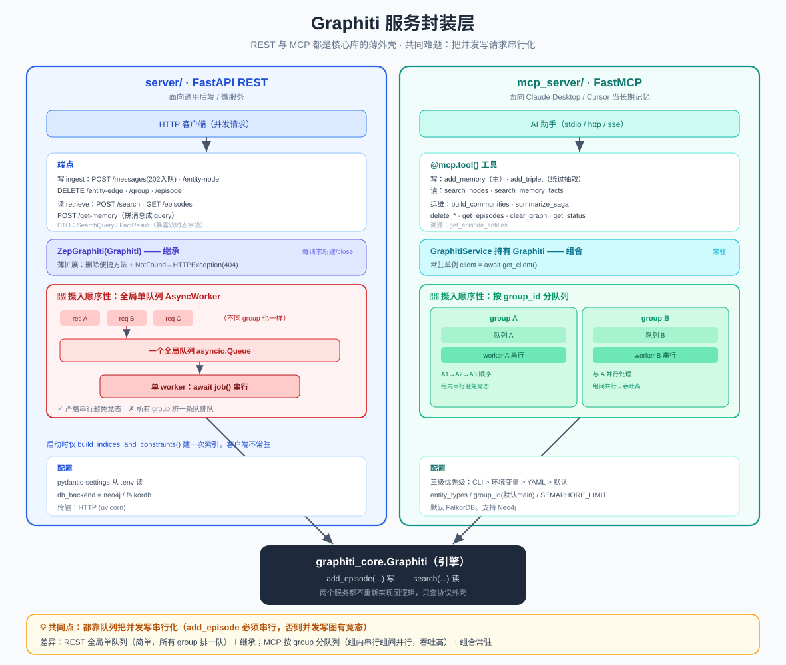

# Graphiti 服务封装层：REST 服务 与 MCP 服务

> 核心库 `graphiti_core` 是个 Python 库，怎么变成能被别的程序、被 Claude/Cursor 调用的**服务**？Graphiti 提供两个封装：`server/`（FastAPI REST）给通用后端用，`mcp_server/`（MCP）给 AI 助手当记忆。本文讲它们怎么把核心库包成服务，以及**摄入顺序性**这个共同难题的不同解法。
>
> 代码位置：`server/graph_service/`、`mcp_server/src/`

> 📖 关联阅读：[写入管道](04-数据写入管道-add_episode.md)（服务的写路径最终都调 `add_episode`）· [检索管道](05-检索管道-search.md)（读路径调 `search`）。

---

## 一、共同本质：两个服务都只是「外壳」

**关键认知**：两个服务**都不重新实现任何图逻辑**。它们只是把核心库 `Graphiti` 类当「引擎」，套上不同的协议外壳：

```
                    ┌─ server/  (FastAPI REST) ─┐
graphiti_core.Graphiti ─┤                          ├─ 对外服务
                    └─ mcp_server/ (MCP)      ─┘

核心动作永远是：Graphiti.add_episode(...)  写
              Graphiti.search(...)       读
```

区别只在两点：**① 协议外壳**（HTTP REST vs MCP）；**② 摄入顺序性队列**怎么实现。

> **为什么顺序性是共同难题**：`add_episode` 必须**串行**执行（后一条要看到前一条写入的状态，否则并发写图会有竞态、去重会乱）。但服务要面对并发请求，所以两个服务都必须用**队列**把并发的写请求排成串行——只是排法不同。

---

## 二、REST 服务 `server/`（FastAPI）

### 2.1 应用骨架 `main.py`（仅 30 行）

```python
app = FastAPI(lifespan=lifespan)
app.include_router(retrieve.router)   # 检索类端点
app.include_router(ingest.router)     # 写入类端点
# GET /healthcheck → {"status":"healthy"}
```

**生命周期**：启动时 `initialize_graphiti` 只做一件事——建一个临时客户端、`build_indices_and_constraints()` 建索引/约束、然后立刻关闭。**索引只在启动建一次，客户端不常驻**。

### 2.2 端点清单

**写入 `routers/ingest.py`：**

| 方法 | 路径 | 状态码 | 作用 |
|------|------|--------|------|
| POST | `/messages` | **202** | 批量摄入消息，**入队异步处理** |
| POST | `/entity-node` | 201 | 直接建实体节点（同步） |
| DELETE | `/entity-edge/{uuid}` | 200 | 删一条 fact 边 |
| DELETE | `/group/{group_id}` | 200 | 删整个 group |
| DELETE | `/episode/{uuid}` | 200 | 删 episode |
| POST | `/clear` | 200 | 清空重建索引 |

**检索 `routers/retrieve.py`：**

| 方法 | 路径 | 映射核心库 |
|------|------|-----------|
| POST | `/search` | `graphiti.search(query, num_results=max_facts)` |
| GET | `/entity-edge/{uuid}` | 取单条 fact |
| GET | `/episodes/{group_id}?last_n=` | `retrieve_episodes` |
| POST | `/get-memory` | 把多条 message 拼成 query 再 search |

### 2.3 DTO：请求/响应契约（`dto/`）

Pydantic 定义 API 契约。关键的 `FactResult`（检索返回）直接暴露了双时态字段：

```python
class FactResult(BaseModel):
    uuid, name, fact
    valid_at, invalid_at        # 事件时间轴
    created_at, expired_at      # 系统时间轴
    # json_encoders 把 datetime 统一转 UTC ISO
```

桥接函数 `get_fact_result_from_edge` 把核心库的 `EntityEdge` 转成 `FactResult`。

### 2.4 摄入顺序性：全局单队列 `AsyncWorker`

```python
class AsyncWorker:
    queue = asyncio.Queue()
    async def worker():
        while True:
            job = await self.queue.get()
            await job()          # ← 串行，一个接一个，绝不并发
```

`POST /messages` 把每条消息包成任务 `put` 进队列，**立即返回 202**，不等处理完。全局只有**一个 worker、一个队列**，所以 `add_episode` 严格按入队顺序执行。

> **缺点**：全局单队列 → 所有 group_id 共享一个串行通道，互相排队（MCP 改进了这点，见下）。

### 2.5 `ZepGraphiti`：继承核心库

```python
class ZepGraphiti(Graphiti):   # ← 直接继承
    ...
```

只加了几个 REST 需要的便捷方法（`save_entity_node`、`delete_*`），并把核心库的 `NotFoundError` 转成 FastAPI `HTTPException(404)`。

**依赖注入**：`get_graphiti` 是 FastAPI 依赖，**每个请求新建一个 client、用完 `close()`**（无常驻）。路由函数签名里的 `graphiti: ZepGraphitiDep` 就是这么注入的。

---

## 三、MCP 服务 `mcp_server/`

给 **Claude Desktop / Cursor** 这类 AI 助手当「长期记忆」。用 **FastMCP** 框架，每个能力用 `@mcp.tool()` 暴露成一个 MCP 工具。

### 3.1 MCP 工具清单

| 工具 | 作用 | 映射核心库 |
|------|------|-----------|
| `add_memory` | **主写入**，加 episode（text/json/message），支持双时态、自定义类型、saga | 入队 → `add_episode` |
| `search_nodes` | 搜实体节点，可按类型过滤/中心节点重排 | `search_(NODE_HYBRID_*)` |
| `search_memory_facts` | 搜 facts（边），支持日期范围过滤 | `search(...)` |
| `add_triplet` | 直接写三元组，**绕过 episode 抽取** | `add_triplet` |
| `delete_entity_edge` / `delete_episode` | 删除 | `EntityEdge.delete` / `remove_episode` |
| `get_entity_edge` / `get_episodes` / `get_episode_entities` | 查询/溯源 | 各 get 方法 |
| `build_communities` | 社区检测 + 摘要 | `build_communities` |
| `summarize_saga` | 汇总 saga 叙事 | `summarize_saga` |
| `clear_graph` / `get_status` | 运维 | `clear_data` / 连接检查 |

### 3.2 传输方式（面向不同客户端）

| 传输 | 用途 |
|------|------|
| **`http`**（streamable HTTP，默认推荐） | 端点 `http://host:port/mcp/` |
| **`stdio`** | 给 Claude Desktop/Cursor 本地 spawn 子进程用 |
| `sse`（已弃用） | `/sse` 端点 |

### 3.3 配置：三级优先级

`GraphitiConfig`（pydantic-settings），优先级 **CLI 参数 > 环境变量 > YAML > 默认值**。YAML 支持 `${VAR:default}` 环境变量展开。

- **entity_types**：YAML 里配（默认给了 Preference/Requirement/Procedure/Person/Organization… 10 个），name 匹配注册的富模型就用富模型
- **group_id**：默认 `'main'`，工具未显式传就回退到它
- **并发**：`SEMAPHORE_LIMIT`（默认 10）传给 `Graphiti(max_coroutines=...)`
- **数据库**：默认 FalkorDB，支持 Neo4j，通过工厂类创建

### 3.4 摄入顺序性：按 group_id 分队列 🌟

MCP 比 REST 更精细——**每个 group_id 一个独立队列 + 一个独立 worker**：

```python
class QueueService:
    _episode_queues: dict[str, asyncio.Queue]   # 每个 group 一个队列
    _queue_workers: dict[str, bool]             # 每个 group 一个 worker
```

同一 group 内串行（避免竞态），**不同 group 之间可并行**——吞吐更高。工具文档明说 "Episodes for the same group_id are processed sequentially to avoid race conditions"。`add_memory` 立即返回 "queued for processing"。

### 3.5 `GraphitiService`：组合而非继承

MCP 用 `GraphitiService` **持有（组合）** 一个常驻 `Graphiti` 单例（`client = await graphiti_service.get_client()`），而不是像 REST 那样继承。

---

## 四、两个服务对比总表

| 维度 | REST (`server/`) | MCP (`mcp_server/`) |
|------|------------------|---------------------|
| 协议外壳 | FastAPI REST | FastMCP (MCP) |
| 与核心库关系 | `ZepGraphiti(Graphiti)` **继承** | `GraphitiService` **组合持有** |
| Graphiti 客户端 | 每请求新建/关闭 | 常驻单例 |
| **摄入队列** | 全局单队列，**全局串行** | 按 group_id 分队列，**组内串行、组间并行** |
| 写核心方法 | `add_episode` | `add_episode` / `add_triplet` |
| 配置 | pydantic-settings（`.env`） | YAML + env + CLI 三级 |
| 传输 | HTTP (uvicorn) | http / stdio / sse |
| 面向 | 通用后端/微服务 | Claude Desktop / Cursor 等 AI 助手 |

---

## 五、一句话总结

> `server/` 和 `mcp_server/` 都是**核心库的薄外壳**——不实现图逻辑，只把 `Graphiti.add_episode/search` 套上协议（REST / MCP）。两者都必须用**队列把并发写请求串行化**以避免竞态：REST 用**全局单队列**（简单但所有 group 排一队），MCP 用**按 group_id 分队列**（组内串行、组间并行，吞吐更高）。集成方式也不同：REST **继承** `Graphiti`（每请求新建），MCP **组合** `Graphiti`（常驻单例）。

> 配套结构图见：
