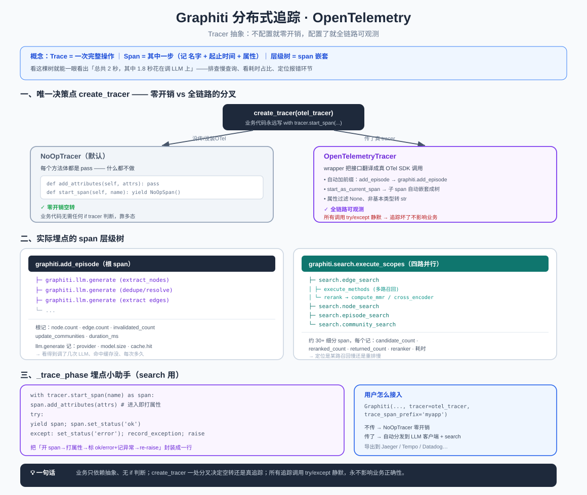

# Graphiti 分布式追踪：OpenTelemetry 与「零开销可观测性」

> add_episode 花了 2 秒——到底慢在哪？抽实体？调 LLM？写库？Graphiti 用 **OpenTelemetry 分布式追踪**把每一步的耗时和层级记录下来。妙处在于：**不配置时零开销，配置了就全链路可观测**。本文讲清这套 Tracer 抽象怎么做到这一点。
>
> 代码位置：`graphiti_core/tracer.py`、`graphiti.py`、`search/search.py`

> 📖 关联阅读：[写入管道](04-数据写入管道-add_episode.md) 和 [检索管道](05-检索管道-search.md)——追踪 span 就埋在它们的每一步上。

---

## 一、先搞懂：什么是 trace 和 span？

- **Trace（追踪）**：一次完整业务操作（如「add_episode 加一条记忆」）从头到尾的记录。
- **Span（跨度）**：这次操作里的**某一步**。每个 span 记三件事：
  1. **名字**（干嘛的，如 `graphiti.add_episode`、`graphiti.llm.generate`）
  2. **起止时间**（→ 能算出这步耗时多少毫秒）
  3. **属性**（键值对指标，如 `node.count=12`、`duration_ms=843`）
- **层级树**：span 能嵌套。大操作 span 下挂很多小步骤 span，形成一棵树。看这棵树就能一眼看出「总共 2 秒，其中 1.8 秒花在调 LLM 上」。

> **为什么要它**：排查慢查询（哪步慢）、看每步耗时占比、定位报错在哪个环节——这就是「可观测性」。Graphiti 用 **OpenTelemetry**（厂商中立标准），采集的数据可导出到 Jaeger、Grafana Tempo、Datadog 等任意后端。

---

## 二、核心设计：Graphiti 不直接依赖 OpenTelemetry

这是整个设计的关键——Graphiti **自己定义了两个抽象接口**，把 OTel 变成「可选插件」。

### 两个抽象基类（`tracer.py`）

**`TracerSpan`**（一个 span 能做什么）：

| 方法 | 作用 |
|------|------|
| `add_attributes(dict)` | 给这一步打标签/记指标 |
| `set_status(status, desc)` | 标记成功(`'ok'`)/失败(`'error'`) |
| `record_exception(exc)` | 记录异常堆栈 |

**`Tracer`**（追踪器工厂）：

| 方法 | 作用 |
|------|------|
| `start_span(name)` | 开一个新 span，返回**上下文管理器** |

所以用法永远是 `with tracer.start_span('xxx') as span:`——进入 `with` 开始计时，退出自动结束。

> 注：这个抽象层里**只有** `add_attributes`/`set_status`/`record_exception` 三个方法，**没有** `add_event`。

### 依赖是「软」的

```python
try:
    from opentelemetry.trace import Span, StatusCode
    OTEL_AVAILABLE = True
except ImportError:
    OTEL_AVAILABLE = False
```

**即使没装 opentelemetry 包，`import graphiti_core` 也不报错**——OTel 完全可选。

---

## 三、NoOpTracer：「不配置就零开销」的核心 🌟

`tracer.py` 定义了两个「空实现」：

```python
class NoOpSpan(TracerSpan):
    def add_attributes(self, attributes): pass    # 什么都不做
    def set_status(self, status, description=None): pass
    def record_exception(self, exception): pass

class NoOpTracer(Tracer):
    @contextmanager
    def start_span(self, name):
        yield NoOpSpan()
```

**为什么需要它**：埋点代码（`with tracer.start_span(...)` + `span.add_attributes(...)`）遍布 `graphiti.py`、`search.py`、LLM 客户端。如果用户没配追踪，这些调用**照样执行**，但落到 NoOpTracer 上时每个方法体都是 `pass`——**什么都不做，零开销**。

> **关键好处**：业务代码里**不需要写任何 `if tracer is not None:` 判断**。埋点代码永远长一个样，靠**多态**在运行时决定「真记录」还是「空转」。这就是「不配置零开销、配置了全可观测」的实现方式——非常干净的设计。

---

## 四、OpenTelemetry 适配（Wrapper 桥接）

用户传入真 OTel tracer 时，用两个 wrapper 把 Graphiti 接口翻译成 OTel SDK 调用：

- **`OpenTelemetrySpan`**：包一个真 OTel Span，把三个方法翻译过去。做了防御性处理——过滤 `None` 值、非基本类型转字符串（OTel 只接受 str/int/float/bool）；**整个包在 `try/except: pass` 里——追踪出错绝不影响业务**。
- **`OpenTelemetryTracer`**：`start_span` 时自动加前缀（`add_episode` → `graphiti.add_episode`），并用 OTel 的 **`start_as_current_span`**——这是**父子嵌套自动生效**的原理：任何在这个 `with` 块内部（包括跨 `await`）新开的 span，自动成为它的子 span（靠 contextvars 传播）。

### 唯一决策点：`create_tracer`

```python
def create_tracer(otel_tracer=None, span_prefix='graphiti') -> Tracer:
    if otel_tracer is None:   return NoOpTracer()      # 没传 → 空实现
    if not OTEL_AVAILABLE:    return NoOpTracer()      # 没装 OTel → 空实现
    return OpenTelemetryTracer(otel_tracer, span_prefix)  # 真追踪
```

这是「零开销 vs 全链路」分叉的**唯一决策点**。

---

## 五、实际埋了哪些 span？

`Graphiti.__init__` 接收 `tracer` 参数，`create_tracer` 后**注入到 LLM 客户端和 search 的 clients 束**，全链路共用一个 tracer。

### add_episode 的 span 树

```
graphiti.add_episode                    ← 根 span
├── graphiti.llm.generate   (extract_nodes 的 LLM 调用)
├── graphiti.llm.generate   (dedupe/resolve 的)
├── graphiti.llm.generate   (extract edges / attributes ...)
└── ...
```

靠 `start_as_current_span`，所有 LLM span **自动挂在 add_episode 下面**。

**根 span 记录的指标**：`episode.uuid`、`episode.source`、`group_id`、`node.count`、`edge.count`、`edge.invalidated_count`、`previous_episodes.count`、`update_communities`、`communities.count`、`duration_ms`。出错时 `set_status('error')` + `record_exception` 后重新抛出。

**`llm.generate` span 记录**：`llm.provider`、`model.size`、`max_tokens`、`cache.enabled`、`cache.hit`、`prompt.name`。——所以你能直接看到「这次 add_episode 调了几次 LLM、命中缓存没、每次多久」。

### search 的 span 树

search **没有单一根 span**，而是两个并列顶层阶段：

```
graphiti.search.embed_query_vector      (仅当需要向量时)
graphiti.search.execute_scopes          ← 四路并行搜索都挂它下面
├── graphiti.search.edge_search
│   ├── ...edge_search.execute_methods       (多路召回)
│   ├── ...edge_search.expand_bfs
│   └── ...edge_search.rerank                 (重排)
│       ├── ...load_embeddings / compute_mmr   (MMR)
│       ├── ...cross_encoder_rank
│       └── ...seed_rrf / node_distance_rank
├── graphiti.search.node_search
├── graphiti.search.episode_search
└── graphiti.search.community_search
```

约 **30+ 个细分 span**，每个记录检索指标：`candidate_count`（候选数）、`reranked_count`、`returned_count`、`reranker`（用的哪个重排器）、`search_methods`（哪几路召回）、`limit` 等。——排查「检索为什么慢」时，能精确定位到是某路召回慢还是重排慢。

---

## 六、`_trace_phase`：search 的埋点小助手

search 里所有 span 不直接用 `start_span`，而是包一层 helper：

```python
@contextmanager
def _trace_phase(tracer, name, attributes=None):
    with tracer.start_span(name) as span:
        if attributes:
            span.add_attributes(attributes)   # 进入即打初始属性
        try:
            yield span
            span.set_status('ok')             # 正常 → ok
        except Exception as e:
            span.set_status('error', str(e))  # 异常 → error
            span.record_exception(e)          # 记堆栈
            raise                             # 再抛出，不吞异常
```

把「开 span → 打属性 → 成功标 ok / 失败标 error+记异常 → re-raise」这套样板封装成一行 `with _trace_phase(...) as span:`。业务代码只写逻辑，异常处理全自动。

---

## 七、用户怎么接入

```python
from opentelemetry import trace
# ...配置你的 exporter (Jaeger/OTLP) 到 TracerProvider...
otel_tracer = trace.get_tracer(__name__)

graphiti = Graphiti(
    uri, user, password,
    tracer=otel_tracer,                  # ← 传入真的 OTel tracer
    trace_span_prefix='myapp.graphiti',  # ← 可选，自定义 span 名前缀
)
```

- **不传 `tracer`**（默认）：`NoOpTracer` → 全链路零开销空转。
- **传 `tracer`**：所有 span 带前缀导出到你的后端。
- **装了 OTel 但 tracer 有问题**：wrapper 内部 try/except + NoOpSpan 兜底，追踪失败绝不中断 add_episode/search。

---

## 八、一句话总结

> Graphiti 自定义 `Tracer`/`TracerSpan` 抽象，业务代码只依赖抽象、永远写成 `with tracer.start_span(...)`（**无 if 判断**）。`create_tracer` 是唯一分叉点：没配 → `NoOpTracer`（方法全 `pass`，纯空转零开销）；配了 → `OpenTelemetryTracer` 包真 SDK，靠 `start_as_current_span` 让 span 自动嵌套成树。实际埋点覆盖 `add_episode`（记 node/edge count、时长）、`llm.generate`（记 provider/缓存命中）、search 的 30+ 细分 span（记候选数/重排器/耗时）。且所有追踪调用都 try/except 静默——**追踪永远不影响业务正确性**。

> 配套结构图见：
