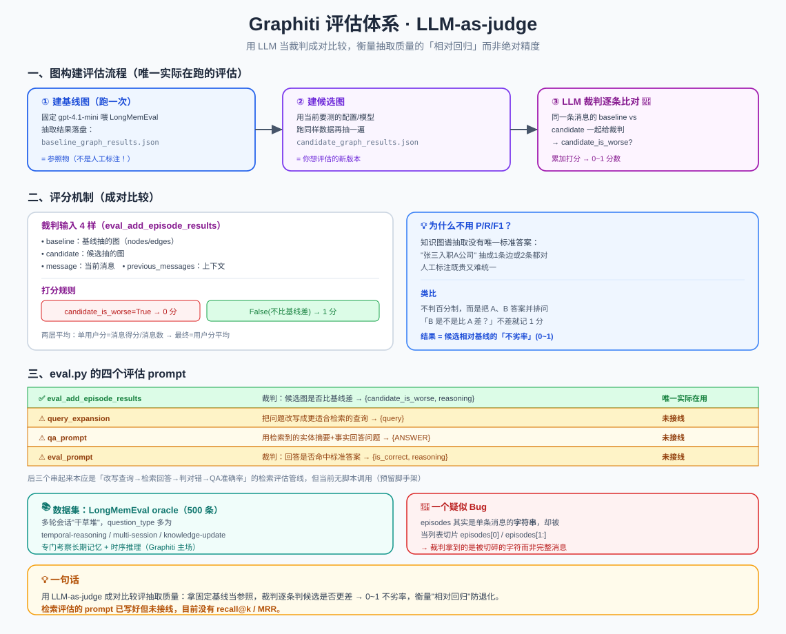

# Graphiti 评估体系：怎么量化衡量抽取/检索质量

> 改了 prompt、换了模型、调了抽取逻辑——**怎么知道图建得比以前好还是差了？** Graphiti 用 **LLM-as-judge（让 LLM 当裁判）** 的成对比较来量化。本文讲清它的评分机制，以及一个重要现状：**目前只有"图构建评估"真的在跑，检索评估是预留脚手架**。
>
> 代码位置：`tests/evals/`、`graphiti_core/prompts/eval.py`

> 📖 关联阅读：[写入管道](04-数据写入管道-add_episode.md)（被评估的抽取结果就是它的产物）· [LLM 提示词设计](09-LLM提示词设计-prompts.md)（评估也是一套 prompt）。

---

## 一、一句话现状

> Graphiti 的评估体系里，**真正能跑起来的只有一个：图构建质量（抽取质量）评估**。它用 **LLM-as-judge 成对比较**——让裁判 LLM 判断"新版本抽的图是否比基线更差"。而**检索质量评估的 prompt 虽然写好了，当前代码里没有任何脚本调用它们**，属于预留脚手架。

这点很重要：别以为有一套完整的 recall@k/MRR 检索评测——目前没有。

---

## 二、为什么用 LLM 当裁判，而不是 P/R/F1？

传统做法：人工标注一份"标准答案图"，然后算抽取的 precision/recall/F1。但知识图谱的抽取**没有唯一标准答案**——"张三入职A公司"可以抽成一条边，也可以拆成两条，都对。人工标注既贵又难统一。

Graphiti 的取巧办法：**不追求绝对正确率，只衡量"相对回归"**。
- 拿一个**固定基线**（写死用 `gpt-4.1-mini` 跑出的抽取结果）当参照物
- 新配置跑一遍得到"候选"
- 让 LLM 裁判逐条比较：候选比基线**差了吗**？

> **类比**：不是给试卷判百分制，而是把 A、B 两份答案并排放到老师面前问「B 是不是比 A 差？」，B 不比 A 差就记 1 分。跑一遍统计 B 的整体"不劣率"。

---

## 三、图构建评估的完整流程

代码在 `tests/evals/eval_e2e_graph_building.py`，是个**端到端（e2e）评估**，三步：

```
① 建基线图  build_baseline_graph
   用固定 gpt-4.1-mini 把数据集喂进 Graphiti
   抽取结果(节点+边)存盘 → baseline_graph_results.json（只需跑一次）
        │
② 建候选图  build_graph
   用当前要测的配置/模型再跑一遍同样数据
   → candidate_graph_results.json
        │
③ 逐条比对  eval_graph（LLM 裁判）
   同一条消息的 baseline vs candidate 一起给裁判
   → candidate_is_worse? → 累加打分
```

### 数据怎么进图

- 数据集每个用户有多轮会话，每条消息拼成 `"{role}: {content}"` 作为一个 episode，用对应日期作 `reference_time`，调 `add_episode` 写入。
- `session_length` 限制每用户最多处理多少条消息；`multi_session_count` 控制处理多少个用户（并发建子图）。
- 抽取出的 embedding 会被清空——**评估只关心文本内容，不比向量**。

---

## 四、评分机制（核心）

对每个用户的每一条消息，取出四样东西交给裁判：

| 输入 | 内容 |
|------|------|
| `baseline` | 基线版本对这条消息抽出的图（`AddEpisodeResults`：nodes/edges/…） |
| `candidate` | 候选版本对同一条消息抽出的图 |
| `message` | 当前消息 |
| `previous_messages` | 之前的消息（上下文） |

裁判用 `eval_add_episode_results` prompt，返回结构化结果 `EvalAddEpisodeResults`，含一个布尔字段 **`candidate_is_worse`**。

**打分规则**：

```
candidate_is_worse = True   → 候选更差 → 得 0 分
candidate_is_worse = False  → 候选不比基线差（或差不多）→ 得 1 分
```

**两层平均聚合**：
```
单用户分 = 该用户所有消息得分之和 / 消息数     （候选没变差的消息占比）
最终分   = 所有用户分的平均                    （0~1 的浮点数）
```

结果越接近 **1** 表示候选质量越好（相对基线没退步）。可理解为**"候选相对基线的不劣率/胜率"**。

> ⚠️ **命名有点绕**：字段叫 `candidate_is_worse`，但 prompt 里规则是——基线更好 → 返回 `False`；候选更好或两者几乎相同 → 返回 `True`。读代码时留意这个语义。

---

## 五、`eval.py` 的四个评估 prompt

每个 prompt 配一个 Pydantic 返回模型（结构化输出）：

| prompt | 让 LLM 做什么 | 返回 | 现状 |
|--------|--------------|------|------|
| `eval_add_episode_results` | 裁判：候选抽的图是否比基线差 | `{candidate_is_worse, reasoning}` | ✅ **唯一实际在用** |
| `query_expansion` | 把问题改写成更适合检索的查询 | `{query}` | ⚠️ 未接线 |
| `qa_prompt` | 扮演角色，用检索到的实体摘要+事实回答问题 | `{ANSWER}` | ⚠️ 未接线 |
| `eval_prompt` | 裁判：回答是否命中标准答案（宽容：更啰嗦但主题对就算对） | `{is_correct, reasoning}` | ⚠️ 未接线 |

后三个（query_expansion → qa_prompt → eval_prompt）串起来本应是一条**检索评估管线**：改写查询 → 用图谱检索结果回答 → 判断答对没答对 → 汇总成 QA 准确率。但**当前仓库没有驱动脚本调用它们**——即便将来接上，也仍是 **LLM-as-judge 的二元判定**（答案对/错 → 准确率），而不是传统 IR 的 recall@k/MRR。

---

## 六、数据集：LongMemEval

- 用开源的 **LongMemEval** 的 `oracle` 子集（500 条，来自 HuggingFace `xiaowu0162/longmemeval`），可切换 oracle/s/m 三个规模。
- 每条含：`question`、`answer`、`question_date`、`haystack_sessions`（多轮会话"干草堆"，每条消息标 `has_answer`）、`answer_session_ids` 等。
- **question_type 分布**：temporal-reasoning、multi-session、knowledge-update、single-session-* 等——专门考察**长期记忆和时序推理**能力（正是 Graphiti 的主场）。

**两种 ground truth**：
- 检索评估（未接线）：ground truth 是数据集自带的 `answer`
- **图构建评估（实际在跑）：ground truth 不是 answer，而是基线模型跑出的抽取结果**。数据集在这里只提供"对话原文"作输入。

---

## 七、命令行怎么跑（`eval_cli.py`）

```bash
# 第一次：建基线 + 评估
python -m tests.evals.eval_cli --multi-session-count 10 --session-length 20 --build-baseline

# 之后改了代码/模型，只评估候选（复用已有基线）
python -m tests.evals.eval_cli --multi-session-count 10 --session-length 20
```

| 参数 | 含义 |
|------|------|
| `--multi-session-count` | 处理多少个用户 |
| `--session-length` | 每用户最多处理多少条消息 |
| `--build-baseline` | 加上则先重建基线图 |

依赖 Neo4j 连接和 `OPENAI_API_KEY`。跑完打印 `Result of eval_graph: <float>`。

---

## 八、基线机制的设计意图

评估是**"自我相对基线"而非"外部 SOTA 基线"**：
- 基线 = 固定 `gpt-4.1-mini` 跑出并落盘的抽取结果
- 候选 = 你想测的任意配置/模型
- 输出 = 候选相对基线的不劣率

**意义**：当你换模型、改 prompt、调抽取逻辑时，快速回答**"新版本让抽取质量退化了吗？"**——它衡量**回归/相对提升**，不给绝对精度。这对持续迭代一个抽取系统非常实用。

---

## 九、一个值得注意的疑似 Bug 🐛

`eval_e2e_graph_building.py` 里，`message` 和 `previous_messages` 用 `episodes[0]` 和 `episodes[1:]` 取值，但 `episodes` 实际是**单条消息的字符串**（不是消息列表）。于是：
- `episodes[0]` 取到字符串的**第一个字符**
- `episodes[1:]` 取到**从第二个字符起的子串**

原意应该是"取消息列表的第 0 条和其余条"，结果裁判 prompt 里的 `MESSAGE`/`PREVIOUS MESSAGES` 拿到的是被切碎的字符。这看起来是个 bug——读这块代码时留个心眼。

---

## 十、一句话总结

> Graphiti 用 **LLM-as-judge 成对比较** 评估抽取质量：拿固定基线（gpt-4.1-mini 抽取结果）当参照，让裁判 LLM 逐条判断候选是否更差，算出 0~1 的"不劣率"。它衡量**相对回归**而非绝对精度，适合迭代时防退化。**检索评估的 prompt（QA 那套）已写好但未接线**，目前没有 recall@k/MRR。数据集用 **LongMemEval**（长期记忆/时序推理问答）。

> 配套结构图见：
