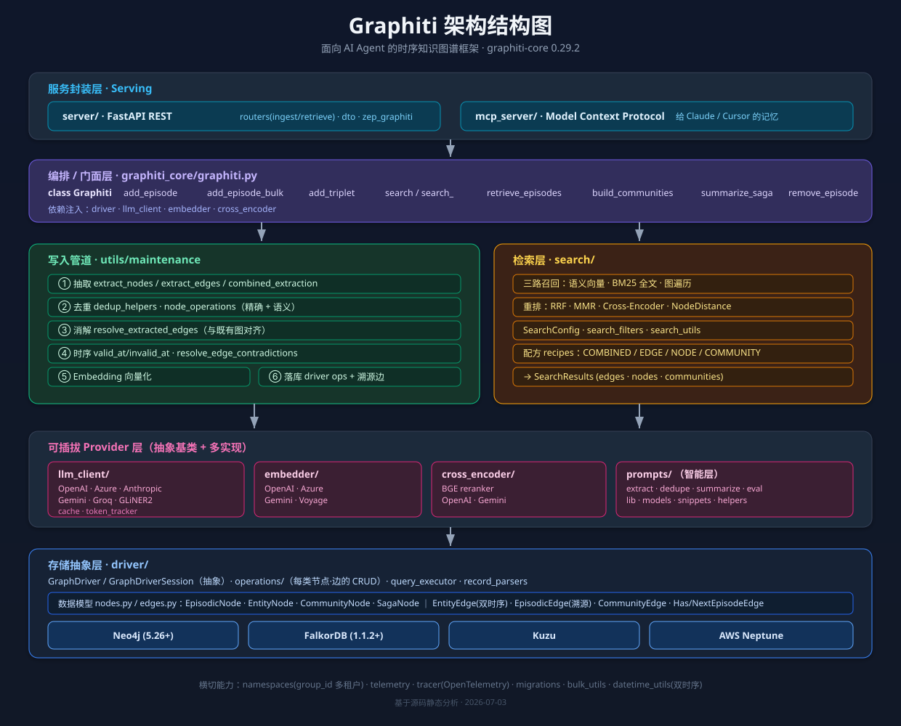
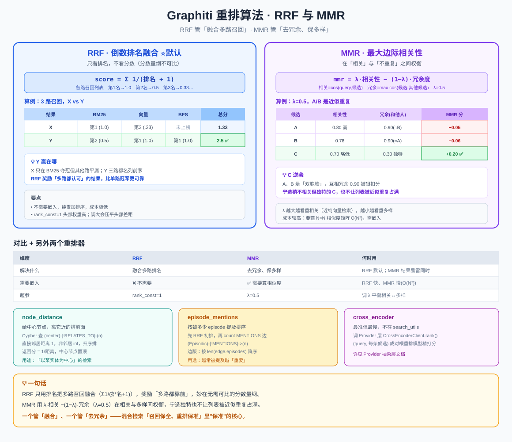
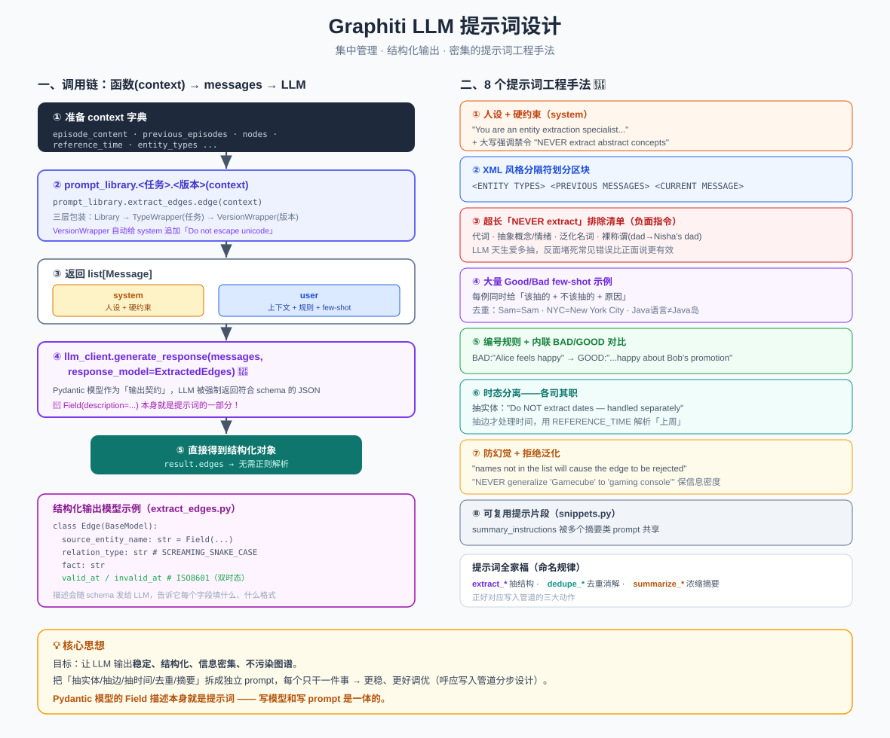

# Graphiti 架构分析

> Graphiti —— 面向 AI Agent 的**时序知识图谱（Temporal Context Graph）**构建框架
> 版本：`graphiti-core 0.29.2` ｜ Python `>=3.10,<4` ｜ 仓库：getzep/graphiti

---

## 1. 项目定位

Graphiti 是一个用于构建和查询「随时间演化」的知识图谱的 Python 框架，专为 AI Agent 的长期记忆设计。它与传统静态知识图谱、传统 RAG 的核心区别：

- **双时序模型（Bi-temporal）**：显式区分「事件发生时间」与「数据被写入图谱的时间」，支持精确的历史时间点查询。
- **增量更新**：每次交互实时融合进图谱，无需批量重算整张图。
- **混合检索（Hybrid Retrieval）**：语义向量 + 关键词 BM25（全文）+ 图遍历三路召回融合。
- **可定制本体（Ontology）**：通过 Pydantic 模型自定义实体类型 / 边类型；同时支持 LLM 学习出的本体。
- **溯源（Provenance）**：每条事实都能追溯到来源 episode。

三大交付形态：**核心库（`graphiti_core`）** → **REST 服务（`server/`）** → **MCP 服务（`mcp_server/`）**。

---

## 2. 顶层目录结构

```
graphiti/
├── graphiti_core/        # 核心库（本文重点）
├── server/               # FastAPI REST 服务，封装核心库
├── mcp_server/           # Model Context Protocol 服务，给 Claude/Cursor 等做记忆
├── tests/                # 单元测试 + 集成测试(_int) + evals 评估（详解见 15-评估体系-evals.md）
├── examples/             # 使用示例
├── signatures/           # CLA 签名等
├── pyproject.toml        # graphiti-core 包定义 + ruff/pyright 配置
├── Makefile              # format / lint / test / check
└── CLAUDE.md             # 面向 AI 的项目说明
```

---

## 3. 核心库 `graphiti_core/` 分层架构

```
┌─────────────────────────────────────────────────────────────┐
│                     Graphiti (graphiti.py)                    │  编排层 / 门面
│   add_episode · add_episode_bulk · search · build_communities │
└───────────────┬─────────────────────────────┬────────────────┘
                │                             │
     ┌──────────▼──────────┐       ┌──────────▼───────────┐
     │  维护/管道操作          │       │      检索层            │
     │  utils/maintenance   │       │      search/          │
     │  (抽取·去重·消解·社区)   │       │  (混合检索·重排·配方)    │
     └──────────┬───────────┘       └──────────┬───────────┘
                │                             │
   ┌────────────┼──────────────┬──────────────┼─────────────┐
   ▼            ▼              ▼              ▼             ▼
┌──────┐  ┌──────────┐   ┌──────────┐   ┌──────────┐  ┌──────────┐
│ LLM  │  │ Embedder │   │  Cross-  │   │ Prompts  │  │  Driver  │
│client│  │          │   │ Encoder  │   │          │  │  (存储)   │
└──────┘  └──────────┘   └──────────┘   └──────────┘  └────┬─────┘
                                                            ▼
                                         Neo4j · FalkorDB · Kuzu · Neptune
```

上图的可视化版本：



### 3.1 核心数据结构（`nodes.py` / `edges.py`）

> 📖 **深入版**：三类节点/三类边的所有字段、以及「双时态」（`valid_at`/`invalid_at` 事件时间 vs `created_at`/`expired_at` 系统时间）详解见 [`03-双时态数据模型-nodes与edges.md`](03-双时态数据模型-nodes与edges.md)，配套结构图见下：
>
> 

图谱由**节点**和**边**两类元素构成，均基于 Pydantic `BaseModel` 抽象：

**节点（`nodes.py`，抽象基类 `Node`）：**

| 类 | 说明 |
|---|---|
| `EpisodicNode` | 一条原始输入（消息/文本/JSON），是所有事实的**来源** |
| `EntityNode` | 抽取出的实体（人、地点、概念…），带 embedding 和自定义属性 |
| `CommunityNode` | 由社区检测算法聚合而成的实体簇（宏观主题） |
| `SagaNode` | Saga（连续剧情/长会话）聚合节点，串联多个 episode |

`EpisodeType`（枚举）：`message` / `text` / `json` 等输入类型。

**边（`edges.py`，抽象基类 `Edge`）：**

| 类 | 连接 | 说明 |
|---|---|---|
| `EntityEdge` | Entity → Entity | 事实/关系，带 `valid_at`/`invalid_at` 双时序字段 + fact embedding |
| `EpisodicEdge` | Episode → Entity | 记录某实体在哪个 episode 被提及（溯源） |
| `CommunityEdge` | Community ↔ Entity | 社区归属 |
| `HasEpisodeEdge` | Saga → Episode | Saga 包含哪些 episode |
| `NextEpisodeEdge` | Episode → Episode | episode 时序链 |

> **双时序的关键**：`EntityEdge` 上的 `valid_at` / `invalid_at`（事实有效期）与节点/边的 `created_at`（写入时间）分离。当新事实与旧事实矛盾时，旧边被标记 `invalid_at` 而非删除，从而保留历史。

### 3.2 编排层 `graphiti.py`

`Graphiti` 类是整个框架的门面，构造时注入 driver、llm_client、embedder、cross_encoder。核心方法：

| 方法 | 作用 |
|---|---|
| `add_episode(...)` | **核心写入管道**：抽取实体/边 → 去重消解 → 时序处理 → 落库 |
| `add_episode_bulk(...)` | 批量写入，优化大批量导入（详解见 [`11-批量导入-add_episode_bulk.md`](11-批量导入-add_episode_bulk.md) + [`svg/11-bulk-import.svg`](svg/11-bulk-import.svg)） |
| `add_triplet(...)` | 直接写入 (源实体, 边, 目标实体) 三元组 |
| `search(...)` | 高层混合检索（返回相关事实/边） |
| `search_(...)` | 底层可配置检索（传入 `SearchConfig`） |
| `retrieve_episodes(...)` | 按时间检索原始 episode |
| `build_communities(...)` | 运行社区检测，生成 `CommunityNode`（详解见 [`08-社区构建-communities.md`](08-社区构建-communities.md) + [`svg/08-community-building.svg`](svg/08-community-building.svg)） |
| `build_indices_and_constraints(...)` | 初始化图数据库索引与约束 |
| `remove_episode(...)` | 删除 episode 及其派生元素 |
| `summarize_saga(...)` | 对 Saga 生成摘要 |
| `get_nodes_and_edges_by_episode(...)` | 按 episode 反查节点/边 |

---

## 4. 数据写入管道（`add_episode` 流程）

> 📖 **深入版**：本节是概览。逐阶段（含 LLM 调用点、节点/边如何抽取、去重三级策略、时序失效）的详细拆解见 [`04-数据写入管道-add_episode.md`](04-数据写入管道-add_episode.md)，配套结构图见下：
>
> 
>
> 其中「去重」一步的算法（MinHash + LSH + LLM 三级漏斗）单独详解见 [`06-去重算法-dedup.md`](06-去重算法-dedup.md)，配套结构图见下：
>
> 

这是 Graphiti 最核心的处理链路，实现分散在 `utils/maintenance/` 中：

```
输入 episode (message/text/json)
        │
        ▼
① 抽取 (extract_nodes / extract_edges)          ← LLM + prompts/extract_*
   从文本中抽取实体节点与关系边
        │
        ▼
② 去重 (dedup_helpers, node_operations)          ← 精确去重 + 语义/LLM 去重
   _collapse_exact_duplicate · _merge_candidate_nodes
        │
        ▼
③ 消解 (resolve_extracted_edges)                 ← LLM + prompts/dedupe_*
   与图中已有实体/边对齐，判断是否同一实体
        │
        ▼
④ 时序处理 (_extract_edge_timestamps,            ← 计算 valid_at/invalid_at
   resolve_edge_contradictions)                    矛盾事实 → 旧边失效
        │
        ▼
⑤ Embedding (embedder)                           ← 生成节点名/边事实向量
        │
        ▼
⑥ 落库 (driver operations)                        ← 写入图数据库 + 建立溯源边
        │
        ▼
（可选）build_communities                          ← 更新社区
```

`utils/maintenance/` 关键模块：

| 模块 | 职责 |
|---|---|
| `node_operations.py` | 实体抽取、实体节点去重与合并 |
| `edge_operations.py` | 边抽取、边消解、时序戳抽取、矛盾消解 |
| `combined_extraction.py` | 节点+边一次性联合抽取（省 LLM 调用） |
| `dedup_helpers.py` | 去重辅助（精确匹配 + 相似度） |
| `community_operations.py` | 社区检测与社区节点/边构建 |
| `attribute_utils.py` | 自定义属性抽取与填充 |
| `graph_data_operations.py` | 图级别数据操作 |

---

## 5. 存储抽象层 `driver/`

> 📖 **入门版**：如果对图数据库/Neo4j 不熟，可先看 [`01-Neo4jDriver简介.md`](01-Neo4jDriver简介.md)（零基础，含 Neo4jDriver 逐段代码解读），配图见下：
>
> 

Graphiti 通过统一的 `GraphDriver` 抽象支持 **4 种图数据库后端**：

| Provider | 文件 | 说明 |
|---|---|---|
| **Neo4j** | `neo4j_driver.py` | 主力后端，要求 5.26+，默认库名 `neo4j` |
| **FalkorDB** | `falkordb_driver.py` | 轻量替代，1.1.2+，默认库名 `default_db` |
| **Kuzu** | `kuzu_driver.py` | 嵌入式图数据库 |
| **Neptune** | `neptune_driver.py` | AWS 托管图数据库 |

**抽象设计（`driver/driver.py`）：**

- `GraphProvider`（枚举）：`NEO4J` / `FALKORDB` / `KUZU` / `NEPTUNE`
- `GraphDriver`（抽象基类，继承 `QueryExecutor`）：定义 `execute_query`、`session`、`build_indices_and_constraints`、`with_database`/`clone`（多库切换）、`build_fulltext_query`（全文检索）、`transaction` 等。
- `GraphDriverSession`（抽象基类）：异步会话，支持 `async with`、`run`、`execute_write`。

**Operations 分层（`driver/operations/`）：**
driver 通过一组 `*_ops` 属性暴露针对每类节点/边的 CRUD 操作，把「Cypher 查询细节」从核心逻辑中隔离，各后端可差异化实现：

```
entity_node_ops · episode_node_ops · community_node_ops · saga_node_ops
entity_edge_ops · episodic_edge_ops · community_edge_ops
has_episode_edge_ops · next_episode_edge_ops · search_ops
```

配套：`query_executor.py`（查询执行）、`record_parsers.py`（结果解析）、`graph_queries.py`（查询模板）、`graph_operations/`、`search_interface/`。

---

## 6. 检索层 `search/`

> 📖 **深入版**：本节是概览。逐阶段（两入口、按需嵌入、四 scope 并行、三路召回、5 种重排器、检索配方）的详细拆解见 [`05-检索管道-search.md`](05-检索管道-search.md)，配套结构图见下：
>
> 
>
> 其中重排器 RRF / MMR 的公式与逐行实现（附带数字算例）单独详解见 [`07-重排算法-RRF与MMR.md`](07-重排算法-RRF与MMR.md)，配套结构图见下：
>
> 

混合检索是 Graphiti 的核心能力，三路召回 + 重排：

```
Query
  │
  ├── 语义检索（向量相似度，embedder）
  ├── 关键词检索（BM25 / 全文索引）
  └── 图遍历（node distance / episode mentions）
        │
        ▼
   融合 & 重排（Reranker）
     · RRF（Reciprocal Rank Fusion，倒数排名融合）
     · MMR（Maximal Marginal Relevance，最大边际相关，去冗余）
     · Cross-Encoder（重排模型）
     · Node Distance / Episode Mentions（图信号）
        │
        ▼
   SearchResults（edges / nodes / communities）
```

**模块划分：**

| 文件 | 职责 |
|---|---|
| `search.py` | 检索主逻辑 |
| `search_config.py` | `SearchConfig` 检索配置模型 |
| `search_config_recipes.py` | **预设配方**（开箱即用的配置组合） |
| `search_filters.py` | 过滤器（时间、group_id、实体类型等）（详解见 [`13-检索过滤器-search_filters.md`](13-检索过滤器-search_filters.md) + [`svg/13-search-filters.svg`](svg/13-search-filters.svg)） |
| `search_utils.py` / `search_helpers.py` | 工具函数 |

**检索配方（recipes）** 按目标类型 × 融合策略组合，例如：

- `COMBINED_HYBRID_SEARCH_RRF / _MMR / _CROSS_ENCODER` —— 综合检索
- `EDGE_HYBRID_SEARCH_*` —— 只检索边（事实）
- `NODE_HYBRID_SEARCH_*` —— 只检索实体节点
- `COMMUNITY_HYBRID_SEARCH_*` —— 检索社区

---

## 7. 可插拔的 Provider 层

### 7.1 LLM 客户端 `llm_client/`

> 📖 **深入版**：LLM/Embedder/Cross-Encoder 三类 Provider 如何用「基类统一契约 + 各厂商差异实现」支持多家厂商（结构化输出的不同机制、自我纠正重试、大小模型分级），详解见 [`10-Provider抽象层-llm与embedder.md`](10-Provider抽象层-llm与embedder.md)，配套结构图见下：
>
> 

统一基类 `LLMClient`（`client.py`），支持结构化输出（推荐 OpenAI/Gemini）：

| Provider | 文件 |
|---|---|
| OpenAI | `openai_client.py` / `openai_base_client.py` / `openai_generic_client.py` |
| Azure OpenAI | `azure_openai_client.py` |
| Anthropic | `anthropic_client.py` |
| Gemini | `gemini_client.py` |
| Groq | `groq_client.py` |
| GLiNER2（本地抽取） | `gliner2_client.py` |

辅助：`cache.py`（LLM 响应缓存）、`token_tracker.py`（token 统计）、`config.py`、`errors.py`。

### 7.2 Embedder `embedder/`

统一基类 `EmbedderClient`：OpenAI / Azure OpenAI / Gemini / Voyage。

### 7.3 Cross-Encoder（重排）`cross_encoder/`

统一基类 `CrossEncoderClient`：BGE reranker（本地）/ OpenAI / Gemini。

### 7.4 Prompts `prompts/`

> 📖 **深入版**：提示词的架构（`prompt_library.<任务>.<版本>()` 三层调用 + Pydantic 结构化输出）和 8 个提示词工程手法（人设/XML分隔/排除清单/few-shot/时态分离/防幻觉…）详解见 [`09-LLM提示词设计-prompts.md`](09-LLM提示词设计-prompts.md)，配套结构图见下：
>
> 

所有 LLM 交互的提示词集中管理，是「抽取-去重-消解-摘要」管道的智能核心：

| 文件 | 用途 |
|---|---|
| `extract_nodes.py` / `extract_edges.py` / `extract_nodes_and_edges.py` | 实体/关系抽取 |
| `dedupe_nodes.py` / `dedupe_edges.py` | 去重消解判断 |
| `summarize_nodes.py` / `summarize_sagas.py` | 实体/Saga 摘要 |
| `eval.py` | 评估用 |
| `lib.py` / `models.py` / `prompt_helpers.py` / `snippets.py` | 提示词框架与复用片段 |

---

## 8. 其他核心模块

| 模块 | 职责 |
|---|---|
| `models/` | `nodes/` `edges/` 的数据模型定义（与 DB 序列化相关） |
| `namespaces/` | 命名空间/`group_id` 隔离（多租户支持） |
| `migrations/` | 数据库/数据迁移脚本 |
| `telemetry/` | 匿名遥测（`telemetry.py`） |
| `tracer.py` | OpenTelemetry 分布式追踪（可选）（详解见 [`14-分布式追踪-opentelemetry.md`](14-分布式追踪-opentelemetry.md) + [`svg/14-tracing-spans.svg`](svg/14-tracing-spans.svg)） |
| `decorators.py` | 通用装饰器 |
| `errors.py` | 自定义异常 |
| `helpers.py` | 通用工具 |
| `graphiti_types.py` | 核心类型定义 |
| `utils/bulk_utils.py` | 批量导入优化 |
| `utils/datetime_utils.py` | 时间处理（双时序核心工具） |
| `utils/text_utils.py` / `content_chunking.py` | 文本处理与分块 |
| `utils/ontology_utils/` | 本体（实体/边类型）工具 |

---

## 9. 服务封装层

> 📖 **深入版**：REST 与 MCP 如何把核心库包成服务、以及摄入顺序性的两种队列解法（REST 全局单队列 vs MCP 按 group_id 分队列），详解见 [`12-服务封装-server与mcp.md`](12-服务封装-server与mcp.md)，配套结构图见下：
>
> 

### 9.1 REST 服务 `server/`（FastAPI）

```
graph_service/
├── main.py            # FastAPI 应用入口
├── zep_graphiti.py    # 封装 Graphiti 核心库
├── config.py          # 配置
├── routers/
│   ├── ingest.py      # 写入端点（add episode）
│   └── retrieve.py    # 检索端点
└── dto/               # 请求/响应数据契约
    ├── ingest.py · retrieve.py · common.py
```

- 类型检查更严格（`typeCheckingMode = "standard"`）
- 开发：`uvicorn graph_service.main:app --reload`

### 9.2 MCP 服务 `mcp_server/`

实现 Model Context Protocol，为 Claude / Cursor 等 AI 助手提供**基于知识图谱的记忆能力**（temporal-aware memory）。目录含 `src/`、`config/`、`docker/`、`docs/`，支持 Docker Compose + Neo4j 一键部署。

> 使用约定（`cursor_rules.md`）：加新信息前先搜索既有知识；用实体类型过滤（`Preference` / `Procedure` / `Requirement`）；发现即存储。

---

## 10. 架构设计要点总结

1. **门面 + 管道**：`Graphiti` 类作为统一门面，`add_episode` 是「抽取→去重→消解→时序→落库」的清晰管道，各步骤解耦在 `utils/maintenance/`。
2. **三层可插拔**：存储（4 种图库）、LLM、Embedder、Reranker 均为抽象基类 + 多实现，通过依赖注入切换。
3. **存储抽象彻底**：`driver/operations/` 把每类节点/边的 Cypher 操作隔离，新增后端只需实现 ops，核心逻辑零改动。
4. **双时序是灵魂**：事实有效期（`valid_at`/`invalid_at`）与写入时间分离 + 矛盾消解（旧边失效不删除），实现「时间旅行」查询。
5. **混合检索 + 配方**：三路召回 × 多种重排策略，用预设 recipes 降低使用门槛。
6. **提示词即逻辑**：图谱构建质量高度依赖 `prompts/`，是框架的「智能层」，最适配支持结构化输出的模型。
7. **多租户与溯源**：`namespaces`/`group_id` 隔离数据，`EpisodicEdge` 保证每条事实可溯源。

---

## 11. 关键文件速查

| 想了解… | 看这里 |
|---|---|
| 整体 API / 编排 | `graphiti_core/graphiti.py` |
| 数据模型 | `graphiti_core/nodes.py` · `edges.py` |
| 写入管道逻辑 | `graphiti_core/utils/maintenance/{node,edge}_operations.py` |
| 存储抽象 | `graphiti_core/driver/driver.py` · `driver/operations/` |
| 检索 | `graphiti_core/search/search.py` · `search_config_recipes.py` |
| LLM 提示词 | `graphiti_core/prompts/` |
| REST API | `server/graph_service/` |
| MCP 记忆服务 | `mcp_server/` |

---

*生成时间：2026-07-03 ｜ 基于 graphiti-core 0.29.2 源码分析*
