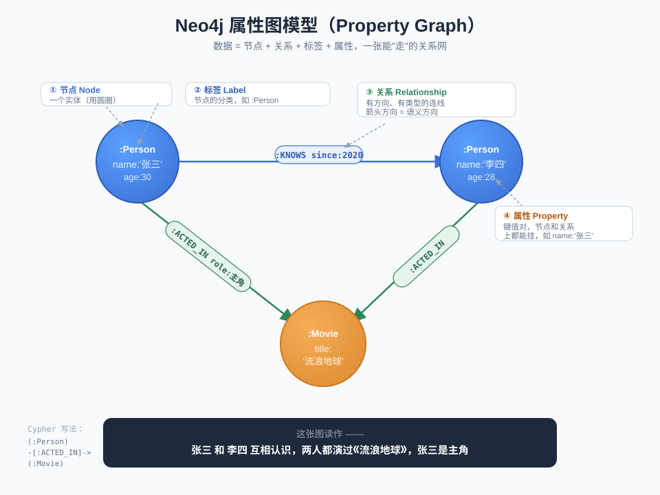

# Neo4j 入门（零基础完全指南）

> 面向从没接触过图数据库的同学。从「它是什么、为什么需要它」开始，到能自己动手建节点、写查询。

---

## 一、Neo4j 是什么？

**Neo4j 是目前最流行的「图数据库（Graph Database）」。**

一句话：它把数据存成一张**关系网**——由「点」和「连线」组成，而不是传统的表格。

- **它擅长的事**：管理「东西和东西之间的关系」，比如社交网络、推荐系统、知识图谱、风控反欺诈、供应链。
- **诞生背景**：2007 年发布，用 Java 编写，是「原生图数据库」的代表（底层存储就是按图设计的，不是在关系库上套壳）。

---

## 二、为什么需要图数据库？（和 MySQL 的本质区别）

你熟悉的 MySQL / PostgreSQL 是**关系型数据库**，数据存在一张张「表」里，靠外键 + JOIN 把表关联起来。

问题出在**「深层关系查询」**上。举个例子：

> 「找出张三的朋友的朋友的朋友，都认识谁？」（4 层关系）

- **关系型数据库**：要写 4 层 `JOIN`。每多一层，JOIN 的数据量指数级膨胀，**层数越深越慢**，深了直接卡死。
- **图数据库**：数据本身就是一张网，查询时顺着「连线」一步步「走」过去即可，**性能几乎只跟你走过的路径长度有关**，跟数据库总量关系不大。

这个特性叫 **免索引邻接（index-free adjacency）**：每个节点直接「记着」它连到哪些节点，找邻居不用查全局索引，直接跳过去。

### 一张对比表

| 维度 | 关系型数据库（MySQL） | 图数据库（Neo4j） |
|------|----------------------|-------------------|
| 数据模型 | 表格（行 + 列） | 节点 + 关系 |
| 表达关系 | 外键 + JOIN | 直接用「连线」 |
| 深层关系查询 | 多层 JOIN，越深越慢 | 顺着路径走，天然高效 |
| 查询语言 | SQL | **Cypher** |
| 最适合 | 结构化、事务性数据 | 关联密集、关系是核心的数据 |
| 典型场景 | 订单、账务、库存 | 社交、推荐、知识图谱、反欺诈 |

> **不是谁取代谁**。关系型库依旧是主力；只有当「关系本身」是你要查询的核心时，图数据库才显出巨大优势。

---

## 三、核心概念（4 个就够）

Neo4j 的数据模型叫 **属性图（Property Graph）**，只有 4 个基本概念：

### 1. 节点 Node —— 一个实体
表示一个「东西」：一个人、一部电影、一座城市。
用 `()` 表示。

### 2. 标签 Label —— 节点的分类
给节点贴的「类型标签」，比如 `Person`、`Movie`。一个节点可以有多个标签。
写作 `(:Person)`。

### 3. 关系 Relationship —— 连线
连接两个节点，**必须有方向和类型**。比如「张三 —演过→ 某电影」。
写作 `-[:ACTED_IN]->`。

### 4. 属性 Property —— 键值对
节点和关系上都能挂属性（数据）。比如人的 `name='张三'`、`age=30`；关系上也能有属性，比如演出关系上的 `role='主角'`。

### 拼在一起长这样

```
(:Person {name:'张三', age:30})  -[:ACTED_IN {role:'主角'}]->  (:Movie {title:'流浪地球'})
   \_______节点 + 标签 + 属性___/     \____关系 + 类型 + 属性___/     \____另一个节点____/
```

读作：**「张三」这个人，以主角身份，演过《流浪地球》这部电影。**

### 一张图看懂 4 个概念



> 上图用一个具体例子把 4 个概念串在一起：两个 `:Person` 节点（张三、李四）互相 `:KNOWS`，两人都 `:ACTED_IN` 同一部 `:Movie`（流浪地球），张三是主角。四个标注框分别指出①节点 ②标签 ③关系 ④属性。

---

## 四、Cypher —— Neo4j 的查询语言

SQL 之于 MySQL，就是 Cypher 之于 Neo4j。Cypher 最大的特点是**「像画图一样写查询」**：用 `()` 画节点、用 `-->` 画关系，非常直观。

### 1. 创建数据 CREATE

```cypher
// 创建两个人，和一段"认识"关系
CREATE (a:Person {name: '张三', age: 30})
CREATE (b:Person {name: '李四', age: 28})
CREATE (a)-[:KNOWS {since: 2020}]->(b)
```

### 2. 查询数据 MATCH（最核心）

`MATCH` 描述你想找的「图形状」，Neo4j 帮你把匹配的部分找出来。

```cypher
// 查张三认识的所有人
MATCH (a:Person {name: '张三'})-[:KNOWS]->(friend)
RETURN friend.name
```

```cypher
// 查张三"朋友的朋友"（2 层关系）—— 这就是图数据库的拿手好戏
MATCH (a:Person {name: '张三'})-[:KNOWS]->()-[:KNOWS]->(fof)
RETURN fof.name
```

### 3. 条件过滤 WHERE

```cypher
MATCH (p:Person)
WHERE p.age > 25
RETURN p.name, p.age
```

### 4. 更新 SET / 删除 DELETE

```cypher
// 修改属性
MATCH (p:Person {name: '张三'}) SET p.age = 31

// 删除节点（要先删掉它的关系，用 DETACH）
MATCH (p:Person {name: '张三'}) DETACH DELETE p
```

### Cypher 和 SQL 对照速记

| 目的 | SQL | Cypher |
|------|-----|--------|
| 查询 | `SELECT` | `MATCH ... RETURN` |
| 条件 | `WHERE` | `WHERE` |
| 插入 | `INSERT` | `CREATE` |
| 更新 | `UPDATE ... SET` | `SET` |
| 删除 | `DELETE` | `DELETE` / `DETACH DELETE` |

---

## 五、动手跑起来（10 分钟体验）

### 方式一：Neo4j Desktop（最省心）
去 [neo4j.com/download](https://neo4j.com/download/) 下载桌面版，点点鼠标就能建库，自带可视化界面。适合完全新手。

### 方式二：Docker（一行命令，推荐）

```bash
docker run --name neo4j -p 7474:7474 -p 7687:7687 \
  -e NEO4J_AUTH=neo4j/password12345 \
  neo4j:5.26
```

两个端口的含义：

| 端口 | 用途 |
|------|------|
| **7474** | 浏览器可视化界面。打开 http://localhost:7474 就能画图、写 Cypher |
| **7687** | **Bolt 协议**端口，代码/程序连接数据库走这个 |

> `bolt://` 是 Neo4j 专用的高效二进制通信协议，各语言的官方驱动都通过它连库。

### 上手三步

1. 浏览器打开 `http://localhost:7474`，用 `neo4j / password12345` 登录。
2. 在顶部命令框粘贴上面「创建数据」的 Cypher，回车执行。
3. 再执行一条 `MATCH (n) RETURN n`，你会看到节点和连线被**画出来**——这就是图数据库最爽的地方。

---

## 六、几个进阶但重要的概念

- **索引（Index）**：和关系库一样，给常查的属性建索引能大幅加速。Neo4j 还支持**全文索引**，用来做关键词搜索。
- **约束（Constraint）**：比如「每个 Person 的 name 唯一」，保证数据质量。
- **事务（Transaction）**：Neo4j 支持 **ACID 事务**（要么全成功、要么全回滚），这点比很多 NoSQL 强，数据很安全。
- **Cypher 是标准**：Cypher 已发展成开放标准 **openCypher**，也是新国际标准 **GQL**（图查询语言）的基础。
- **APOC / GDS**：两个官方扩展库。APOC 是「瑞士军刀」工具函数集；GDS（Graph Data Science）提供 PageRank、社区发现、最短路径等图算法。

---

## 七、什么时候该用 Neo4j？

**适合 ✅**
- 社交网络：好友、关注、共同好友
- 推荐系统：「买了这个的人还买了……」
- 知识图谱：实体 + 关系的海量网络
- 反欺诈 / 风控：追踪资金/账户之间的可疑链路
- 权限 / 组织架构：层级和依赖关系

**不太适合 ❌**
- 简单的增删改查、报表统计（关系型库更合适）
- 海量非结构化文档存储（用文档库或对象存储）
- 关系不是核心、只是偶尔关联的数据

---

## 八、一句话总结

> **Neo4j** 是用「节点 + 关系」存数据的图数据库，靠 **免索引邻接**让深层关系查询飞快；它的查询语言是像画图一样直观的 **Cypher**。当「关系本身就是你要查的东西」时，它比传统关系型数据库强太多。

---

## 九、继续学习

- 官方交互式教程：[neo4j.com/graphacademy](https://graphacademy.neo4j.com/)（免费，带在线沙箱）
- Cypher 手册：[neo4j.com/docs/cypher-manual](https://neo4j.com/docs/cypher-manual/)
- 在线免费沙箱（无需安装）：[sandbox.neo4j.com](https://sandbox.neo4j.com/)
